## Real MySQL

### Ep.01 
### CHAR vs VARCHAR

* 공통점
  * 문자열 저장용 컬럼
  * 최대 저장 가능 문자 길이 명시 (바이트 수 아님) ex) CHAR(10) -> 10글자 
    * CHAR(10) VARCHAR(10) 두 타입 모두 어떤 문자열 셋을 사용하는가에 따라 사용하는 저장 공간의 크기가 달라질 수 있음
    
* 차이점
  * 저장 방식
    * CHAR : 값의 실제 크기에 관계없이 설정된 고정된 공간 할당 여부 
    * VARCHAR : 저장되는 문자열 길이 만큼만 저장 공간 할당
  * 최대 저장 길이 : CHAR(255) vs VARCHAR(16383)
  * 저장된 값의 길이 관리 여부 (VARCHAR와 가변 길이 문자셋 사용하는 CHAR는 저장된 값 길이 관리)
  * CHAR도 UTF-8 MB4와 같이 가변길이 문자셋을 사용하면 컬럼에 저장된 값의 길이를 같이 관리 


#### CHAR vs VARCHAR (Latin1)

* CHAR(10)   
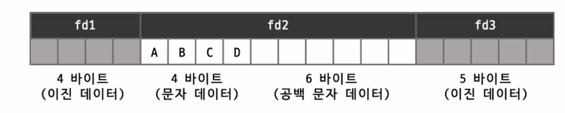

* VARCHAR(10)  


#### CHAR vs VARCHAR (UTF-8MB4)
* VARCHAR(10)
  * (문자당 바이트 수가 달라도) 문자 셋 관계없이, 꼭 필요한 만큼만 공간 사용
* CHAR(10)
  * 예약하는 공간 크기 달라짐 ( 가변길이 문자 셋인 경우, 길이 저장용 바이트 사용)  
  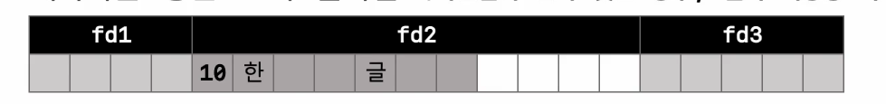
  * UTF-8MB4 문자 셋을 사용하는 컬럼에서 한글 2글자의 경우, 바이트 수 기준으로 공백 4개 채움  
  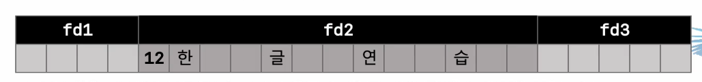
  * 4글자의 경우, CHAR(10) 컬럼에는 12 바이트를 사용하고, 미리 예약하는 빈 공백 공간 없음


### CHAR 타입의 공간 낭비
* 일반적으로 알고 있는 구분 기준
  * 고정된 길이의 값 저장은 CHAR 타입, 그 외의 경우 VARCHAR 타입

* CHAR 대신 VARCHAR를 사용하면?
  * 어떤 경우에는 CHAR 타입의 공간 낭비 심함
    * 저장되는 문자열의 최소 최대 길이 가변 폭이 큰 경우 
  * 하지만 그렇지 않은 경우도 있음
    * 저장되는 문자열의 최소 최대 길이 가변폭이 작은 경우 
  * 저장되는 값의 길이 변동이 크지 않다면 낭비는 크지 않음


### 컬럼 값의 길이 변경시 작동 방법
* VARCHAR(10) 레코드 INSERT ( ABCD )
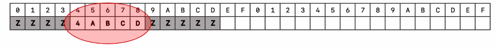
* VARCHAR(10) 레코드 UPDATE ( ABCDE )  
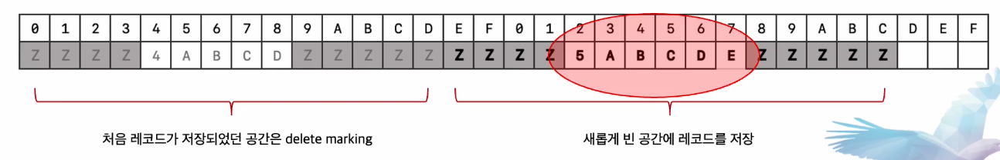
  * 레코드의 길이가 변경되었기 때문에 원래 레코드가 저장되어있던 위치에 inplace update 불가능
  * MySQL server의 각 DataPage는 insert update delete 되면서 구조가 계속 변경됨 레코드를 저장할 수 있는 빈 공간을 찾는것이 어려워짐
  * 결국에는 레코드를 입력할 수 있는 빈 공간을 찾을 수 없게 되고 결국 page의 레코드들을 다시 정리하는 작업이 필요해짐
* 만약 해당 컬럼이 VARCHAR(10)이 아니라 CHAR(10)이면 
* MySQL server는 해당 컬럼의 크기만큼 빈 공간을 미리 확보해 두었기 떄문에 공간 낭비는 되었겠지만 위와 같이 데이터가 한 글자 더 늘어나는 형태로 업데이트가 실행되어도 레코드를 옮겨 쓰기 하는 작업이 필요 없음

<br/>

* 이와 같이 MySQL server에서 CHAR 타입의 장점은 이렇게 레코드의 위치를 옮겨 적어야 하는 가능성을 낮춰 줄 수 있다. 
* 특시 저장되는 문자열의 가변 길이 폭이 좁고 자주 변경되는 컬럼의 경우 VARCHAR 보다 CHAR 타입을 사용하면 컬럼의 길이 변경시 data page 관리 작업을 최소화 하고 자연스럽게 페이지의 프레그멘테이션을 최소화 해줌

<br/>

### 문자열 타입 선정
* VARCHAR 보다는 CHAR를 선택해야 하는 경우
  * 값의 가변 길이 범위 폭이 좁고 
  * 자주 변경되는 경우 (특히 인덱스된 컬럼인 경우)
* 위 같은 경우 VARCHAR 사용시
  * 데이터 페이지 내부의 조각화 현상 커짐
  * CHAR 타입보다 공간 효율 떨어짐
  * 내부적으로 빈번한 page reorganization 작업 필요


### Ep.02
### VARCHAR vs TEXT
#### 공통점
  * 문자열 속성 값을 저장
  * 최대 65535 Bytes 까지 저장 가능
####  차이점
  * VARCHAR 타입 컬럼에는 지정된 글자 수 만큼만 데이터 저장 가능
    * VARCHAR(10) -> 10글자 이하만 저장 가능
  * TEXT 타입 걸렄은 인덱스 생성 시 반드시 Prefix 길이 지정 필요
    * CREATE INDEX idx_name ON table_name (text_column(10));
  * TEXT 타입 컬럼은 표현식으로만 디폴트 값 지정가능
    * CREATE TABLE table_name (text_column TEXT DEFAULT 'default value'); -> error
    * CREATE TABLE table_name (text_column TEXT DEFAULT ('default value')); -> success

<br />   

####  일반적인 사용 형태
  * 길이가 짧으면 VARCHAR, 길이가 길면 TEXT
####  그렇다면 CARCHAR(5000) vs TEXT ??? 
  * MySQL에서는 세션에서 어떤 테이블에 저장된 데이터를 읽는다고 할 때 메모리에 이를 위한 버퍼 공간을 미리 할당해두고 그걸 유지하면서 재활용함,   
  이 버퍼 공간은 테이블 레코드의 최대 사이즈로 메모리에 할당되는데 이때 VARCHAR 타입 컬럼의 경우 이 버퍼 공간에 포함돼서 메모리 공간을 재사용할 수 있지만   
  텍스트 타입인 경우 그렇지 않고 그때그떄 필요할 때마다 메모리가 할당되고 해제됩니다.
  * VARCHAR 타입은 메모리 버퍼 공간을 미리 할당해두며 재활용 가능, TEXT 타입은 그때 그때 필요할 때마다 할당 & 해제
  * 컬럼 사용이 빈번하고 메모리 용령이 충분하다면 VARCHAR 타입 추천
  * VARCHAR(5000)과 같이 길이가 긴 컬럼들을 자주 추가하는 경우, Row 사이즈 제한 (65,535 Byte)에 도달할 수 있으므로 적절하게 TEXT 타입과 같이 사용하는 것을 권장
####  VARCHAR(30) VS VARCHAR(255)
  * 실제 최대 사용하는 길이만큼 명시해야 메모리 사용 효유율 증가
  * 디스크 공간 효율 차이도 미미하게 존재 내부적으로 컬럼에 저장되는 데이터의 길이 정보를 저장 (1Byte vs 2Byte)

#### VARCHAR & TEXT 주의사항
* 저장되는 값의 사이즈가 크면 Off-Page 형태로 데이터가 저장될 수 있음
  * MySQL의 Innodb Storage Engine에서 하나의 레코드 크기가 데이터 페이지의 절반 크기보다 큰 경우에는 레코드에서 외부로 저장할 가변길이 컬럼을 선택하게 되고 선택된 컬럼은 별로 외부 페이지에 데이터가 저장  
  실제 다른 컬럼들이 모두 저장되어있는 본래의 데이터 페이지에는 외부 페이지를 가르키는 20바이트의 포인터 값만 저장되어 있음 -> external off page
  * 쿼리에서 Off-Page 컬럼의 참조 여부에 따라 쿼리 처리 성능이 매우 달라짐

```sql
CREATE TABLE user_log
(
  id         int NOT NULL AUTO_INCREMENT,
  user_id    int NOT NULL,
  extra_info TEXT,
  PRIMARY KEY (id),
  KEY ix_user_id (user_id)
)
  
```

```sql
select user_id, email 
from user_log
where user_id = 7;
# 4684 rows in set (0.32 sec)
```
```sql
select user_id, email, extra_info 
from user_log
where user_id = 7;
# 4684 rows in set (1.23 sec)
```

#### 정리
* 상대적으로 저장되는 데이터 사이즈가 많이 크지 않고, 컬럼 사용이 빈번하며 DB서버의 메모리 용량이 충분하다면 VARCHAR 타입 권장
* 저장되는 데이터 사이즈가 큰 편이고, 컬럼을 자주 사용하지 않으며 테이블에서 다른 문자열 컬럼들이 많이 사용된다면 TEXT 타입 권장
* VARCHAR 타입을 사용하는 경우, 길이는 실제 사용되는 만큼만 지정

### Ep.03
### COUNT(*) vs COUNT(DISTINCT)
#### COUNT(*) 성능 개선
* Covering Index
```sql
select count(*) where ix_fd1=? and ix_fd2=?;
select count(ix_fd2) where ix_fd1=?;
```
* Non-Covering Index
```sql
select count(*) where ix_fd1=? and non_ix_fd2=?;
select count(non_ix_fd2) where ix_fd1=?;
```
#### COUNT(*) vs COUNT(DISTINCT expr)
* COUNT(*)는 레코드 건수만 확인
* COUNT(DISTINCT expr)는 임시 테이블로 중복 제거후 건수 확인  
테이블 -> select(중복 여부 확인) -> insert or update -> 중복 제거용 임시 테이블  
테이블의 레코드를 모두 임시 테이블로 복사 후 임시 테이블의 최종 레코드 건수 반환

`만약 레코드 건수가 너무 많다면 MySQL 서버는 너무 큰 임시 테이블이 메모리에 상주하는것을 막기 위해서 적절한 타이밍에 다시 디스크에 옮겨 저장하는 작업을 진행 -> 메모리 cpu 뿐만 아니라 io 작업도 가중됨 성능 저하`

#### COUNT(*) 튜닝
* 최고의 튜닝은 쿼리 자체를 제거하는 것
  * 전체 결과 건수 확인 쿼리 제거 
  * 페이지 번호 없이, "이전" "이후" 페이지 이동
* 쿼리를 제거할 수 없다면, 대략적 건수 활용
  * 부분 레코드 건수 조회 
    * 표시할 페이지 번호만큼의 레코드만 건수 확인  
    select count(*) from (select 1 from table limit 200) z;
  * 임의의 페이지 번호는 표기
    * 첫 페이지에서 10개 페이지 표시 후 -> 실제 해당 페이지로 이동하면서 페이지 번호 보정
  * 통계 정보 활용
    * 쿼리 조건이 없는 경우, 테이블 통계 활용  
    ```sql
        select table_rows 
        from information_schema.tables 
        where schema_name= ? and table_name= ?;
    ```
    * 쿼리 조건이 있는 경우, 실행 계획 활용
      * 정확도 낮음
      * 조인이나 서브쿼리 사용시 계산 난이도 높음  
  
  * `성능은 빠르지만, 페이지 이동하면서 보정 필요` 
    
* 제거 대상
  * where 조건이 없는 count(*) 
  * where 조건에 일치하는 레코드 건수가 많은 count(*)
* 인덱스를 활용하여 최적화 대상
  * 정확한 count(*)가 필요한 경우
  * count(*) 대상 건수가 소량인 경우
  * where 조건이 인덱스로 처리될 수 있는 경우

### Ep.04
### Paging query
#### 페이징 쿼리란?
* 원하는 전체 데이터에 대해 부분적으로 나눠서 데이터를 조회 및 처리하는 방법
* db 및 어플리케이션 서버의 리소스(CPU/memory/network) 사용 효율 증가
* 어플리케이션 단의 처리 시간 단축

#### 페이징 쿼리 작성
* DB 서버에서 제공하는 LIMIT & OFFSET 구문을 사용하는 경우가 많음
* LIMIT & OFFSET을 사용하는 경우 오히려 DBMS 서버에 더 많은 부하를 발생시킴
* DBMS에서 순차적으로 레코드를 읽지 않고 지정된 OFFSET 이후 데이터만 바로 가져올 수는 없음
* 결국 LIMIT & OFFSET 구문을 사용하는 경우 쿼리 실행 횟수가 늘어날수록 점점 더 읽는 데이터가 많아지고 응답 시간이 길어짐
  * 500건씩 N번 조회시 최종적으로 ((1*500) + (2*500)+...+(N*500)) 건의 레코드 읽기가 발생
  * LIMIT & OFFSET을 사용하지 않고 한번에 모두 읽어서 가져가는 것보다 많은 데이터를 읽고 처리

<br/>

* LIMIT & OFFSET 구문을 사용하지 않으면서 데이터를 원하는 만큼만 조회해서 가져갈 수 있도록 쿼리를 작성해야함
* 대표적으로 아래 두 가지 방식으로 구현해볼 수 있음
  * 범위 기반 방식
  * 데이터 개수 기반 방식

#### 범위 기반 방식
* 날짜 기간이나 숫자 범위로 나눠서 데이터를 조회하는 방식
* 매 쿼리 실행시 where절에서 조회 범위를 직접 지정하는 형태로, 쿼리에서 LIMIT절이 사용되지 않음
* 주로 배치 작업 등에서 테이블의 전체 데이터를 일정한 날짜/숫자 범위로 나눠서 조회할 떄 사용
* 쿼리에서 사용되는 조회 조건도 굉장히 단순하며, 여러 번 쿼리를 나눠 실행하더라도 사용하는 쿼리 형태는 동 
* 숫자인 id값을 바탕으로 범위를 나눠 데이터 조회 
```sql
select *
from users
where id > 0 AND id <= 500
```
* 날짜 기준으로 나눠서 조회 
```sql
select *
from payments
where finished_at >= '2022-01-01' AND finished_at < '2022-01-02'
```

#### 데이터 개수 기반 방식
* 지정된 데이터 건수 만큼 결과 데이터를 반환하는 형태로 구현된 방식
* 배치보다는 주로 서비스 단에서 많이 사용되는 방식으로, 쿼리에서 ORDER BY와 LIMIT절을 사용하여 데이터를 조회
* 처음 쿼리를 실행할 떄 (1회차)와 그 이후 쿼리를 실행할 때 (N회차) 쿼리 형태가 달라짐
* 쿼리의 WHERE절에서 사용되는 조건 타입에 따라서 N회차 실행 시의 쿼리 형태도 달라짐

<br/>

#### 동등 조건 사용

```sql
CREATE TABLE payments
(
  id      int NOT NULL AUTO_INCREMENT,
  user_id int NOT NULL,
  PRIMARY KEY (id),
  KEY ix_userid_id (user_id, id)
);
```
 * 페이징 적용 대상 쿼리
```sql
SELECT *
FROM payments
WHERE user_id = ?
```

* 1회차 쿼리
```sql
SELECT *
from payments
WHERE user_id = ?
ORDER BY id
LIMIT 30
```

* N회차 쿼리
```sql
SELECT *
from payments
WHERE user_id = ? 
  AND id > {마지막으로 조회한 id}
ORDER BY id
LIMIT 30
```

* ORDER BY절에는 각각의 데이터를 식별할 수 있 식별자 컬럼(PK와 같은 컬럼)이 반드시 포함되어야 함

<br/>

#### 범위 조건 사용


```sql
CREATE TABLE payments
(
  id      int NOT NULL AUTO_INCREMENT,
  user_id int NOT NULL,
  finished_at datetime NOT NULL,
  
  PRIMARY KEY (id),
  KEY ix_finishedat_id (finished_at, id)
);
```
* 페이징 적용 대상 쿼리
```sql
SELECT *
FROM payments
WHERE finished_at >= ?
    AND finished_at < ?
```

* 1회차 쿼리
```sql
SELECT *
from payments
WHERE finished_at >= '{시작 날짜}'
  AND finished_at < '{종료 날짜}'
ORDER BY finished_at, id
LIMIT 30
``` 
 
* 왜 ORDER BY 절에 finished_at 컬럼이 포함되어야 하는가?
  * ORDER BY 절에 id 컬럼만 명시하는 경우 `조건을 만족하는 데이터들을 모두 읽어들인 후 id로 정렬한다음 지정된 건수만큼 반환 하게 됨`
  * ORDER BY 절에 finished_at 컬럼을 선두에 명시하면, (finished_at, id) 인덱스를 사용해서 정렬 작업 없이 원하는 건수만큼 데이터를 순차적으로 읽을 수 있으므로 처리 효율 향상

* 범위 조건에서의 N회차 쿼리
  * 데이터  

| finished_at         | id |
|---------------------|----|
| 2024-01-01 00:00:00 | 5  |
| 2024-01-01 00:00:01 | 1  |
| 2024-01-01 00:00:01 | 2  |
| 2024-01-01 00:00:01 | 3  |
| 2024-01-01 00:00:02 | 8  |
| 2024-01-01 00:00:02 | 9  |
| 2024-01-01 00:00:03 | 4  |
| 2024-01-01 00:00:03 | 6  |

  * 1회차 쿼리 예시   
  ```sql
    SELECT *
    from payments
    WHERE finished_at >= '2024-01-01 00:00:00'
      AND finished_at < '2024-01-02 00:00:00'
    ORDER BY finished_at, id
    LIMIT 5
  ```

  * 결과  

  | finished_at         | id |
|---------------------|----|
| 2024-01-01 00:00:00 | 5  |
| 2024-01-01 00:00:01 | 1  |
| 2024-01-01 00:00:01 | 2  |
| 2024-01-01 00:00:01 | 3  |
| 2024-01-01 00:00:02 | 8  |

  * N회차 쿼리
    * where절에 식별자 컬럼 조건 추가?
    ```sql
        SELECT *
    from payments
    WHERE finished_at >= '2024-01-01 00:00:00'
      AND finished_at < '2024-01-02 00:00:00'
      AND id > 8
    ORDER BY finished_at, id
    LIMIT 5
    ```
    * 결과
    * 데이터 누락 발생 id 4 , 6
    * 범위 조건에서 N회차 쿼리 작성
    ```sql
    SELECT *
    FROM payments
    WHERE ((finished_at = '2024-01-01 00:00:02' AND id > 8) OR (finished_at > '2024-01-01 00:00:02' AND finished_at < '2024-01-02 00:00:00'))
    ORDER BY finished_at, id
    LIMIT 5  
    ```
  * where절에 식별자 컬럼 조건만 추가해도 문제 없는 케이스
  * data  

| created_at          | id |
|---------------------|----|
| 2024-01-01 00:00:00 | 1  |
| 2024-01-01 00:00:01 | 2  |
| 2024-01-01 00:00:01 | 3  |
| 2024-01-01 00:00:01 | 4  |
| 2024-01-01 00:00:02 | 5  |
| 2024-01-01 00:00:02 | 6  |
| 2024-01-01 00:00:02 | 7  |
| 2024-01-01 00:00:02 | 8  |

  ```sql
  SELECT *
  FROM user_logs
  WHERE created_at >= '2024-01-01 00:00:00'
    AND created_at < '2024-01-02 00:00:00'
  ORDER BY created_at, id
  LIMIT 5
  ```

  ```sql
  SELECT *
  FROM user_logs
  WHERE created_at >= '2024-01-01 00:00:02'
    AND created_at < '2024-01-02 00:00:00'
    AND id > 5
  ORDER BY created_at, id
  LIMIT 5
  ```
  * created_at, id 정렬 순서가 같은 경우 where절에 식별자 컬럼 조건만 추가해도 문제 없음  
  * 범위 조건에서의 N회차 쿼리
    * 범위 조건 컬럼과 식별자 컬럼의 값 순서 일치 여부에 따라 두 가지 방식이 존재
    * 범위 조건 컬럼 값 순서와 식별자 컬럼 값 순서가 동일하지 않은 경우는 아래와 같이 사용
    * 1 회차
    ```sql
    SELECT *
    FROM payments
    WHERE finished_at >= '{시작 날짜}'
        AND finished_at < '{종료 날짜}'
    ORDER BY finished_at, id
    LIMIT 5
    ```
    * N 회차
    ```sql
    SELECT *
    FROM payments
    WHERE ((finished_at = '{이전 마지막 데이터의 날짜값}' AND id > '{이전 마지막 데이터의 id}') OR (finished_at > '{이전 마지막 데이터의 finished_at}' AND finished_at < '{종료 날짜}'))
    ORDER BY finished_at, id
    LIMIT 5
    ```
    * 범위 조건 컬럼 ㄱ밧 순서와 식별자 컬럼 값 순서가 동일한 경우는 아래와 같이 사용
    * 1 회차
    ```sql
    SELECT *
    FROM user_logs
    WHERE created_at >= '{시작 날짜}'
        AND created_at < '{종료 날짜}'
    ORDER BY created_at, id
    LIMIT 5
    ```
    * N 회차
    ```sql
    SELECT *
    FROM user_logs
    WHERE created_at >= '{이전 마지막 데이터의 날짜값}'
        AND created_at < '{종료 날짜}'
        AND id > '{이전 마지막 데이터의 id}'
    ORDER BY created_at, id
    LIMIT 5
    ```
#### 정리
* LIMIT & OFFSET 구문은 DB서버 부하를 발생시키므로 사용을 지양
* 페이징 쿼리는 대표적으로 두 가지로 구분할 수 있음
  * 범위 기반 방식
  * 데이터 개수 기반 방식
* 범위 기반 방식은 단순하게 날짜/숫자 값을 특정 범위로 나눠서 쿼리를 실행하는 형태로 1회차와 N회차 쿼리 형태가 동일
* 데이터 개수 기반 방식은 지정한 데이터 개수만큼 조회하는 형태로, 1회차와 N회차 쿼리 형태가 다름
  * 쿼리에 사용되는 조건 타입에 따라, 또 경우에 따라 쿼리 형태가 달라지므로 페이징을 적용하고자 하는 쿼리에 맞는 형태로 페이징 쿼리 작성 필요


### Ep.05
### Stored Function
#### MySQL Function
* Built-in Function 
* User Defined Function 
* Stored Function 

#### DETERMINISTIC vs NOT DETERMINISTIC
* MySQL의 Stored Function은 반드시 DETERMINISTIC 과 NOT DETERMINISTIC 중 하나의 속성을 가진다
* DETERMINISTIC ( 확정적 )
  * 동일 상태와 동일 입력으로 호출 -> 동일한 결과 반환
  * 그렇지 않은 경우 -> NOT DETERMINISTIC
  * ex 오늘 가입한 사용자의 수를 가져오는 함수를 만들었을 때 stored function이 실행되는 도중에도 사용자의 가입은 계속 진행되기 때문에 이 함수는 호출 시점에 따라 결과가 달라질 수 있음  
  하지만 이때 사용자 테이블의 레코드가 달라지는 것도 입력이 달라지는 것으로 해석

* DETERMINISTIC 여부에 따른 차이
```sql
CREATE
  DEFINER=root@'localhost'
  FUNCTION func1() RETURNS INTEGER
  DETERMINISTIC SQL SECURITY INVOKER
BEGIN
    SET @func1_called = IFNULL(@func1_called, 0) + 1;
    RETURN 1;
END;;

CREATE
  DEFINER=root@'localhost'
  FUNCTION func2() RETURNS INTEGER
  NOT DETERMINISTIC SQL SECURITY INVOKER
BEGIN
    SET @func2_called = IFNULL(@func2_called, 0) + 1;
    RETURN 1;
END;;
```

```sql
SELECT * from tab where id = func1();
SELECT * from tab where id = func2();

SELECT @func1_called, @func2_called;
```

| @func1_called | @func2_called |
|---------------|---------------|
| 3             | 12            |

* 두 세션 변수 값의 변화를 보면 func1은 3번 호출되었고 func2는 12번 호출되었음

* DETERMINISTIC 여부에 따른 작동 차이
```sql
EXPLAIN SELECT * from tab where id = func1();

+----+-------------+-------+------+---------+---------+------+-------------+
| id | select_type | table | type | key     | key_len | rows | Extra       |
+----+-------------+-------+------+---------+---------+------+-------------+
| 1  | SIMPLE      | tab   | const| PRIMARY | 4       | 1    | NULL        |
+----+-------------+-------+------+---------+---------+------+-------------+

Note (Code 1003): /* select#1 */ select '1' AS `id`, 'd' AS `COL` from `test`,`tab` where true
```
* Primary key를 const 타입으로 접근하는 것은 테이블의 레코드를 1건만 읽었다는 것을 의미하고 이는 매우 빠르게 처리되는 실행 계획
* 실행 계획 하단의 노트에 명시된 query에서도 where절의 func1 함수 호출이 없어졌다 이는 최적화 되어서 함수 호출 자체가 사라졌다는 것을 의미
```sql
EXPLAIN SELECT * from tab where id = func2();

+----+-------------+-------+------+---------+---------+------+-------------+
| id | select_type | table | type | key     | key_len | rows | Extra       |
+----+-------------+-------+------+---------+---------+------+-------------+
| 1  | SIMPLE      | tab   | ALL  | NULL    | NULL    | 12    | USING WHERE|
+----+-------------+-------+------+---------+---------+------+-------------+

Note (Code 1003): /* select#1 */ select `test`.`tab`.`id` AS `id`, `test`.`tab`.`col` AS `COL` from `test`,`tab` where (`test`.`tab`.`id` = func2())
```
* 실행 계획의 type이 ALL -> 풀 테이블 스캔으로 처리되었다는 것을 의미
* 노트에 표시된 쿼리에서 where절의 func2 함수 호출이 그대로 남아있는 것을 확인할 수 있음

<br/>

* 사실 바로위 에서 NOT DETERMINISTIC의 함수의 호출 횟수가 높았던 이유는 쿼리 실행계획이 인덱스를 사용하지 못하고 풀 테이블 스캔으로 바뀌었기 때문이었음. 


#### NOT DETERMINISTIC 최적화 이슈
* NOT DETERMINISTIC 함수의 결과는 비확정적임
  * 매번 호출 시점마다 결과가 달라질 수 있음
    * 비교 기준 값이 상수가 아니고 변수임
    * 매번 레코드를 읽은 후, WHERE절을 평가할 때마다 결과가 달라질 수 있음
    * 인덱스에서 특정 값을 검색할 수 없음
    * 인덱스 최적화 불가능

#### NOT DETERMINISTIC 효과
* NOT DETERMINISTIC Built-in Function
  * RAND()
  * NOW()
  * UUID()
  * SYSDATE()
  * ....
* NOT DETERMINISTIC Function 표현식
  * WHERE col = (RAND() * 1000 )

#### NOT DETERMINISTIC 예외
* NOW() vs SYSDATE()
  * 동일하게 현재 일자와 시간 반환하는 함수 
  * 둘 모두 NOT DETERMINISTIC 함수
  * 하지만
    * NOW()는 DETRMINISTIC 처럼 작동
    * NOW()는, 하나의 Statement내에서는 Statement의 시작 시점 반환
    * SYSDATE()는, NOT DETEMINISTIC
    * SYSDATE()는, 매번 호출 시점마다 해당 시점 반환
    

```sql
SELECT NOW(), SYSDATE(), SLEEP(1)
FROM tab LIMIT 10;

+---------------------+---------------------+
| NOW()               | SYSDATE()           |
+---------------------+---------------------+
| 2022-01-01 00:00:01 | 2022-01-01 00:00:01 |
| 2022-01-01 00:00:01 | 2022-01-01 00:00:02 |
| 2022-01-01 00:00:01 | 2022-01-01 00:00:03 |
....
| 2022-01-01 00:00:01 | 2022-01-01 00:00:04 |
| 2022-01-01 00:00:01 | 2022-01-01 00:00:05 |
+---------------------+---------------------+
```

* 사실 NOW()와 SYSDATE()는 모두 NOT DETERMINISTIC 함수이지만, NOW()는 하나의 문장 안에서는 DETERMINISTIC 함수처럼 작동 

```sql
ADD INDEX ix_created_at (created_at);
SELECT * from tab where created_at = NOW();
SELECT * from tab where created_at = SYSDATE();
```
* NOW()는 하나의 문장 안에서는 DETERMINISTIC 함수처럼 작동하므로 인덱스를 사용할 수 있음 
* SYSDATE()는 매번 호출 시점마다 다른 값을 반환하므로 인덱스를 사용할 수 없음 풀 테이블 스캔


<br/>

* sysdate-is-now 설정 -> SYSDATE()가 NOW()처럼 동작하도록 설정


#### Stored Function 주의 사항
* 기본 NOT DETEMINISTIC  Stored Function
  * 옵션이 명시되지 않으면, 기본적으로 NOT DETERMINISTIC 속성을 가짐
  * StoredFunction 생성시 기본 옵션 꼭 명시


### Ep.06
### Lateral Derived Table
#### Lateral Derived Table 이란
* Derived Table(파생 테이블)은 쿼리의 FROM 절에서 서브쿼리를 통해 생성되는 임시 테이블을 의미
* 일반적으로 Derived Table은 선행 테이블의 컬러럼을 참조할 수 없으나, Lateral Derived Table은 참조 가능
* 정의된 Derived Table 앞부분에 LATERAL 키워드를 추가해서 사용
* 참조한 값을 바탕으로 동적으로 결과 생성

#### 동작 방식
```sql
SELECT e.emp_no, s.sales_count, s.total_sales
FROM employees e 
LEFT JOIN LATERAL (
  SELECT COUNT(*) AS sales_count, 
         IFNULL(SUM(total_price), 0) AS total_sales
  FROM sales
  WHERE emp_no = e.emp_no
) s ON TRUE;


+----+-----------------------+-------------+---------------------+-------------+-------------+-------------+--------------------------------------------+
| id | select_type           | table       | type                | key         | ref         | rows        | extra                                      |
+----+-----------------------+-------------+---------------------+-------------+-------------+-------------+--------------------------------------------+
| 1  | PRIMARY               | e           | index               | PRIMARY     | NULL        | 300473      | Using index; Rematerialize (<derived2>)    |
| 1  | PRIMARY               | <derived2>  | ALL                 | NULL        | NULL        | 2           | NULL                                       |
| 2  | DEPENDENT DERIVED     | sales       | ix_empno_totalprice |test.e.emp_no|test.e.emp_no| 1           | Using index                                |

```

#### 활용 예제 (1) 종속 서브 쿼리의 다중 값 반환
* 부서별 가장 먼저 입사한 직원의 입사일과 직원 이름을 조회 한다고 가정

```sql
SELECT d.dept_name,
       (SELECT e.hire_date as earliest_hire_date,
                CONCAT(e.first_name, ' ', e.last_name) AS full_name
        FROM dept_emp de 
        INNER JOIN employees e ON de.emp_no = e.emp_no
        WHERE de.dept_no = d.dept_no
        ORDER BY e.hire_date LIMIT 1)
FROM departments d;

=> ERROR 1241 (21000): Operand should contain 1 column(s)
```

* Lateral Derived Table을 사용하여 해결
```sql
SELECT d.dept_name, 
       x.earliest_hire_date, 
       x.full_name
FROM departments d
INNER JOIN LATERAL (
    SELECT e.hire_date AS earliest_hire_date, 
             CONCAT(e.first_name, ' ', e.last_name) AS full_name
    FROM dept_emp de
    INNER JOIN employees e ON de.emp_no = e.emp_no
    WHERE de.dept_no = d.dept_no
    ORDER BY e.hire_date
    LIMIT 1
  ) X
```

* FROM 절에서 LATERAL 키워드를 사용해 하나의 서브쿼리로 원하는 값들을 모두 조회
* MySQL에서는 LEFT JOIN과 달리 INNER JOIN은 ON 절이 선택 사항 즉 문법 규칙을 지기키 위해 ON TRUE 생략 가능

#### 활용 예제 (2) select 절 내 연산 결과 반복 참조
* 일별 매출 데이터 조회 쿼리
```sql
SELECT ( total_sales * margin_rate) AS profit,
       ((total_sales * margin_rate) / total_sales_number ) AS avg_profit,
       (expected_sales * margin_rate) AS expected_profit,
       ((total_sales * margin_rate) / (expected_sales * margin_rate) * 100) AS sales_achievement_rate
FROM daily_revenue
WHERE sales_date = '2023-12-01';
```
* select문 내에서 연산 결과를 참조하기 위해 동일한 연산을 중복 기재해서 사용
* Lateral Derived Table을 사용하여 해결
```sql
SELECT profit,
       avg_profit,
       expected_profit,
       sales_achievement_rate
FROM daily_revenue,
     LATERAL (SELECT (total_sales * margin_rate) AS profit) p,
     LATERAL (SELECT (profit / total_sales_number) AS avg_profit) ap,
     LATERAL (SELECT (expected_sales * margin_rate) AS expected_profit) ep,
     LATERAL (SELECT (profit / expected_profit * 100) AS sales_achievement_rate) sar
WHERE sales_date = '2023-12-01';
```
* FROM 절에서 LATERAL 키워드를 사용해 연산 결과 값을 직접 참조

#### 활용 예제 (3) 선행 데이터를 기반으로 한 데이터 분석
* 처음 서비스에 가입하고나서 일주일내로 결제 완료한 사용자의 비율
  * 2024년 1월에 가입한 유저들을 대상으로 분석
  * 사용자 관련 이벤트 데이터를 저장하는 user_events 테이블을 활용 (약 50만건)

```sql
CREATE TABLE user_events
(
    id         int         NOT NULL AUTO_INCREMENT,
    user_id    int         NOT NULL,
    event_type varchar(50) NOT NULL, 
  ......,
    created_at datetime    NOT NULL,
    PRIMARY KEY (id),
    KEY ix_eventtype_userid_createdat (event_type, user_id, created_at),
);
```
 * 2024년 1월에 가입한 사용자들 중 일주일내로 결제까지 완료한 사용자의 비율
 * 2024년 1월에 가입한 유저 목록 -> user_id, created_at -> 일주일 내 결제 유무 확인

```sql
SELECT SUM(sign_up) AS signed_up,
       SUM(complete_purchase) AS completed_purchase,
       (SUM(complete_purchase) / SUM(sign_up) * 100) AS conversion_rate
FROM (SELECT user_id AS sign_up, MIN(created_at) AS sign_up_time
      FROM user_events
      WHERE event_type = 'SIGN_UP'
        AND created_at >= '2024-01-01 00:00:00'
        AND created_at < '2024-02-01 00:00:00'
      GROUP BY user_id) e1 
  LEFT JOIN (SELECT 1 AS complete_purchase, MIN(created_at) AS complete_purchase_time
             FROM user_events
             WHERE event_type = 'COMPLETE_PURCHASE'
             GROUP BY user_id

) e2 ON e2.user_id = e1.user_id
WHERE e2.complete_purchase_time >= e1.sign_up_time
  AND e2.complete_purchase_time < DATE_ADD(e1.sign_up_time, INTERVAL 7 DAY);
```

* Lateral Derived Table을 사용하여 해결
```sql
SELECT SUM(sign_up)                                  AS signed_up,
       SUM(complete_purchase)                        AS completed_purchase,
       (SUM(complete_purchase) / SUM(sign_up) * 100) AS conversion_rate
FROM (SELECT user_id AS sign_up, MIN(created_at) AS sign_up_time
      FROM user_events
      WHERE event_type = 'SIGN_UP'
        AND created_at >= '2024-01-01 00:00:00'
        AND created_at < '2024-02-01 00:00:00'
      GROUP BY user_id) e1
       LEFT JOIN LATERAL (
  SELECT 1 AS complete_purchase
  FROM user_events
  WHERE user_id = e1.user_id
    AND event_type = 'COMPLETE_PURCHASE'
    AND created_at >= e1.sign_up_time
    AND created_at < DATE_ADD(e1.sign_up_time, INTERVAL 7 DAY)
  ORDER BY event_type, user_id, created_at
  LIMIT 1
  ) e2 ON TRUE;
```
* 일반 Derived Table 사용한 쿼리 -> 0.46 sec
* Lateral Derived Table 사용한 쿼리 -> 0.08 sec


#### 활용 예제 (4) Top N 데이터 조회
* 카테고리별 조회수가 가장 높은 3개 기사 추출
```sql
CREATE TABLE categories(
    id int NOT NULL AUTO_INCREMENT,
    name varchar(50) NOT NULL,
    PRIMARY KEY (id)
);
```

```sql
CREATE TABLE articles(
    id int NOT NULL AUTO_INCREMENT,
    category_id int NOT NULL,
    title varchar(100) NOT NULL,
    views int NOT NULL,
    PRIMARY KEY (id),
    KEY ix_categoryid_views (category_id, views)
);
```

* 카테고리별 조회수가 가장 높은 3개 기사 추출
```sql
SELECT x.name, x.title, x.views
FROM (
  SELECT c.name, a.title, a.views,
            ROW_NUMBER() OVER 
            (PARTITION BY a.category_id ORDER BY a.views DESC) AS article_rank
    FROM categories c
    INNER JOIN articles a ON c.id = a.category_id
) x
WHERE x.article_rank <= 3;
```

```sql
+----+-----------------------+-------------+---------------------+-------------+-----------------+--------------------------+-------------+--------------------------------------------+
| id | select_type           | table       | type                | key         | key_len         | ref                       | rows        | extra                                     |
+----+-----------------------+-------------+---------------------+-------------+-----------------+--------------------------+-------------+--------------------------------------------+
| 1  | PRIMARY               | <derived2>  | ALL                 | NULL        | NULL            | NULL                     | 996030      | Using where                                |
| 2  | DERIVED               | a           | ALL                 | NULL        | NULL            | NULL                     | 996030      | Using temporary; Using filesort            |
| 2  | DERIVED               | c           | eq_ref              | 4           | 4               | test.a.category_id       | 1           | NULL                                       |
+----+-----------------------+-------------+---------------------+-------------+-----------------+--------------------------+-------------+--------------------------------------------+
```
                                                                                                                                                             
* Lateral Derived Table을 사용하여 개선
```sql
SELECT c.name, a.title, a.views
FROM categories c
INNER JOIN LATERAL (
  SELECT category_id, title, views
  FROM articles 
  WHERE category_id = c.id
  ORDER BY category_id DESC, views DESC
  LIMIT 3
) a ON TRUE;
```

```sql
+----+-----------------------+-------------+---------------------+---------------------+-----------------+--------------------------+-------------+--------------------------------------------+
| id | select_type           | table       | type                | key                 | key_len         | ref                       | rows        | extra                                     |
+----+-----------------------+-------------+---------------------+---------------------+-----------------+--------------------------+-------------+--------------------------------------------+
| 1  | PRIMARY               | c           | ALL                 | NULL                | NULL            | NULL                     | 10          | Rematerialize (<derived2>)                 |
| 2  | PRIMARY               | <derived2>  | ALL                 | NULL                | NULL            | NULL                     | 3           | NULL                                       |
| 2  | DEPENDENT DERIVED     | articles    | ref                 | ix_categoryid_views | 4               | test.c.id                | 110670      | Backward index scan                        |
+----+-----------------------+-------------+---------------------+---------------------+-----------------+--------------------------+-------------+--------------------------------------------+
```


### Ep.07
### SELECT ... FOR UPDATE
#### SELECT (REPEATABLE READ) 
* Non-Locking consistent read (MVCC)
* 순수 SELECT는 트랜잭션 가시 범위의 데이터 반환
* 필요시 Undo의 변경 이력 참조

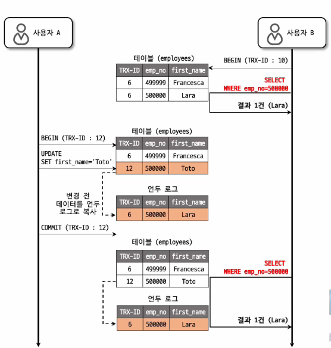

* SELECT .. FOR [UPDATE | SHARE ]
  * 격리 수준과 무관하게 항상 select 시점의 최신 커밋 데이터 조회  
  * 단순 SELECT와 다른 결과 반환 가능함  
  
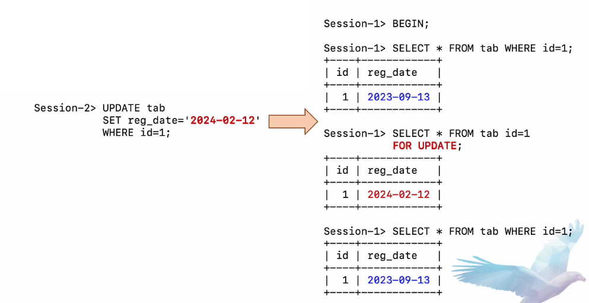

* SELECT ... FOR SHARE = S-lock
  * 부모 테이블의 레코드 삭제 방지
  * 부모 테이블의 SELECT와 자식 테이블의 INSERT 시점 사이에, 부모 삭제 방지 

```sql
BEGIN;
SELECT * FROM article WHERE article_id = 'A' FOR SHARE;

/* 부모 테이블인 article 확인 후, 자식 테이블인 comment 테이블의 레코드 INSERT */
if(article.canAddComment()){
    INSERT INTO comment (....) VALUES ('A', ...);
    COMMIT;
}else{
   ROLLBACK; 
}
```
* 만약 SELECT ... FOR SHARE를 사용하지 않으면, SELECT * FROM article WHERE article_id = 'A' 직후 부모 테이블의 레코드가 삭제가능

* SELECT ... FOR SHARE = S-lock
* UPDATE & SELECT ... FOR UPDATE = X-lock
* SELECT ... FOR SHARE 이후 UPDATE & DELETE 필요한 경우 FOR SHARE 사용 자제 
  * Lock upgrade 필요 S-lock -> X-lock
  * Deadlock 가능성 높음

#### Lost Update Anomaly
* 아래의 경우, 계좌 잔액이 음수가 되는 문제 발생  
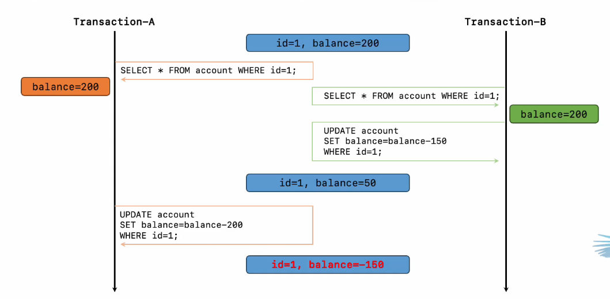    
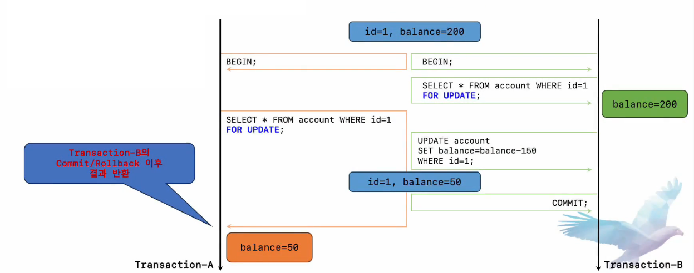


### Ep.08
### Generated 컬럼 & 함수 기반 인덱스
#### Generated column 이란?
* '표현식' 으로 정의된 컬럼
* 정의된 '표현식'에 따라 컬럼의 값이 자동으로 생성
  * '표현식' = 고정된 값, 함수 또는 다른 컬럼들에 대한 연산 조합 등이 해당
* 사용자가 직접 값을 입력하거나 변경할 수 없음
* 두 가지 종류가 존재
  * Virtual Generated Column
  * Stored Generated Column 

#### Generated Column 생성  
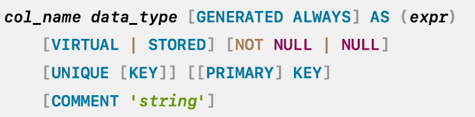  
     
```sql
ALTER TABLE test ADD COLUMN generated_column AS (col1 + col2) VIRTUAL;
```
* 기본적으로 VIRTUAL 타입으로 생성 & NULL 값 허용
* PRIMARY KEY로는 STORED 타입만 허용
* 하나의 테이블에서 가상 컬럼과 스토어드 컬럼 혼합해서 사용 가능

#### 가상 컬럼 (Virtual Generated Column)
```sql
CREATE TABLE tb_virtual_column(
    id int NOT NULL AUTO_INCREMENT,
    price int NOT NULL DEFAULT '0',
    quantity int NOT NULL DEFAULT '0',
    total_price int GENERATED ALWAYS AS (price * quantity) VIRTUAL,
    PRIMARY KEY (id),
    KEY ix_total_price (total_price)
)
```
* 컬럼의 값을 디스크에 저장하지 않음
* 컬럼의 값은 레코드가 읽히기 전 또는 BEFORE 트리거 실행 직후에 계산됨
* 인덱스 생성 가능
  * 인덱스 데이터는 디스크에 저장됨

#### 스토어드 컬럼 (Stored Generated Column)
```sql
CREATE TABLE tb_stored_column(
    id int NOT NULL AUTO_INCREMENT,
    price int NOT NULL DEFAULT '0',
    quantity int NOT NULL DEFAULT '0',
    total_price int GENERATED ALWAYS AS (price * quantity) STORED,
    PRIMARY KEY (id),
    KEY ix_total_price (total_price)
)
```
* 컬럼의 값을 디스크에 저장
* 컬럼의 값은 레코드가 INSERT 되거나 UPDATE 될 떄 계산되어 저장
* 인덱스 생성 가능

#### Generated Column DDL 작업
* ALTER 명령으로 ADD/MODIFY/CHANGE/DROP/RENAME 가능
* 일반 컬럼을 스토어드 커럼으로, 스토어드 컬럼을 일반 컬럼으로 변경 가능
  * 가상 컬럼은 일반 컬럼으로 전환 불가
* 스토어드 컬럼 <-> 가상 컬럼 간 변경 불가.
  * 새로 컬럼을 추가하고 삭제하는 방식으로만 전환 가능  


* 가상 컬럼 추가 또는 변경 시(ADD/CHANGE/MODIFY) 사용 가능한 유효성 검사 옵션
  * WITHOUT VALIDATION
    * 기본 설정
    * 기존 데이터 무결성 확인하지 않으며, 가능한 경우 in-place 방식으로 작업 수행
    * 계산된 값이 컬럼의 값 범위를 벗어날 수 있음 (경고 또는 에러 발생 가능)
  * WITH VALIDATION
    * 테이블 데이터 복사 수행
    * 작업 중 DML 유입 시 잠금 대기 (메타데이터 락 대기 ) 발생
    * 작업 시 계산된 값이 컬럼의 값 범위를 벗어나는 경우 명령문 실패

* 유효성 검사 예제
```sql
CREATE TABLE t1(
    id int NOT NULL AUTO_INCREMENT,
    col1 varchar(10) DEFAULT NULL,
    col2 int DEFAULT NULL,
    PRIMARY KEY (id)
);
```

```sql
mysql > SELECT *
        FROM t1;
+----+------+------+
| id | col1 | col2 |
+----+------+------+
| 1  | abcd | 1234 |
+----+------+------+

mysql > ALTER TABLE t1
        ADD COLUMN v_col int AS (CAST(CONCAT(col1, col2) AS UNSIGNED )) VIRTUAL,
        WITHOUT VALIDATION;
Query OK, 0 rows affected (0.01 sec)
# WITHOUT VALIDATION 입력시 문제 없이 적용
mysql > SELECT * 
        FROM t1;
+----+------+------+-------+
| id | col1 | col2 | v_col |
+----+------+------+-------+
| 1  | abcd | 1234 | 0     |
+----+------+------+-------+
```

```sql
mysql > ALTER TABLE t1
        ADD COLUMN v_col int AS (CAST(CONCAT(col1, col2) AS UNSIGNED )) VIRTUAL,
        WITH VALIDATION;
ERROR 1292 (22007): Truncated incorrect INTEGER value: 'abcd1234'
```


#### 인덱스 사용
* 일반 컬럼과 동일하게 쿼리에서 인덱스 사용 가능
* 쿼리에 Generated 컬럼명 대신 표현식을 사용해도 인덱스 사용 가능
* 대신 표현식은 컬럼에 정의된 표현식과 완전히 일치해야 함
  * 컬럼에는 (col1 + 1)로 정의했으나, 쿼리에서 (col1 + 2)로 사용 시 인덱스 사용 불가
* 또한 주어진 조건값과 컬럼 타입도 동일해야 함
* =, <, <=,>,>=, BETWEEN, IN 연상자 사용 시 이러한 최적화가 적용됨
* Generated 컬럼명을 조건절에 사용
```sql
CREATE TABLE product(
    id int NOT NULL AUTO_INCREMENT,
    price int NOT NULL DEFAULT '0',
    quantity int NOT NULL DEFAULT '0',
    total_price int GENERATED ALWAYS AS (price * quantity) VIRTUAL ,
    PRIMARY KEY (id),
    KEY ix_total_price (total_price)
)

mysql > EXPLAIN SELECT * FROM product WHERE total_price >= 30000 AND total_price < 50000;
+----+-------------+---------+------+----------------+---------+------+------+-------------+
| id | select_type | table   | type |  key           | key_len | ref  | rows | Extra       |
+----+-------------+---------+------+----------------+---------+------+------+-------------+
| 1  | SIMPLE      | product | range| ix_total_price | 5       | NULL| 3057 | Using where |
```
* 표현식을 조건절에 사용
```sql
mysql > EXPLAIN SELECT * FROM product WHERE price * quantity >= 30000 AND price * quantity < 50000;
+----+-------------+---------+------+----------------+---------+------+------+-------------+
| id | select_type | table   | type |  key           | key_len | ref  | rows | Extra       |
+----+-------------+---------+------+----------------+---------+------+------+-------------+
| 1  | SIMPLE      | product | range| ix_total_price | 5       | NULL| 3057 | Using where |

```
* Generated 컬럼의 표현식과 완전히 동일한 형태 & 타입이여야 인덱스 사용 가능

#### 제한 사항
* 표현식에 아래 항목들은 사용 불가
  * 비결정적 함수, 스토어드 프로그램, 변수
  * 서브 쿼리
* INSERT/UPDATE시 Generated 컬럼에 직접 값을 지정할 수 없으며, 지정할 수 있는 값은 DEFAULT 만 가능
* 트리거에서 NEW.col_name이나 OLD.col_name으로 Generated 컬럼을 참조 가능


#### Function Based Index
* 일반 인덱스는 컬럼 또는 컬럼의 Prefix만 인덱싱 가능
  * CREATE INDEX ix_col1 ON tab (col1);
  * CREATE INDEX ix_col20 ON tab (col(20));
* 함수 기반 인덱스는 "표현식"을 인덱싱 값으로 사용 가능
  * CREATE INDEX f_index on tab ((col1+col2), (col1 * col2));
  * CREATE INDEX f_index on tab (DATE(col1));
* 쿼리의 조건절에서 컬럼을 가공하는 경우에 유용하게 사용 가능
  * 사용하는 쿼리 -> SELECT * FROM tab WHERE (col1 + col2) > 10;
  * 쿼리를 위한 인덱스 -> CREATE INDEX f_index on tab ((col1 + col2));

#### 동작 방식
* Virtual Generated Column을 자동 생성 후 인덱싱
  * 자동 생성된 Virtual 컬럼은 일반적인 환경에서는 확인 불가.
  * 가상 컬럼의 이름은 '!hidden!index_name!key_part!counter' 형태로 지정되며, 타입도 자동 지정됨.

```sql
mysql > CREATE TABLE tb1 (col1 int, KEY ix_test ( (abs(col1))));

mysql > SET SESSION  debud="+d,show_hidden_columns";

mysql > SHOW CREATE TABLE tb1;

CREATE TABLE `tb1` (
    `col1` int DEFAULT NULL,
    `!hidden!ix_test!0!0` int GENERATED ALWAYS AS (abs(`col1`)) VIRTUAL,
    KEY `ix_test` ((abs(`col1`))
) ENGINE=InnoDB DEFAULT CHARSET=utf8mb4 COLLATE=utf8mb4_0900_ai_ci
```

#### Function Based Index 사용 방법
* 각각의 표현식은 반드시 괄호로 묶어서 명시
  * CREATE INDEX ix_test ON tb1 ((abs(col1)), (col1 * col2));
* 일반 컬럼과 함께 복합 인덱스로도 구성 가능
  * CREATE INDEX ix_test ON tb1 (col1, (abs(col2)), (col1 * col2));
* 표현식 값에 대해 ASC & DESC 지정 가능
* UNIQUE 설정 가능

#### 활용 예시
* 문자열 값의 특정 부분에 대해서 조회
```sql
CREATE INDEX ix_email_domain on users (( SUBSTRING_INDEX(email, '@', -1)));

CREATE INDEX ix_address_depth2 on stores (( SUBSTRING_INDEX(address, ' ', 2), ' ', -1));
```

* 일/월/연도 별 조회
```sql
CREATE INDEX ix_createdat_day ON evnets ((DAY(created_at)));
CREATE INDEX ix_createdat_month ON evnets ((MONTH(created_at)));
CREATE INDEX ix_createdat_year ON evnets ((YEAR(created_at)));
```

* 대소문자 구분 없이 문자열 검색
```sql
CREATE INDEX ix_title on books ((LOWER(title)));
```

* 계산된 값 조회 
```sql
CREATE INDEX ix_discounted_price on products ((price * (1 - discount_rate)));
```

* 해싱된 값 조회 
```sql
CREATE INDEX ix_hashed_id on users ((MD5(id)));
```


#### 주의사항
* 인덱스 생성 후 실행 계획을 반드시 확인
  * 표현식을 정확하게 동일한 형태로 명시해야 인덱스 사용가능
* 표현식 결과의 데이터 타입을 명확하게 확인해서 조건값 지정 
  * mysql --column-type-info 옵션 사용
* 기본적으로 일반 인덱스보다 추가적인 계산 비용이 발생
  * 변경이 잦은 컬럼 & 복잡한 표현식 사용 시 오버헤드가 커질 수 있음.

#### 제한 사항
* 표현식에 비결정적(Non-deterministic) 함수 사용 불가
* 일반 컬럼 및 Prefix 길이 지정된 컬럼은 키 값으로 지정 불가.
  * 괄호 없이 사용하거나, SUBSTRING 또는 CAST 함수를 사용
* 공간 인덱스나 전문검색 인덱스는 지원하지 않음
* Primary Key에 표현식은 포함 불가

### Ep.09
### Error Handling
#### MySQL 에러 구분
* Global Error
  * Server-side & Client-side에서 공용으로 발생
* Server Error
  * Server-side에서만 발생
* Client Error
  * Client-side에서만 발생

* 일부 Server Error는 Client-side로 전달
  * Client-side에서 보여지는 에러는 Client 또는 Server Error일 수 있음
  * Client Error
```shell
  mysql -h no-such-host -u root
    ERROR 2005 (HY000): Unknown MySQL server host 'no-such-host' (0)
```
  * Server Error
```shell
  mysql > select * from no_such_table;
  ERROR 1146 (42S02): Table 'test.no_such_table' doesn't exist
```


#### MySQL 에러 포멧
```shell
mysql > INSERT INTO user ....
ERROR 1062 (23000): Duplicate entry 'abc...' for key 'PRIMARY'
``` 

* 3개 파트로 구성
  * Error No
  * SQLState
  * Error Message

#### Error No
* 4자리 정수 -> 6자리 정수를 이용한 문자값도 추가
* 에러 번호의 구분
  * 1 ~ 999 : MySQL Global 에러
  * 1000 ~ 1999 : MySQL Server 에러
  * 2000 ~ 2999 : MySQL Client(or connector) 에러
  * 3000 ~  : MySQL Server 에러
  * MY-010000 ~ : MySQL Server 에러
* 3500 이후 대역과 MY-010000 이후 대역
  * MySQL 8.0 이후부터 사용
* MySQL의 스토리지 엔진에 종속적인 경우가 많다

#### SQLState
* 5글자 영문 숫자로 구성
* ANSI-SQL에서 제정한 Vendor 비 의존적 에러 코드
* SQL-STATE는 두 파트로 구분
  * 앞 두글자: 상태값 분류
    * 00 : 정상
    * 01 : 경고
    * 02 : 레코드 없음
    * HY : ANSI-SQL에서 아직 표준 분류를 하지 않은 상태 ( 벤더 의존적 상태 값 )
    * 나머지는 모두 에러
  * 뒤 세 글자 : 주로 숫자 값이며, 각 분류별 상세 에러 코드 값

#### Error Message
* 사람이 인식할 수 있는 문자열
* MySQL 서버 버전별로 다른 에러 메시지가 존재
* 버전과 스토리지 엔진에 종속적인 경우 많음
* 메시지를 에러 처리용으로 사용 비추


### Ep.10
### Left Join 주의사항 & 튜닝
#### 대표적으로 사용되는 JOIN 종류   
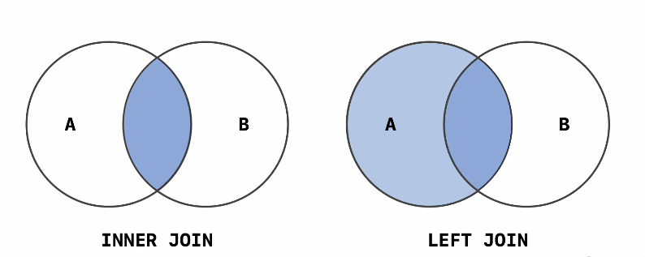


#### Left Join 예시 
```sql
CREATE TABLE user (
    id int NOT NULL AUTO_INCREMENT,
    name varchar(50) NOT NULL,
  ....
    PRIMARY KEY (id)
);

CREATE TABLE user_coupon(
    user_id int NOT NULL,
    coupon_id int NOT NULL,
  ...
    PRIMARY KEY (user_id, coupon_id)
    KEY ix_coupon_id (coupon_id)
);
```

* 전체 유저 목록을 조회하는데, 3번 쿠폰을 가진 유저들에 대해서는 쿠폰 사용 여부를 같이 조회하는 경우

```sql
SELECT u.id, u.name, uc.coupon_id, uc.use_yn
FROM user u
LEFT JOIN user_coupon uc ON u.id = uc.user_id AND uc.coupon_id = 3;
```

#### LEFT JOIN 예시
| 테이블 명       | COUNT                                                                                       |
|-------------|---------------------------------------------------------------------------------------------|
| user        | 30,000 rows                                                                                 | 
| user_coupon | 3,000 rows<br/> ( coupon_id = 1 : 1000)<br/>( coupon_id = 2 : 1000) <br/>( coupon_id = 3 : 1000) |

```sql
SELECT u.id, u.name, uc.coupon_id, uc.use_yn
FROM user u
LEFT JOIN user_coupon uc ON u.id = uc.user_id AND uc.coupon_id = 3;
-> 30000 rows in set (0.04 sec)
```

```sql
SELECT u.id, u.name, uc.coupon_id, uc.use_yn
FROM user u
LEFT JOIN user_coupon uc ON u.id = uc.user_id 
WHERE uc.coupon_id = 3;
-> 10000 rows in set (0.04 sec)
```

```sql
EXPLAIN SELECT u.id, u.name, uc.coupon_id, uc.use_yn
FROM user u
LEFT JOIN user_coupon uc ON u.id = uc.user_id AND uc.coupon_id = 3;

+----+-------+--------+----------------------+-----------+---------+----------------+------+-------------+
| id | table | type   | possible_keys        | key       | key_len | ref            | rows | Extra       |
+----+-------+--------+----------------------+-----------+---------+----------------+------+-------------+
| 1  | u     | ALL    | PRIMARY              | NULL      | NULL    | NULL           | 29372| NULL        |
| 1  | uc    | eq_ref | PRIMARY,ix_coupon_id | PRIMARY   | 8       | test.uc.id,const| 1    | NULL        |
```

```sql
EXPLAIN SELECT u.id, u.name, uc.coupon_id, uc.use_yn
FROM user u
LEFT JOIN user_coupon uc ON u.id = uc.user_id and uc.coupon_id = 3;

+----+-------+--------+----------------------+-----------+---------+----------------+------+-------------+
| id | table | type   | possible_keys        | key       | key_len | ref            | rows | Extra       |
+----+-------+--------+----------------------+-----------+---------+----------------+------+-------------+
| 1  | uc    | ref    | PRIMARY,ix_coupon_id | ix_couponid| 4       | const           | 1000 | NULL        |
| 1  | u     | eq_ref | PRIMARY              | PRIMARY    | 4       | test.uc.user_id | 1    | NULL        |

```

* LEFT JOIN시 실제 기준이 되는 왼쪽에 위치한 드라이빙 테이블을 항상 먼저 읽는 반면 INNER JOIN은 JOIN에 참여하는 테이블들의 교잡합 데이터를 결과로 반환


#### COUNT(*) with LEFT JOIN
* LEFT JOIN을 하지 않아도 결과가 동일한 경우에는, 불필요한 LEFT JOIN은 제거해서 사용

```sql
SELECT COUNT(*)
FROM user u
LEFT JOIN user_coupon uc ON u.id = uc.user_id AND uc.coupon_id = 3;

+-----------+
| COUNT(*)  |
+-----------+
| 1000      |
```

```sql
SELECT COUNT(*)
FROM user u

+-----------+
| COUNT(*)  |
+-----------+
| 1000      |
```


#### LEFR JOIN 정리
* LEFT JOIN을 사용하고자 한다면 Driven Table(Inner Table)컬럼의 조건 (조인 조건)은 반드시 ON절에 명시해서 사용(IS NULL 조건은 예외)
* LEFT JOIN과 INNER JOIN은 결과 데이터 및 쿼리 처리 방식 등이 매우 다르므로, 필요에 맞게 올바르게 사용하는 것이 중요
* LEFT JOIN쿼리에서 COUNT를 사용하는 경우 LEFT JOIN이 굳이 필요하지 않다면 JOIN은 제거 


### Ep.11
### Prepared Statement 
#### Prepared Statement??

* Binding Query
```java
var pstmt = connection.prepareStatement("SELECT * FROM user WHERE id = ?");
pstmt.setInt(1, 1234);
var re = pstmt.executeQuery(); 
```
* 장점
  * SQL Injection 방지
  * 쿼리 파싱 비용 감소 (2번째 이후 실행)
* 단점
  * 메모리 사용량 증가
  * 2번의 Network round-trip 필요 ( 첫번째 실헹 )
  * Execution-plan은 캐시되지 않음, Parse-Tree만 캐시됨
  * 캐시된 Prepared Statement는 Connection내에서만 공유됨

#### PreparedStatement의 비밀
* MySQL의 Prepared Statement
  * Client side PreparedStatement
  * Server side PreparedStatement
  * 모두 SQL-Injection은 막을 수 있음 ( PreparedStatement만 사용한다면 )
* JDBC Server-side PreparedStatement는
  * useServerPrepStmts=true 경우에만 작동
  * useServerPrepStmts=false (기본값)
  * ORM에서는 TRUE로 기본 설정되는 경우 많음

#### PreparedStatement 실익
* 케이스 1
```java
for(int idx = 0; idx<100; idx++){
  PreparedSZtatement pstmt = conn.prepareStatement("SELECT ... WHERE id = ?");
    pstmt.setInt(1, targetUserIds[idx]);
    pstmt.executeQuery();
    ...
}
```
* 케이스 2
```java
PreparedStatement pstmt = conn.prepareStatement("SELECT ... WHERE id = ?");
for(int idx = 0; idx<100; idx++){
    pstmt.setInt(1, targetUserIds[idx]);
    pstmt.executeQuery();
    ...
}
```

* 케이스 1번은 루프를 돌때마다 새로운 PreparedStatement를 생성 -> 매번 쿼리를 파싱해서 메모리에 케시함 하지만 재사용이 발생하지 않음

#### PreparedStatement vs Connection pool
* MySQL 서버의 PreparedStatment는 
  * 하나의 Connection 내에서만 공유됨
  * Re-parsing 비용 최소화
    * 모든 PreparedStatement는 Connection 단위로 캐시되어야 함
    * 전체 커넥션이 5000개이고, 필요한 쿼리 패턴이 100개인 경우
      * 500,000개의 ps객체가 MySQL 서버에 저장되어야 함 (max_prepared_stmt_count=16382)
* 쿼리의 복잡도에 따라서
  * 매우 복잡하면 PreparedStatement가 도움
  * 단순하면 PreparedStatement의 장점이 경감
* 메모리 사용량 vs CPU 사용량
  * AWS RDS는 매우 소규모 서버들 사용
  * 일반적으로 메모리 적음
  * 오히려 PreparedStatement의 parseTree를 캐시하는것 보다 innoDB Buffer Pool을 늘리는 것이 더 효율적일 수 있음


<br>

* MySQL 서버에서는
  * server-side PreparedStatement가 부작용이 심한 경우 많음
  * client-side PreparedStatement를 권장

* Server-side PreparedStatement
  * 예상하는 것처럼 성능을 크게 높여주진 않음
  * 반면 메모리 꽤 많이 소비하게 됨(가끔 OOM 유발)
  * Max_prepared_stmt_count 부족시, 쿼리 파싱 겸감 효과 떨어짐


### Ep.12
### SQL 문장의 가독성 향상
#### 가독성의 중요성
* 작성 의도를 보다 쉽게 이해할 수 있음
* 커뮤니케이션 비용 감소, 업무 효율 향상
* 문제 원인을 빠르게 찾을 수 있으며, 실수 감소
* 유지보수에도 용이

#### DISTINCT를 함수처럼 사용하는 형태 지양
* DISTINCT는 함수가 아니며 괄호와 함께 사용한다고 하더라도 그렇지 않은 경우와 결과가 동일함
* 괄호 사용시 오해의 여지가 있으므로 괄호 없는 형태로 사용하는 것을 권고

```sql
SELECT DISTINCT (col1), col2 
FROM tab;

```
```sql
SELECT DISTINCT col1, col2 
FROM tab;
```

#### LEFT JOIN 사용 방법 준수
* LEFT JOIN 사용시 드리븐 테이블 (조인 대상 테이블)에 대한 조건을 WHERE 정에 명시하는 경우 INNER JOIN을 사용한 것과 동일한 결과가 출력됨
* LEFT JOIN 사용 시에는 드리븐 테이블에 대한 조건은 ON절에 명시
* LEFT JOIN은 필요한 경우에만 사용
  * 1:1 관계로 LEFT JOIN하면서 드라이빙 테이블에 속해있는 컬럼들만 SELECT 하거나, COUNT 쿼리를 실행하는 경우 등에서 LEFT JOIN 제거

#### ORDER BY절 없이 LIMIT n,m 문법 사용 지양
* 쿼리에서 ORDER BY절 없이 LIMIT이 사용되는 경우 어떤 의도로 작성된 건지 파악 어려움
* 불필요한 LIMIT이라면 제거하거나, 만약 페이지네이션 처리를 위한 것이라면 반드시 ORDER BY 절을 명시해서 사용

#### FULL GROUP BY 형태로 사용
* SELECT .... GROUP BY 쿼리에서 GROUP BY절에 명시되지 안흔 컬럼을 SELECT 절에서 참조하는 경우 의도에 맞게 집계 함수를 반드시 사용, 또는 불필요한 컬럼인 경우에는 제거 
* ANY_VALUE()를 사용해서 랜덤값을 가져올 수도 있음
```sql
# X
SELECT col1, col2, COUNT(*)
FROM tab
GROUP BY col1;
```
```sql
# O
SELECT col1, SUM(col2), COUNT(*)
FROM tab
GROUP BY col1;
```

#### AND/OR 조건 함께 사용 시 반드시 괄호 명시
* SQL 에서 AND 연산자는 OR 연산자보다 우선 순위가 높아서, 괄호가 없는 경우 AND연산자를 우선해서 처리

```sql
SELECT 1 OR 0 AND 0;
=> 1
```
```sql
SELECT (1 OR 0) AND 0;
=> 0
```
```sql
SELECT 1 OR (0 AND 0);
=> 1
```
* 가독성을 위해 AND/OR 조건을 쿼리에서 함꼐 사용하는 경우, 의도에 맞게 괄호를 반드시 명시해서 사용

#### 데이터 건수 조회는 COUNT(*) 사용
* 아래와 같은 형태는 모두 동일한 데이터 건수를 반환하게 됨
  * COUNT(*), COUNT(1), SUM(1)
  * COUNT(PK_COL), COUNT(NOT_NULL_COL)
* COUNT 함수의 인자로 특정 컬럼이나 1과 같은 상수값을 사용하는 경우, 쿼리의 가독성이 떨어지고 작성자의 의도를 명확하게 알기 어려움
* 전체 건수가 필요한 경우, COUNT(*)를 사용하는 것을 권장


### Ep.13
### 콜레이션
#### 콜레이션(Collation)이란?
* 문자를 비교하거나 정렬할 떄 사용됭는 규칙
* 문자집합(Character Set)에 종속적
  * 문자와 코드값(코드 포인트)의 조합이 정의돼있는 것이 문자 집합
    * ex) "ㅁ=ㅕ+0041","ㅠ=ㅕ+0042","a=U+0061", "b=U+0062"
* MySQL에서 모든 문자열 타입 컬럼은 독립적인 문자집합과 콜레이션을 가질 수 있음
* 사용자가 특별히 지정하지 않는 경우, 서버에서 설정된 문자집합의 디폴트 콜레이션으로 자동 설정
* "SHOW COLLATION" 명령으로 사용 가능한 콜레이션 목록 확인 가능

#### 콜레이션의 종류
* MySQL에서의 콜레이션 네이밍 컨벤션 
* 문자집합_언어종속_UCA버전_민감도
* 문자집합
  * utf8, utf8mb4, latin1, euckr, cp1251, cp1256, ...
* 언어종속
  * 특정 언어에 대해 해당 언어에서 정의한 정렬 순서에 의해 정렬 및 비교를 수행 (다른 언어들에는 적용되지 않음)
  * locale code(ex "tr") 또는 language(ex "turkish")로 표현
    * utf8mb4_tr_0900_ai_ci 
* Unicode Collation Algorithm Version
  * utf8mb4_0900_ai_ci -> UCA 9.0.0
  * utf8mb4_unicode_520_ci -> UCA 5.2.0
  * utf8mb4_general_ci -> 커스텀 콜레이션
* 민감도
  * _ai = Accent Insensitive
  * _as = Accent Sensitive
  * _ci = Case Insensitive
  * _cs = Case Sensitive
  * _bin = Binary Collation
  * _ks = Kana Sensitive