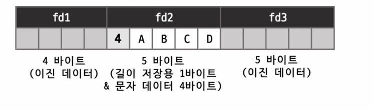

## Real MySQL

### Ep.01 
### CHAR vs VARCHAR

* 공통점
  * 문자열 저장용 컬럼
  * 최대 저장 가능 문자 길이 명시 (바이트 수 아님) ex) CHAR(10) -> 10글자 
    * CHAR(10) VARCHAR(10) 두 타입 모두 어떤 문자열 셋을 사용하는가에 따라 사용하는 저장 공간의 크기가 달라질 수 있음
    
* 차이점
  * 저장 방식
    * CHAR : 값의 실제 크기에 관계없이 설정된 고정된 공간 할당 여부 
    * VARCHAR : 저장되는 문자열 길이 만큼만 저장 공간 할당
  * 최대 저장 길이 : CHAR(255) vs VARCHAR(16383)
  * 저장된 값의 길이 관리 여부 (VARCHAR와 가변 길이 문자셋 사용하는 CHAR는 저장된 값 길이 관리)
  * CHAR도 UTF-8 MB4와 같이 가변길이 문자셋을 사용하면 컬럼에 저장된 값의 길이를 같이 관리 

#### CHAR vs VARCHAR (Latin1)

* CHAR(10)   

* VARCHAR(10)  

#### CHAR vs VARCHAR (UTF-8MB4)
* VARCHAR(10)
  * (문자당 바이트 수가 달라도) 문자 셋 관계없이, 꼭 필요한 만큼만 공간 사용
* CHAR(10)
  * 예약하는 공간 크기 달라짐 ( 가변길이 문자 셋인 경우, 길이 저장용 바이트 사용)  
  
  * UTF-8MB4 문자 셋을 사용하는 컬럼에서 한글 2글자의 경우, 바이트 수 기준으로 공백 4개 채움  
  
  * 4글자의 경우, CHAR(10) 컬럼에는 12 바이트를 사용하고, 미리 예약하는 빈 공백 공간 없음

### CHAR 타입의 공간 낭비
* 일반적으로 알고 있는 구분 기준
  * 고정된 길이의 값 저장은 CHAR 타입, 그 외의 경우 VARCHAR 타입

* CHAR 대신 VARCHAR를 사용하면?
  * 어떤 경우에는 CHAR 타입의 공간 낭비 심함
    * 저장되는 문자열의 최소 최대 길이 가변 폭이 큰 경우 
  * 하지만 그렇지 않은 경우도 있음
    * 저장되는 문자열의 최소 최대 길이 가변폭이 작은 경우 
  * 저장되는 값의 길이 변동이 크지 않다면 낭비는 크지 않음

### 컬럼 값의 길이 변경시 작동 방법
* VARCHAR(10) 레코드 INSERT ( ABCD )

* VARCHAR(10) 레코드 UPDATE ( ABCDE )  

  * 레코드의 길이가 변경되었기 때문에 원래 레코드가 저장되어있던 위치에 inplace update 불가능
  * MySQL server의 각 DataPage는 insert update delete 되면서 구조가 계속 변경됨 레코드를 저장할 수 있는 빈 공간을 찾는것이 어려워짐
  * 결국에는 레코드를 입력할 수 있는 빈 공간을 찾을 수 없게 되고 결국 page의 레코드들을 다시 정리하는 작업이 필요해짐
* 만약 해당 컬럼이 VARCHAR(10)이 아니라 CHAR(10)이면 
* MySQL server는 해당 컬럼의 크기만큼 빈 공간을 미리 확보해 두었기 떄문에 공간 낭비는 되었겠지만 위와 같이 데이터가 한 글자 더 늘어나는 형태로 업데이트가 실행되어도 레코드를 옮겨 쓰기 하는 작업이 필요 없음

 

* 이와 같이 MySQL server에서 CHAR 타입의 장점은 이렇게 레코드의 위치를 옮겨 적어야 하는 가능성을 낮춰 줄 수 있다. 
* 특시 저장되는 문자열의 가변 길이 폭이 좁고 자주 변경되는 컬럼의 경우 VARCHAR 보다 CHAR 타입을 사용하면 컬럼의 길이 변경시 data page 관리 작업을 최소화 하고 자연스럽게 페이지의 프레그멘테이션을 최소화 해줌

 

### 문자열 타입 선정
* VARCHAR 보다는 CHAR를 선택해야 하는 경우
  * 값의 가변 길이 범위 폭이 좁고 
  * 자주 변경되는 경우 (특히 인덱스된 컬럼인 경우)
* 위 같은 경우 VARCHAR 사용시
  * 데이터 페이지 내부의 조각화 현상 커짐
  * CHAR 타입보다 공간 효율 떨어짐
  * 내부적으로 빈번한 page reorganization 작업 필요
