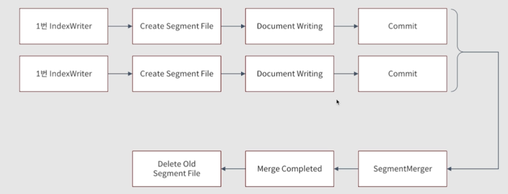
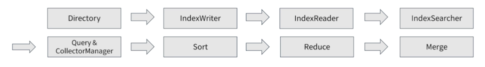
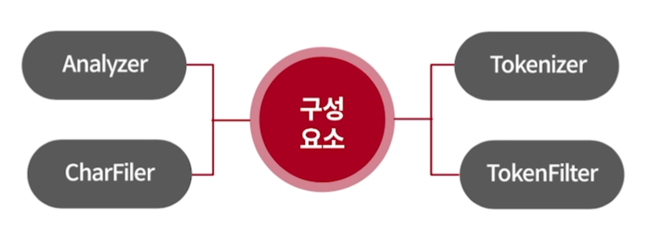
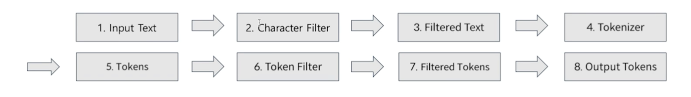

## ElasticSearch
### 역색인 파일(Inverted Index Structure)
* 인덱스를 색인어 기반의 검색을 생성 하기 위해 색인어에 대한 통계를 저장하는 구조  
즉, 용어에 대해서 문서를 나열 하는 구조가 역인덱스 라고 하는 인덱스 계열

<br />  

### 색인이란?
* IndexWriter가 index File 들을 생성 하는 과정
* 수정이 불가능한 Immutable Type
* 여러개로 생성된 Segments파일들을 Merge라는 작업을 통해 하나의 색인 파일로 만드는 과정 필요
* 하나의 Index는 하나의 IndexWriter로 구성
  

<br />  

### 색인 시 알아야 하는 정보
* Index File Formats
* Index Writer
* Index File Formats은 Segment File이라고도 함
* Segment File은 여러 index File 유형중 하나.
* 색인 파일에는 문서의 Field Data, Term, Frequencies, Position, Deleted Documents등과 같은 정보가 저장되고 색인과 검색 시 확용


<br />  

### 검색이란?
* IndexWriter 색인후, IndexSearchㅗ 검색하는 과정
* IndexSearch는 IndexReader를 이용해서 검색 수행을 하게 된다.  
즉, 하나의 index에는 Segment별로 N개의 LeafReader가 존재함.  



<br />  

### 형태소 분석이란?
* 입력 받은 문자열에서 검색 가능한 정보 구조로 분석 및 분해 하는 과정
* Analyzer는 형태소 분석을 위한 최상위 클래스 이며, 하나의 Tokenizer와 다수의 Filter로 구성이 됩니다.
  
* 아래 과정에서 6번의 Token Filter는 정의 된 순서에 맞춰 적용 되기 떄문에 적용 시 순서가 중요 하다.
* 루씬에서 제공 하고 있는 한글 처리를 위한 Analyzer는 CJK와 Nori Analyzer가 존재 한다.  



<br />  

### ElastciSearch와 RDBMS 비교  

|         DBMS         |      ElasticSearch       |
|:--------------------:|:------------------------:|
| DBMS HA 구성(MMM,M/S)  |         Cluster          |
|    DBMS Instance     |           Node           |
|        Table         |          Index           |
|      Partition       |     shard / Routing      |
|         Row          |         Document         |
|        Column        |          Field           |
| Row of Columnar data | Serialized JSON document |   

### 주요 Setting
* path Setting - 인덱스 데이터와 로그 데이터에 대한 저장소 설정
  * path.data: 데이터 저장 경로 array로 설정가능
  * path.logs: 로그 저장 경로
* cluster.name
* node.name
* network.host
* discovery setting 
  * discovery.seed_hosts : 클러스터링 해야하는 노드 리스트 등록 
  * cluster.initial_master_nodes : 클러스터링 초기 마스터 노드 설정
* jvm.options.setting 
  * Heap Size 설정
    * System 리소스의 50%로 설정
    * 31GB가 넘어가지 않도록 구성
    * 설정은 환경변수로 set하거나 jvm.options 파일에 설정 (ES_JAVA_OPTS)
 

### Analysis
* 구조화 되지 않은 텍스트를 검색에 최적화 된 구조의 형식으로 변환 하는 과정

### Text Analysis
* full text검색을 수행 하게 되며, Exact matching이 아니기 때문에 관련된 모든 결과를 반환  
* full text 검색 수행을 위한 분석 과정
  * Tokenization - 텍스트를 토큰이라는 작은 단위로 분할 하는 것 -> 분할 된 토큰은 개별 단어를 의미
  * Normalization - 문자에 대한 변형과 필터를 적용 하는 것(토큰을 표준향식으로 정규화) - 대소문자 적용 / 동의어 처리 / 불용어 제거 등의 작업

### Analyzer
* text를 검색엔진에서 검색 가능한 구조화 된 형식으로 만들어 주는 것
* Analyzer의 구성항목
  * Character Filter 
    * 원본 텍스트에서 불필요한 문자들을 제거 / 추가 / 변경등  
      * 원본 텍스트를 변형해서 Tokenizer로 전달 하여 token 추출되도록 함.
  * Tokenizer - 텍스트를 토큰으로 분할 하는 작업
    * 문자 스트림을 수신 해서 개별 토큰으로 나누고 나눠진 토큰 스트림을 출력
    * 나눠진 토큰의 순서, position, 단어의 시작과 끝의 문자 offset정보를 기록 ( 기록된 정보는 term vector정보로 사용)
  * Token Filter 
    * Tokenizer에서 넘겨 준 토큰 스트림을 받아서 토큰을 제거 / 추가 / 변경
    * 토큰을 소문자로 변환, 불용어 제거, 동의어 추가 등의 작업 수행.
    * `선언 된 순서대로 적용 되며`, 0개 이상 사용가능

### _analyze API 구조
* sample 
```json
GET /_analyze
{
  "analyzer": "standard",
  "text": "2 guys walk into a bar"
}
```

### _analyze API Parameters
* analyzer - 사용할 analyzer 지정
* char_filter - tokenizer로 전달 하기 이전에 입력 된 text를 전처리 하기 위한 filter를 설정(array)
* explain - 기본 false이며, 분석 결과에 대한 상세 정보를 포함하도록 함.
* field - field에 정의 된 analyzer를 사용해서 분석하도록 함.
* filter - tokenizer이 후에 사용할 filter 설정 (array)
* normalizer - analyzer와 유사 하지만, 단일 토큰으로 분석 결과를 만들어 낸다는 차이점이 있음  
 tokenizer를 사용 하지 않음  
 모든 filter적용이 가능 한 것이 아닌 문자 단위로 동작하는 필터만 사용 가능
* text - 형태소 분석할 대상 text (array or string)
* tokenizer - text를 토큰으로 분할 하는 작업을 수행 할 tokenizer 설정