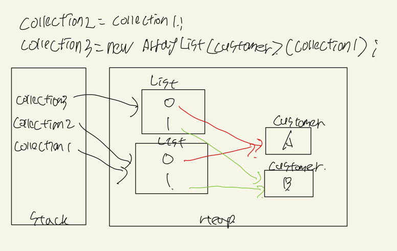

## Escaping References

```java
public class CustomerRecords {
    private Map<String, Customer> records;
    
    public void addCustomer(Customer c) {
        this.records.put(c.getName(), c);
    }
    
    public Map<String, Customer> getCustomers() {
        return this.records;
    }
}
```

```java
public class Customer {

    private String name;

    public String getName() {
        return name;
    }
    
    public void setName(String name) {
        this.name = name;
    }
  
    public Customer(String name) {
        this.name = name;
    }
}
```
* In the above sample code has a problem with getCoustomers method  
  getCustomers method returns a reference to the records map,
  which means that the calling code now obtains a reference to the records map and it can do anything with it
  for example, we could write code that looks like below

```java
CustomerRecords records = new CustomerRecords();

Map<String, Customer> customerMap = records.getCustomers();

customerMap.clear();
```
* The getCustomers method returns a reference to the records map,
  which means that I can call clear method on the map and remove all the customers from the records map

* the reference to the records map has escaped from the class in which it should have been encapsulated  
  it's almost as though we've declared this map as a public variable, have violated the principle of encapsulation


```java
public class CustomerRecords {
  ...
    
    public Map<String, Customer> getCustomers() {
        return new HashMap<>(this.records);
    }
}
```  
* The above code returns a new HashMap object that is a copy of the records map
  so that it won't affect the records map itself



* let's now have a look at the performance impact of this solution
* firstly, what we're doing is creating a new collection in memory so there is certainly going to be some overhead of retrieving the collection,  
  both the time taken to copy the references from the original collection into our copy and memory usage that out new copy is going to need
* but actually, this is going to have a pretty minimal impact 
  because when we take a copy of the collection, jvm doesn't copy the objects, but rather the pointers to the objects, so the size of the data that copied is pretty small,
  and the collection that we created by `getCustomers` method to return as a result of calling, so it is going to be relatively short-lived in other words  
  the memory space that is going to be used up from this collection is going to be freed up pretty quickly
  when we come on to talk about garbage collection, we'll see that the jvm is pretty good at cleaning up short-lived objects


```java
public class CustomerRecords {
  ...
    
    public Map<String, Customer> getCustomers() {
        return Map.copyOf(this.records);
    }
}
```  

* let's try to provide a read only copy of the Customer object

```java
interface ReadonlyCustomer {
    String getName();
}
```  

```java
public class Customer implements ReadonlyCustomer {

    private String name;

    @Override
    public String getName() {
        return name;
    }
    
    public void setName(String name) {
        this.name = name;
    }
  
    public Customer(String name) {
        this.name = name;
    }
    public Customer(Customer customer) {
        this.name = customer.getName();
    }
}
```     

```java
public class CustomerRecords {
    private Map<String, Customer> records;
    
    public void addCustomer(Customer c) {
        this.records.put(c.getName(), c);
    }
    
    public Map<String, Customer> getCustomers() {
        return this.records;
    }
    
    public ReadonlyCustomer find(String name) {
        return new Customer(this.records.get(name));
    }
}
```