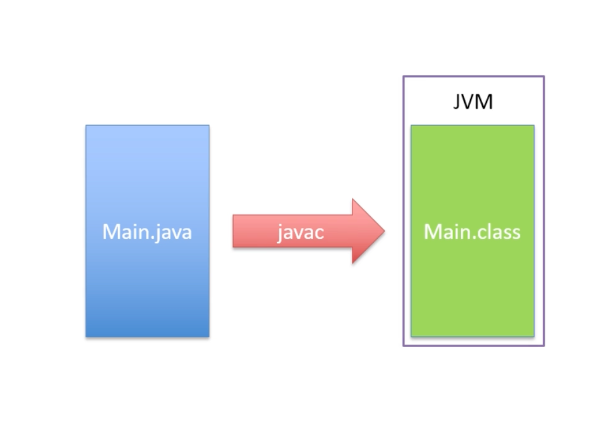
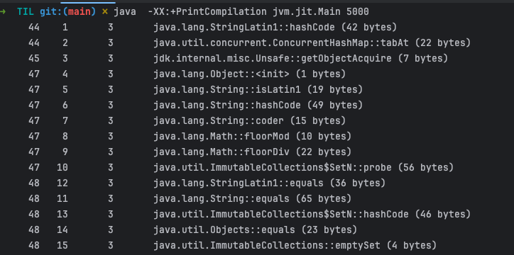
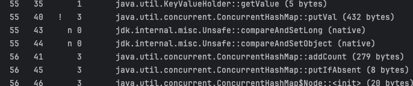
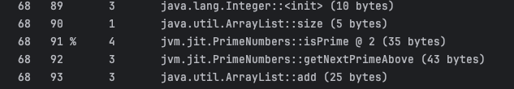
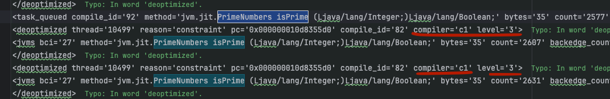
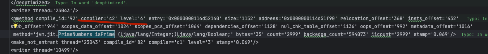
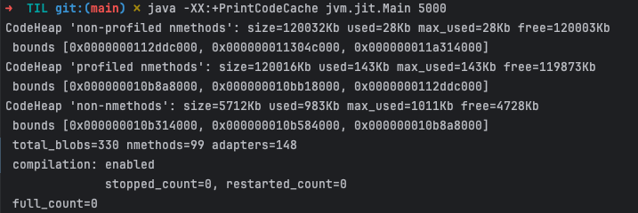
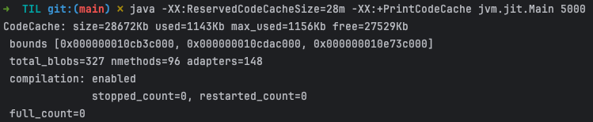
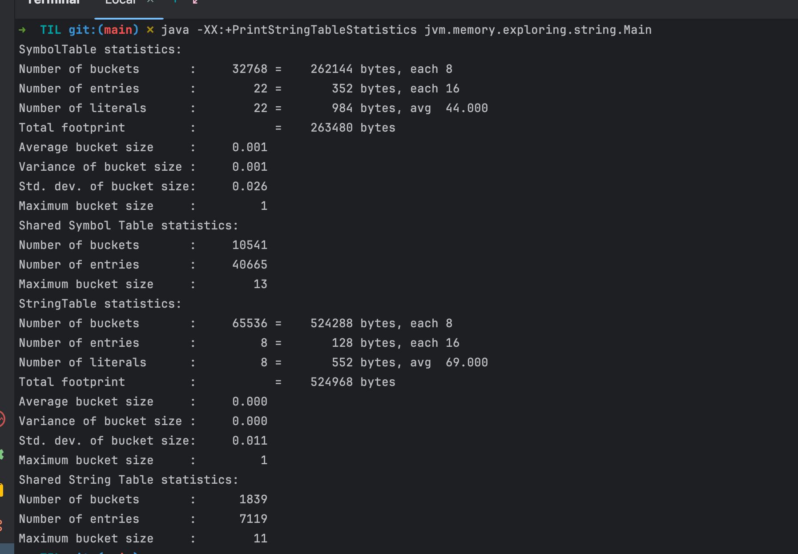
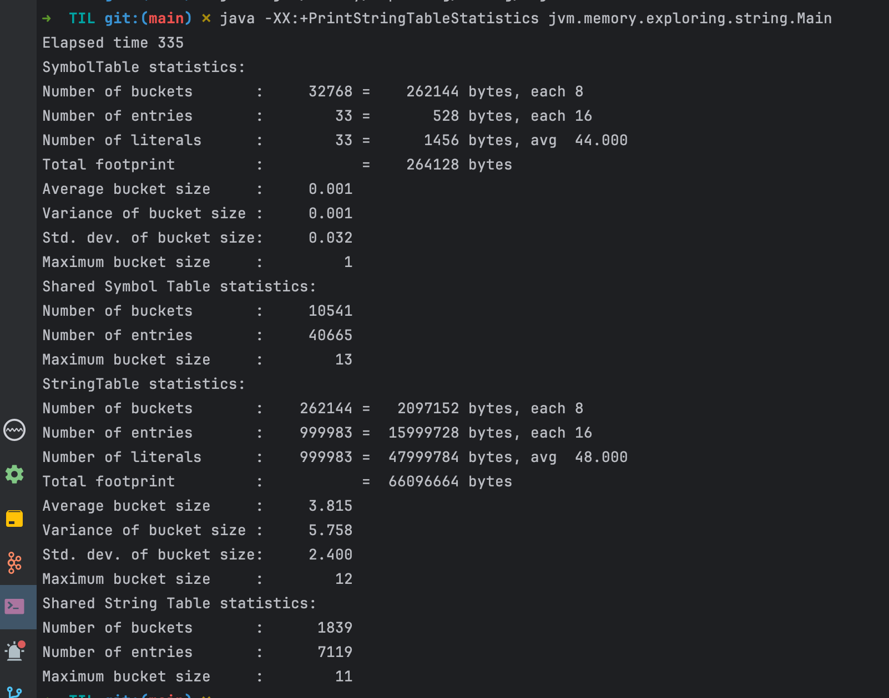

## What happens inside the JVM
* the code we write is compiled into bytecode by the java compiler
* then the bytecode is executed by the JVM




<br />   

* Often think the virtual machine is interpreting the bytecode,   
 but it contains a number of features and complex algorithms to make it more efficient than that.


<br />   

* Like C, which would be complied to native machine code,  
  which means the code is complied into a runnable format that te operating system can comprehend directly.  
  It doesn't need to be interpreted by another program.  
  This makes it quick to run compared to interpreted languages.


<br />   

* To help get around this problem of slower execution in interpreted languages then complied languages like c  
  the JVM has a feature called Just-In-Time (JIT) compilation.


<br />   

* The JVM will monitor which branches of code are run the most often, which methods or parts of methods.  
  specifically loops are executed the most often, and then the JVM can decide,  
  for example that a particular method should be compiled into native machine code.  
  So at this point, some of our application is being run in interpreted mode as bytecode,  
  and some is no longer bytecode but is running as complied native machine code.  
  Just to be clear, then by native machine code, we mean the code that the operating system can run directly.

<br />   

* The JVM is of course a multi-threaded applciation itself,  
  so the threads within the JVM responsible for running the code that is interpreting the bytecode and executing the bytecode  
  won't be affected by the threads that are running the JIT compilation.
  so the process of JIT compilation doesn't stop the application from running.
  while the compilation is taking place, The JVM will continue to use interpreted version but once,  
  that compilation is complete then the native machine code version is available to be used,  
  the JVM can switch to using that instead of the interpreted version.

<br />   


```java
public class Main {

    public static void main(String[] args) {
        PrimeNumbers primeNumbers = new PrimeNumbers();
        Integer max = Integer.parseInt(args[0]);
        primeNumbers.generateNumbers(max);
    }
}
```

```java
import java.util.ArrayList;
import java.util.List;

public class PrimeNumbers {

	private List<Integer> primes;
	
	private Boolean isPrime(Integer testNumber) {
		for (int i = 2; i < testNumber; i++) {
			if (testNumber % i == 0) return false;
		}
		return true;
	}
	
	private Integer getNextPrimeAbove(Integer previous) {
		Integer testNumber = previous + 1;
		while (!isPrime(testNumber)) {
			testNumber++;
		}
		return testNumber;
	}
	
	public void generateNumbers (Integer max) {
		primes = new ArrayList<Integer>();
		primes.add(2);

		Integer next = 2;
		while (primes.size() <= max) {
			next = getNextPrimeAbove(next);
			primes.add(next);
		}
//		System.out.println(primes);
	}

}
```  
* run with java  -XX:+PrintCompilation Main 5000  

  
  


* The first column is the number of milliseconds since JVM started
* The second column is the order or code block was compiled
* The third column has few different value, 
  * N means native method
  * S means it's synchronized method
  * ! means there's some exception handling going on
  * % means that the code has bean natively compiled and is now running in a special part of memory called the code cache  
    that means the method is now running in the most optimal way possible.
* The fourth column has number from 0 to 4 and this tells us what kind of compiling has taken place
  * 0 means no compilation the code has just been interpreted
  * 1 to 4 mean that progressively deeper level of compilation has happened


<br />   

* There are actually two compilers built into the JVM called C1 and C2
  * C1 is able to do the first three levels of compilation level 1, 2, 3 each progressively more complex then the last one
  * C2 can to the fourth level of compilation 
* The JVM decides which level of compilation to apply to a particular code blocks based on how often it's run and how complex it is.  
  -> this called profiling the code  

` run the sample code with java  -XX:+UnlockDiagnosticVMOptions -XX:+LogComilation jvm.jit.Main 5000`




* So the JVM place the code into the code cache if it's going to be used a lot.  
  but the code cache has limited size and if there are lots of methods that could be saved in the code cache  
  then some will need to removed from the code cache to make space for the next one.  
  the removed ones could be recompiled and re-added later on

* if the code cache is full, we can see the following warning message appear in the console  
`VM warning: CodeCache is full. Compiler has been disabled.`  
* this tells us that the application would run better if another part of code could be compiled to native machine code  
  but there's no there's no space in the code cache to do that.
* we can find out the size of the code cache by using JVM flag which is `-XX:+PrintCodeCache`  



* we can change the code cache size with following three different flags
  * `InitialCodeCacheSize` - the size of the code cache when the application starts  
  * `ReservedCodeCacheSize`  - the maximum size of the code cache
  * `CodeCacheExpansionSize` - the amount by which the code cache will grow if it needs to expand  



* with `-XX:-TieredCompilation` we can turn off tiered compilation to tell the JVM to run in interpreted mode only  
  maybe an application that is running one line of code only, maybe like serverless application for example, that wil fire up  
  run a single statement and then shut down again could conceivably be quicker using interpreted mode only.

* there are two factors that can affect the performance of out application  
  the first is how many threads are available to run this compiling process  
  the second is what's the threshold for native compilation

` can change the number of threads for compilation with -XX:CICompilerCount={number of threads}`    

` can change the threshold for native compilation with -XX:CompileThreshold={number of threshold}`


### JVM Optimization

* Are objects always created on the heap?
  * We now know objects are stored on the heap,  
    but What if the object is not going to be shared, if it's needed just for one method, just within one code block
    then well it would be more efficient to have created that object on the stack instead of the heap.
    in java as a developer, we don't have that choice, but modern JVMs are very efficient and very clever  
    and if they detect that an object you're creating is not going to be shared, it doesn't go outside the code block in which it's created  
    and at the end of the code block, the object can instantly be freed up and the memory can be released  
    then the `JVM will in fact create that object on the stack instead of the heap.`  

* String pool  
```java
public static void main(String[] args) {
    String a = "hello";
    String b = "hello";
    System.out.println(a == b); // true
    System.out.println(a.equals(b)); // true
}
```
* What happens with strings is that the JVM puts them into a pool   
  and it will reuse the objects in this pool whenever it can  
  In general, this only happens with little Strings  
  it won't happen with strings that are calculated from something else.

```java
public static void main(String[] args) {
    String a = "hello";
    String b = "hello";
    System.out.println(a == b); // true
    System.out.println(a.equals(b)); // true
  
    Integer i = 76;
    String c = i.toString();
    String d = "76";
    System.out.println(c == d); // false
    System.out.println(c.equals(d)); // true
}
```
* There is a feature within the JVM that can actually detect these duplicated strings and it will remove one of them  
  and make these two variables point to the same underlying reference. it's called String deduplication  
  event though right now `c == d` returns false it's possible at some point in the future that it could return true  
  because of this internal JVM optimization.

* But actually we can also force JVM to put the string into the pool by using `intern` method  

```java
public static void main(String[] args) {

  ...
  
    Integer i = 76;
    String c = i.toString().intern();
    String d = "76";
    System.out.println(c == d); // true
    System.out.println(c.equals(d)); // true
}
```

* The way that these string pool is implemented is by using hash map
  when a string is placed into the string pool in java, what happens is that a calculation takes place 
  which uses the hash code of that string, and that calculation determines which bucket within the string pool the string needs to live in    
  
* This way of working, putting the strings in buckets based on their hash code is actually generally an efficient way of doing things  
  whenever we want to add a new string into the string pool, what java needs to do is check to see whether that string is already in that string pool  
  if it isn't then it can add it searching through every string in the pool to see if it already contains the same content as our new string could take quite a lot of time.
  so rather than doing this, what java says is, well, if our string is already in the pool which bucket would it be in? and once it knows that,   
  it only has to check the strings in that bucket to know if that string is there or not.  
  if you know about hash codes, you'll know that two identical objects will always have the same hash code 
   

* There is a JVM flag that will give us some information about strings in our application and that flag is `-XX:+PrintStringTableStatistics`    



```java
public class Main {

    public static void main(String[] args) {

        Date start = new Date();

        List<String> strings = new ArrayList<>();
        for (int i = 1 ; i < 10_000_000; i++){
            String s = String.valueOf(i).intern();
            strings.add(s);
        }

        Date end = new Date();

        System.out.println("Elapsed time " + ( end.getTime() - start.getTime()));
    }
}

```  



* we can manage the size of the string pool with `-XX:StringTableSize`   
  and for this to work in an optimal way, the number that you provide in this flag should be a prime number.

* as a rough guidance, if the average bucket size is around about 40 ~ 50 or more it may well be worth playing with the number of buckets 