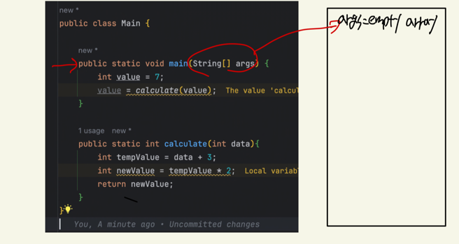
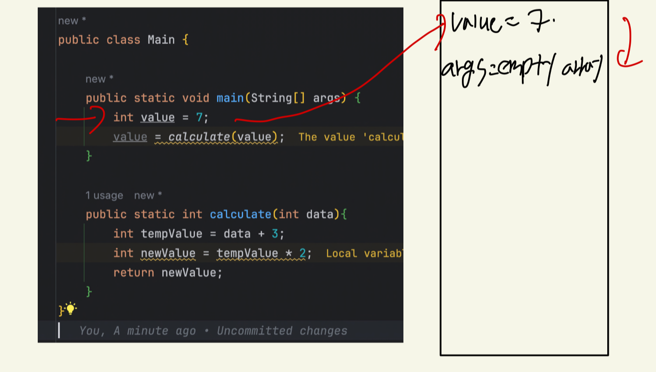
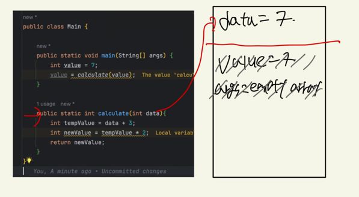
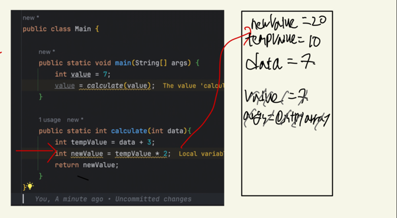
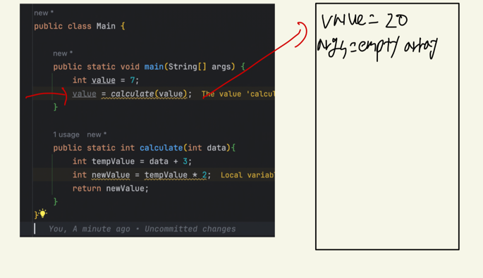
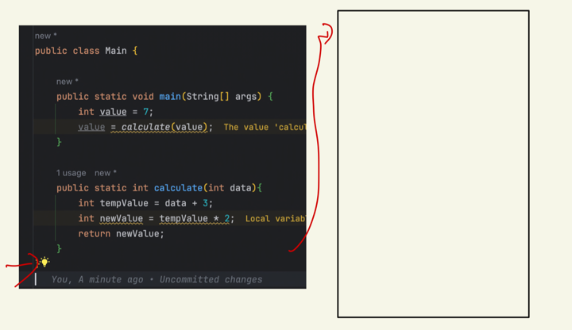

## Java Memory

* When applications run, they need access to some of our computer's memory,  
  for example, to store the objects that we create

## Stack

* Every thread has its own stack,   
  One important aspect of the stack is that java knows exactly when data on the stack can be destroyed.

```java
public class Main {

    public static void main(String[] args) {
        int value = 7;
        value = calculate(value);
    }

    public static int calculate(int data) {
        int tempValue = data + 3;
        int newValue = tempValue * 2;
        return newValue;
    }
}
```







* parameter data is a copy of the variable that is passed into the calculate method  
  so as we enter the calculate method, a new variable is added to the stack called data



* when the methods returns, all the data created on the stack for the method that we were in is popped





* when it gets to the closing bracket, the thread is completed and at this point the stack can now be emptied  
  all the memory that was used for the stack can be freed up

## Heap

* In an application, there is one heap which is shared by all threads
  The designers of Java realized that most objects are quite big and
  that most programs will want to pass around objects between blocks of code  
  by placing objects on the heap, this makes it easy to do

* Just to be clear, the stack is used for local primitives such as ints, doubles and references of objects on the
  heap   
  but all objects such as Strings, custom or integer objects will be stored on the heap

* In summary
    * Objects are stored on the heap
    * Variables are a reference to the object
    * Local variables are stored on the stack

```java
    public static void main(String[] args) {
    List<String> myList = new ArrayList<>();
    myList.add("one");
    myList.add("two");
    myList.add("three");
    printList(myList);
}

private static void printList(List<String> data) {
    String value = data.get(1);
    data.add("Four");
    System.out.println(myList);
}
```

```java
List<String> myList = new ArrayList<>();
```  

| stack                          | heap |
|--------------------------------|------|
| myList(refreence of emptyList) | List |

* The new keyword which is used to create myList means find some free space on the heap large enough to store the
  object  
  and then we will reference that new object from the local variable called myList

```java 
myList.add("one");
```  

| stack  | heap                              |
|--------|-----------------------------------|
| myList | List ( reference of String "One") |
|        | String "One"                      |

* By calling the add method, we add the reference to the String "One" to the emptyList(myList)
* Note that there's nothing created on the stack for the String "One" so we can't access it directly  
  we can only access it through the reference in the list

```java
myList.add("two");
myList.

add("three");
```   

| stack                                   | heap                                                                                                       |
|-----------------------------------------|------------------------------------------------------------------------------------------------------------|
| myList( reference of List on the heap ) | List ( <br/>reference of String "One"<br/>reference of String "Two"<br/>reference of String "threww"<br/>) |
|                                         | String "One"                                                                                               |
|                                         | String "Two"                                                                                               |
|                                         | String "Three"                                                                                             |

```java
   printList(myList);
  }

private static void printList(List<String> data) {

``` 

| stack                                   | heap                                                                                                       |
|-----------------------------------------|------------------------------------------------------------------------------------------------------------|
| data( reference of List on the heap )   | List ( <br/>reference of String "One"<br/>reference of String "Two"<br/>reference of String "threww"<br/>) |
| myList( reference of List on the heap ) | String "One"                                                                                               |
|                                         | String "Two"                                                                                               |
|                                         | String "Three"                                                                                             |  

* we can see why using the heap for data is suddenly a much better choice than if all of this data was stored on
  the stack,  
  all the JVM needs to do in order for us to be able to pass the list into another methods is make a copy of the
  reference

```java
  String value = data.get(1);
```

| stack                                   | heap                                                                                                       |
|-----------------------------------------|------------------------------------------------------------------------------------------------------------|
| value( reference of String "Two" )      | List ( <br/>reference of String "One"<br/>reference of String "Two"<br/>reference of String "threww"<br/>) |
| data( reference of List on the heap )   | String "One"                                                                                               |
| myList( reference of List on the heap ) | String "Two"                                                                                               |
|                                         | String "Three"                                                                                             |


```java
    data.add("Four");
```

| stack                                   | heap                                                                                                       |
|-----------------------------------------|------------------------------------------------------------------------------------------------------------|
| value( reference of String "Two" )      | List ( <br/>reference of String "One"<br/>reference of String "Two"<br/>reference of String "threww"<br/>) |
| data( reference of List on the heap )   | String "One"                                                                                               |
| myList( reference of List on the heap ) | String "Two"                                                                                               |
|                                         | String "Three"                                                                                             |
|                                         | String "Four"                                                                                              |

