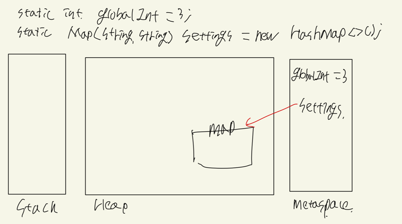

## Metaspace

* metaspace is used primarily to store metadata.   
  That's going to be information about classes, which methods for example have been compiled into bytecode 
  and which have been compiled native code, and so on.  
* In general, this is information which is completely out of reach to us as developers.  
* Also metaspace stores static variables. So static primitives are stored entirely in metaspace 
  and static objects are stored on the heap, but the object pointer of reference held in the metaspace.

  

* Unlike a stack where variables can be popped off when they go out of scope.  
  Variables in the metaspace are permanently there, as we would expect for static variables.
  They never reach a state where they can no longer be referenced.   
  So any objects on the heap which are referenced from the metaspace will never be garbage collected.