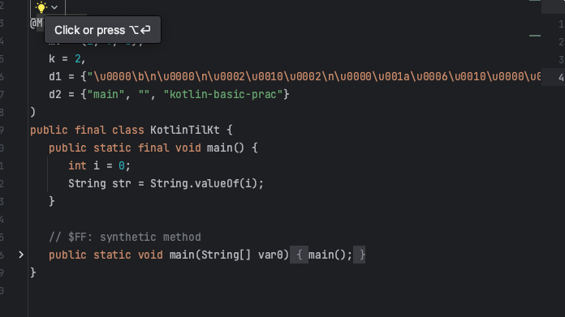
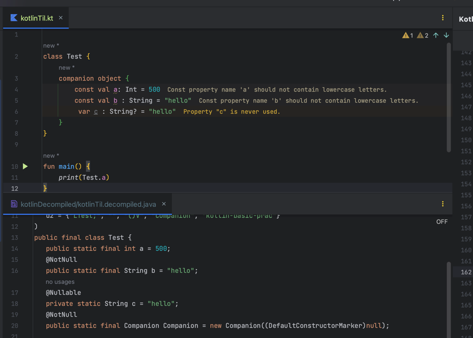
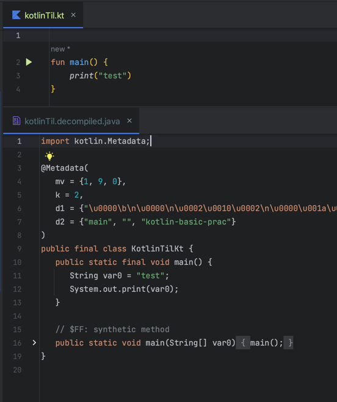
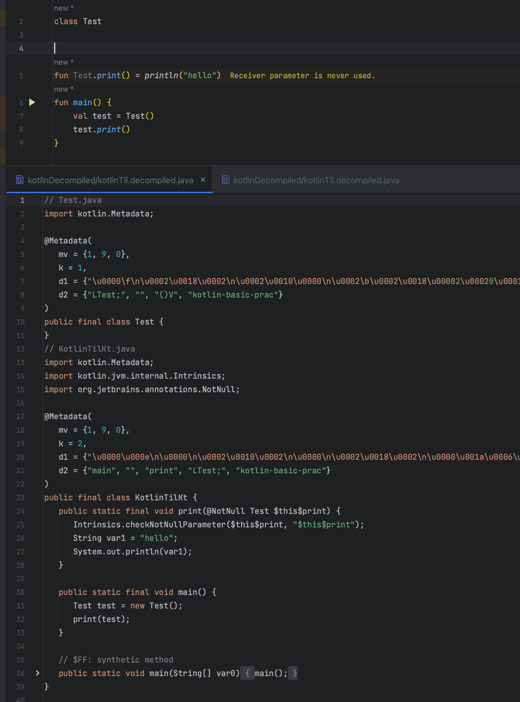
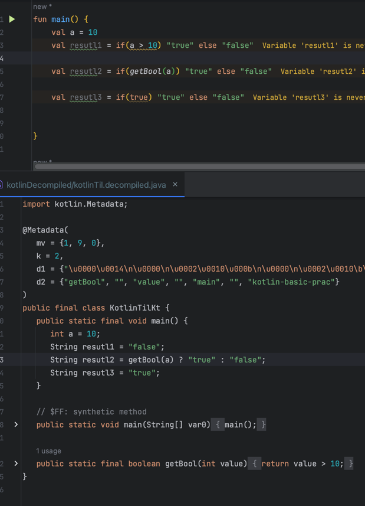
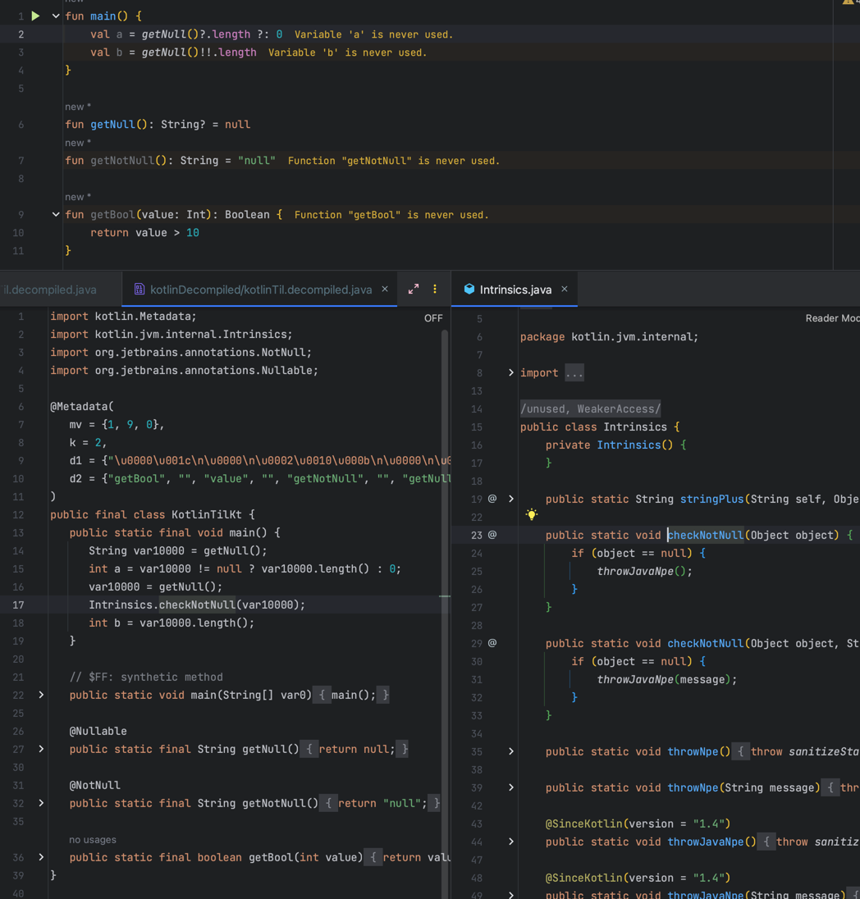

# Kotlin
## Kotlin vs Java

### Checked Exceptions
* 자바 checked Exception은 try catch로 감싸거나 throw로 예외 전파를 강제하지만, 코틀린은 강제하지 않는다.

### Primitive type
* 코틀린은 primitive type이 없다. 모든 것이 객체이다.( 런타임에 원시 값으로 표현될 수 있다. )   
  

### static keyword
* 코틀린은 static 키워드가 없다. 대신 companion object, top-level function, extention function을 제공  
  * companion object : 클래스 내부에 companion object 키워드로 선언 companion object 내부 변수,함수에 클래스 생성 없이 접근 가능  
    
  
     
  
  * top-level function : 클래스 외부에 함수 선언 가능     
  

     
  
  * extention function : 클래스 외부에 해당 클래스의 함수를 작성하여 실제 맴버함수와 같이 사용할 수 있게 함  
  
  
### 삼항연산자
  * 코틀린은 삼항연산자가 대신. if문을 사용한다.  
  

### NullSafe
