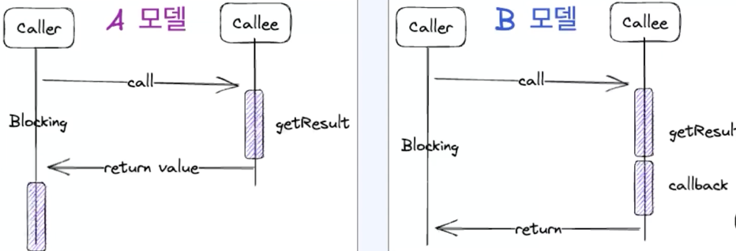
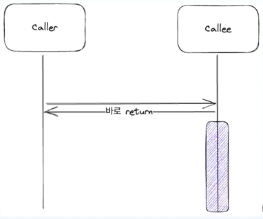
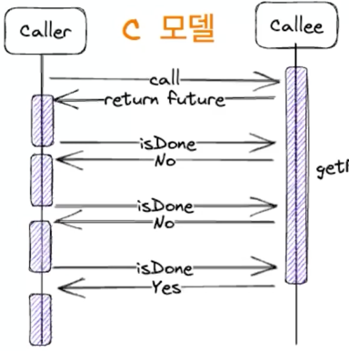
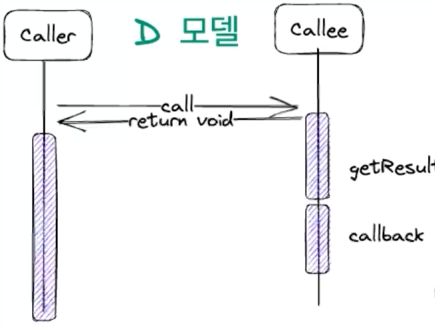
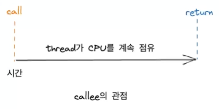
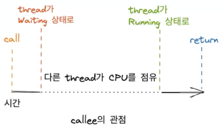
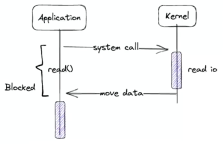
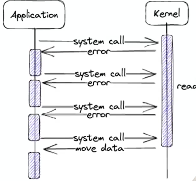
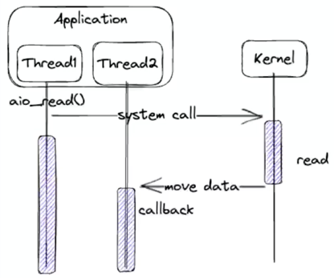

# Sync & Async, Blocking & Non-Blocking
## 함수 호출 관점에서 동기와 비동기
### 핵심 개념
* Caller와 Callee 
* 함수형 인터페이스
  * java 8부터 도입
  * 1개의 추상 메서드를 갖고 있는 인터페이스
  * 함수를 1급 객체로 사용 가능( 함수를 변수에 할당하거나 인자로 전달하고 반환값으로 사용가능)
* Function, Consumer, Supplier, Runnable등
* 함수형 인터페이스를 수현한 익명 클래스를 람다로 변경가능

--- 
* 동기
  * Caller는 Callee의 결과에 관심이 있다.
  * Caller는 결과를 이용해서 action을 수행한다.
* 비동기
  * Caller는 Callee의 결과에 관심이 없다.
  * Callee는 결과를 이용해서 CallBack을 수행한다.

---
## 함수 호출 관점에서 Blocking과 Non-Blocking

### Blocking
* A 모델
  * Caller는 getResult()가 결과를 돌려 주기 전까지 아무것도 할 수 없다.
* B 모델
  * Caller는 getResult()가 결과를 구하고 callback을 실행하기 전까지 다른 일을 할 수 있다.

* Callee를 호출한 수, Callee가 완료되기 전까지 caller가 아무것도 할 수 없다.
* 제어권을 Callee가 가지고 있다.  
    


### Non-Blocking
* Callee를 호출한 후, Callee가 완료되지 않더라도 Caller는 본인의 일을 할 수 있다.
* 제어권을 Caller가 가지고 있다.  
  

```java
public class sample {


  public static void main(String[] args) throws InterruptedException, ExecutionException {
    log.info("Start main");

    var count = 1;
    Future<Integer> result = getResult();
    while(!result.isDone()) {
      log.info("Waiting for result, count : {}", count++);
      Thread.sleep(100);
    }

    var nextValue = result.get() + 1;
    assert nextValue == 1;

    log.info("Finish main");
  }

  public static Future<Integer> getResult() {
    var executor = Executors.newSingleThreadExecutor();
    try {
      return executor.submit(new Callable<Integer>() {
        @Override
        public Integer call() throws Exception {
          log.info("Start getResult");
          try {
            Thread.sleep(1000);
          } catch (InterruptedException e) {
            e.printStackTrace();
          }

          var result = 0;
          try {
            return result;
          } finally {
            log.info("Finish getResult");
          }
        }
      });
    } finally {
      executor.shutdown();
    }
  }
}

```



* A 모델
  * getResult를 호출한 후, getResult가 완료되지 않으면 `main은 본인의 일을 할 수 없다.`
* C 모델
  * getResult를 호출한 후, getResult가 완료되지 않아도 `main은 본인의 일을 할 수 있다.`

### 비동기 Non-Blocking
* Caller는 Caller의 결과에 관심이 없다. -> 비동기
* Caller를 호출한 후 완료되지 않더라도 Caller는 본인의 일을 할 수 있다. -> non-blocking  


```java
public class sample {


  public static void main(String[] args) throws InterruptedException, ExecutionException {
    log.info("Start main");
    getResult(new Consumer<Integer>() {
      @Override
      public void accept(final Integer integer) {
        var nextValue = integer + 1;
        assert nextValue == 1;
      }
    });
    log.info("Finish main");
  }

  public static void getResult(Consumer<Integer> callback) {
    var executor = Executors.newSingleThreadExecutor();
    try {
      executor.submit(new Runnable() {
        @Override
        public void run() {
          log.info("Start getResult");
          try {
            Thread.sleep(1000);
          } catch (InterruptedException e) {
            e.printStackTrace();
          }

          var result = 0;
          try{
            callback.accept(result);
          }finally {
            log.info("Finish getResult");
          }
        }
      });
    }  finally {
      executor.shutdown();
    }
  }
}

```  
---
## I/O 관점에서 Blocking과 Non-Blocking
### Blocking의 종류
* blocking은 thread가 오랜 시간 일을 하거나 대기하는 경우 발생
* CPU-bound blocking: 오랜 시간 일을 한다.
* IO-bound blocking: 오랜 시간 대기 한다.

#### CPU-bound blocking
* thread가 대부분의 시간 CPU 점유
* 연산이 많은 경우
* 추가적인 코어를 투입   



#### IO-bound blocking
* thread가 대부분의 시간을 대기
* 파일 읽기/쓰기, network요청 처리, 요청 전달 등
* IO-bound non-blocking가능 하다.



---  

### Blocking의 전파
* 하나의 함수에서 여러 함수를 호출하기도 하고, 함수 호출은 중첩적으로 발생.
* callee는 caller가 되고 다시 다른 callee를 호출한다.
* blocking한 함수를 하나라도 호출한 다면 Caller는 blocking된다.

<br />     

* 함수가 non-blocking하려면 모든 함수가 non-blocking해야 한다.
* 따라서 I/O bound blocking또한 발생하면 안된다.

#### 동기 Blocking I/O
* recvfrom을 호출
* blocking socket을 이용해서 read/write를 수행
* 쓰레드가 block된다. (wait queue에서 기다린다.)  



#### 동기 Non-Blocking I/O
* recvfrom을 `주기적`으로 호출
* non-blocking socket을 이용해서 read/write를 수행
* 작업이 완료되지 않는다면 EAGAIN/EWOULDBLOCK에러 반환  

  

#### 비동기 Non-Blocking I/O
* aio_read를 호출
* 작업이 완료되면 커널이 완료 시그널을 보내거나 callback을 호출  

  
* Thread1은 Kernel의 결과에 관심이 없다.
* Kernel은 작업을 완료한 후 Thread2에게 결과를 전달한다.
* caller는 callee의 결과에 관심이 없다. -> 비동기
