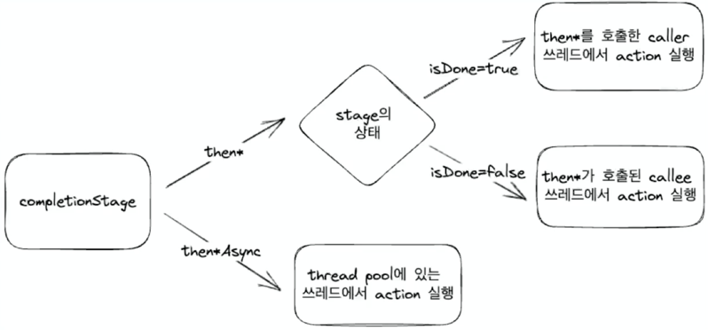

# CompletableFuture
## 핵심 개념
* 2014년에 발표된 java8에서 처음 도입
* 비동기 프로그래밍 지원
* Lambda, Method Reference등 java8의 새로운 기능 지원
  * Method Reference 
    * :: 연산자를 이용해서 함수에 대한 참조를 간결하게 표현
    * method reference
    * static method reference
    * instance method reference
    * constructor method reference

## CompletableFuture의 구조
### CompletableFuture 클래스
```java
public class CompletableFuture<T> implements Future<T>, CompletionStage<T> {
  // ...
}
```
#### CompletableFuture 연산자
* supplyAsync
  * Supplier를 제공하여 CompletableFuture를 생성가능
  * Supplier의 반환값이 CompletableFuture의 결과

* runAsync
  * Runnable을 제공하여 CompletableFuture를 생성가능
  * 값을 반환하지 않는다.
  * 다음 task에 null이 전달된다.
   
* complete
  * Future나 CompletionStage에는 별도로 Complete시키는 메소드가 없었다 CompletableFuture의 상태를 변경 할 수 없었다.
  * CompletableFuture가 완료되지 않았다면 주어진 값으로 채운다.
  * complete에 의해서 상태가 바뀌었다면 true, 라니라면 false를 반환한다.
```java
CompletableFuture<Integer> future = new CompletableFuture<>();
assert !future.isDone();

var triggered = future.complete(1);
assert future.isDone();
assert triggered;
assert future.get() == 1;

triggered = future.complete(2);
assert future.isDone();
assert !triggered;
assert future.get() == 1;
```
* isCompletedExceptionally
  * Exception에 의해서 complete되었는지 확인 가능
```java
var futureWithException = CompletableFuture.supplyAsync(()->{
	return 1/0;
});
Thread.sleep(100);

assert futureWithException.isDone();
assert futureWithException.isCompletedExceptionally();
```
* allOf
  * 여러 completableFuture를 모아서 하나의 completableFuture로 변환할 수 있다.
  * 모든 CompletableFuture가 완료되면 상태가 done으로 변경
  * Void를 반환하므로 각각의 값에 get으로 접근해야 한다.

```java
var startTime = System.currentTimeMillis();
var firstFuture = waitAndReturn(100, 1);
var secondFuture = waitAndReturn(200, 2);
var thirdFuture = waitAndReturn(300, 3);

CompletableFuture.allOf(firstFuture, secondFuture, thirdFuture)
    .thenAcceptAsync((v) -> {
		log.info("after allOf")
        try{
          log.info("first : {}", firstFuture.get());
          log.info("second : {}", secondFuture.get());
          log.info("third : {}", thirdFuture.get());
		}catch (Exception e){
			throw new RuntimeException(e);
        }
    }).join();

var endTime = System.currentTimeMillis();
log.info("time : {}", endTime - startTime); // 314ms
```
 
* anyOf
  * 여러 completableFuture를 모아서 하나의 completableFuture로 변환할 수 있다.
  * 주어진 future중 하나라도 완료되면 상태가 done으로 변경
  * 제일 먼저 done상태가 되는 future의 값을 반환
```java
var startTime = System.currentTimeMillis();
var firstFuture = waitAndReturn(100, 1);
var secondFuture = waitAndReturn(200, 2);
var thirdFuture = waitAndReturn(300, 3);

CompletableFuture.anyOf(firstFuture, secondFuture, thirdFuture)
    .thenAcceptAsync(v -> {
		log.info("after anyOf")
        log.info("first value : {}", v);
    }).join();
var endTime = System.currentTimeMillis();
log.info("time : {}", endTime - startTime); // 114ms
```
#### CompletableFuture의 한계
* 지연 로딩 기능을 제공하지 않는다.
  * CompletableFuture를 반환하는 함수를 호출시 즉시 작업이 실행된다.
* 지속적으로 생성되는 데이터를 처리하기 어렵다.
  * CompletableFuture에서 데이터를 반환하고 나면 다시 다른 값을 전달하기 어렵다.

---   

### Future
* 비동기적인 작업을 수행
* 해당 작업이 완료되면 결과를 반환하는 인터페이스
* 비동기 연산의 결과를 조회하는 메소드
  * get() 
    * 결과를 구할 때까지 thread가 계속 block   
    * future에서 무한 루프나 오랜 시간이 걸린다면 thread가 blocking상태 유지
  * get(long timeout, TimeUnit unit)
    * 결과를 구할 때까지 timeout동안 thread가 block
    * timeout이 넘어가도 응답이 반환되지 않으면 TimeoutException 발생
* 비동기 연산의 결과를 취소하는 메소드
  * cancel(boolean mayInterruptIfRunning)
    * future의 작업 실행을 취소
    * 취소할 수 없는 상황이라면 false를 반환 (이미 완료된 작업, 이미 취소된 작업)
    * mayInterruptIfRunning이 false라면 시작하지 않은 작업에 대해서만 취소
* 비동기 연산의 상태를 조회하는 메소드
  * isCancelled() 
    * task가 완료되었다면, 원인과 상관없이 true를 반환 ( 정상 종료, exception 발생, canceled 모두 true 반환)
  * isDone() 
    * task가 명시적으로 취소된 경우 true 반환

<br />  

* Future 인터페이스의 한계
  * cancel을 제외하고 외부에서 future를 컨트롤 할 수 없다.
  * 반환된 결과를 get()해서 접근하기 때문에 비동기 처리가 어렵다. 
  * 완료되거나 에러가 발생했는지 구분하기 어렵다.

---

### CompletionStage
* 비동기적인 작업을 수행
* 해당 작업이 완료되면 결과를 처리하거나 다른 CompletionStage를 열결하는 인터페이스

#### CompletionStage 연산자 
##### 조합
* 50개에 가까운 연산자들을 활용하여 비동기 task들을 실행하고 값을 변형하는 등 chaning을 이용한 조합 가능
* 에러를 처리하기 위한 콜백 제공
* 결과를 직접적으로 반환하지 않기 때문에 비동기 non-blocking 코드 작성 가능 -> 즉 별도의 Thread 필요

##### 연산자
* thenAccept[Async]
  * Consumer를 파라미터로 받는다.
  * 이전 task로부터 값을 받지만 값을 넘기지 않는다.
  * 다음 task에게 null이 전달된다.
  * 값을 받아서 action만 수행하는 경우 유용
```java
CompletableFuture<Void> thenAccept(Consumer<? super T> action);
CompletableFuture<Void> thenAcceptAsync(Consumer<? super T> action);
```
* thenAccept vs thenAcceptAsync
  * thenAccept는 이전 task와 동일한 thread에서 실행 Caller의 thread에서 실행
  * thenAcceptAsync는 다른 별도 thread에서 실행 (ForkJoinPool)

* thenAccept[Async]의 실행 쓰레드
  * done 상태에서 thenAccept는 caller(main)의 쓰레드에서 실행
  * done 상태의 completionStage에 thenAccept를 사용하는 경우, Caller쓰레드를 block할 수 있다.
  * done 상태가 아닌 thenAccept는 callee(ForkJoinPool)의 쓰레드에서 실행
  * done 상태가 아닌 completionStage에 thenAccept를 사용하는 경우, ForkJoinPool의 쓰레드를 block할 수 있다.



* thenApply[Async]
  * Function을 파라미터로 받는다.
  * 이전 task로부터 T타입의 값을 받아서 가공하고 U타입의 값을 반환한다.
  * 다음 task에게 반환했던 값이 전달된다.
  * 값을 변형해서 전달해야 하는 경우 유용

* thenCompose[Async]
  * Function을 파라미터로 받는다.
  * 이전 task로부터 T타입의 값을 받아서 가공하고 U타입의 CompletionStage를 반환한다.
  * 반환한 CompletionStage가 done상태가 되면 값을 다음 task에 전달한다.
  * 다른 future를 반환해야하는 경우 유용

* thenRun[Async]
  * Runnable을 파라미터로 받는다.
  * 이전 task로부터 값을 ㅂ다지 않고 값을 반환하지 않는다.
  * 다음 task에게 null이 전달된다.
  * future가 완료되었다는 이벤트를 기록할 때 유용

* exceptionally
  * Function을 파라미터로 받는다.
  * 이전 task에서 발생한 exception을 받아서 처리하고 값을 반환한다.
  * 다음 task에게 반환된 값을 전달한다.
  * future 파이프에서 발생한 에러를 처리할때 유용
  

--- 
#### ForkJoinPool - thread pool
* CompletableFuture는 내부적으로 비도익 함수들을 실행하기 위해 ForkJoinPool을 사용
* ForkJoinPool의 기본 size = 할당된 cpu 코어 -1
* 데몬 쓰레드. main 쓰레드가 종료되면 즉각적으로 종료

#### ForkJoinPool - fork & join
* Task를 fork를 통해서 subtask로 나누고
* Thread pool에서 steal work알고리즘을 이용해서 균등하게 처리후
* join을 통해서 결과를 생성   
   
---  

### ExecutorService
* ExecutorService
  * 쓰레드 풀을 이용하여 비동기적으로 작업을 실행하고 관리
  * 별도의 쓰레드를 생성하고 관리하지 않아도 되므로, 코드를 간결하게 유지 가능
  * 쓰레드 풀을 이용하여 자원을 효율적으로 관리
  * ExecutorService 메소드
    * execute(Runnable command) : Runnable 인터페이스를 구현한 작업을 쓰레드 풀에서 비동기적으로 실행
    * submit(Callable task) : Callable 인터페이스를 구현한 작업을 쓰레드 풀에서 비동기적으로 실행하고 해당 작업의 결과를 Future\<T> 객체로 반환
    * shutdown() : ExecutorService를 종료. 더이상 task를 받지 않는다.
  
* Executors - ExecutorService 생성
  * newSingleThreadExecutor: 단일 쓰레드로 구성된 스레드 풀을 생성. 한 번에 하나의 작업만 실행.
  * newFixedThreadPool: 고정된 크기의 스레드 풀을 생성. 크기는 인자로 주어진 n과 동일.
  * newCachedThreadPool: 사용 가능한 쓰레드가 없다면 새로 생성해서 작업을 처리하고, 있다면 재사용. 쓰레드가 일정 시간 사용되지 않으면 회수
  * newScheduledThreadPool: 스케줄링 기능을 갖춘 고정 크기의 쓰레드 풀을 생성. 주기적이거나 지연이 발생하는 작업을 실행
  * newWorkStealingPool: work steal 알고리즘을 사용하는 ForkJoinPool을 생성.