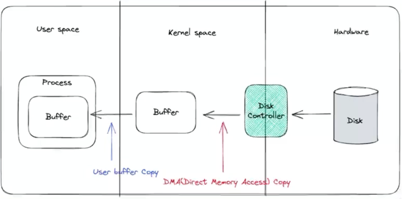
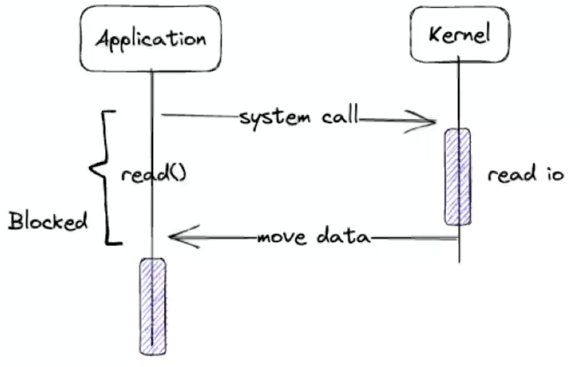
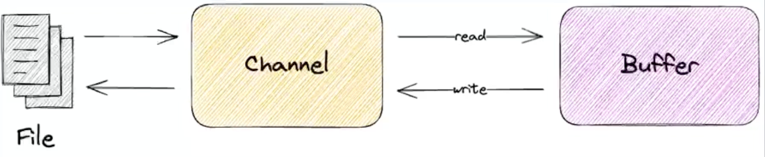
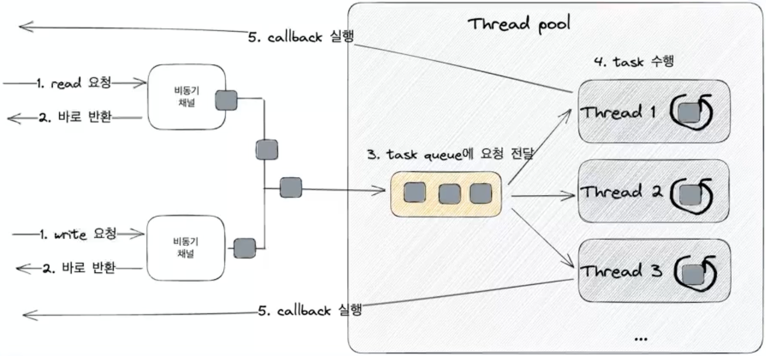

# Java NIO

## Java IO, NIO, AIO

### 함수 호출 모델

|              | 동기                                      | 비동기      |
|--------------|-----------------------------------------|----------|
| Blocking     | Java IO                                 | X        |
| Non-Blocking | Java NIO (File IO는 non-blocking 불가능 | Java AIO |

### I/O 모델

|              | 동기                    | 비동기 |
|--------------|-----------------------|-----|
| Blocking     | Java IO               | X   |
| Non-Blocking | Java NIO Java AIO | X   |

## Java IO

* Java 1.0에서 처음 도입
* 파일과 네트워크에 데이터를 읽고 쓸 수 있는 API제공
* byte 단위로 읽고 쓸 수 있는 stream(InputStream과 OutputStream)
* blocking으로 동작

### Java IO - InputStream

* InputStream
* Closable 구현. 명시적으로 close하거나 try-with-resources 사용 가능
* read:stream으로 데이터를 일고, 읽은 값을 반환. -1이면 더 이상 읽을 데이터가 없음
* close:stream을 닫고 더 이상 데이터를 읽지 않는다.
* 어떤 source로 부터 데이터를 읽을지에 따라 다양한 구현체 존재
* FileInputStream, ByteArrayInputStream, BufferedInputStream

### Java IO - OutputStream

* OutputStream
* write시 바로 전송하지 않고 버퍼에 저장한 다음 일정량의 데이터가 모이면 한번에 전달.
* Closable구현. 명시적으로 close하거나 try-with-resources 사용 가능
* write:stream으로 데이터를 쓴다.
* flush:버퍼에 저장된 모든 데이터를 출력하고 비운다.
* close:stream을 닫고 더 이상 데이터를 쓰지 않는다.
* 어떤 destination에 데이터를 쓸 지에 따라 다양한 구현체 존재
* FileOutputStream, ByteArrayOutputStream, BufferedOutputStream

### Java IO Reader와 Writer

* Java 1.1에서 도입
* Character 단위로 읽고 쓸 수 있는 stream (Reader와 Writer)
* 문자 인코딩 지원
* blocking으로 동작

### Java IO의 한계

* 동기 Blocking으로 동작
* 커널 버퍼에 직접 접근 불가. 따라서 메모리 copy가 발생

#### 커널 버퍼에 직접 접근 불가.

* hardware에서 값을 읽어 오면, disk controller가 DMA를 통해서 커널 버퍼에 값을 복사
* 커널 버퍼에서 jvm 버퍼로 복사. -> 이 과정에서 cpu자원을 소모
* jvm 버퍼, jvm 메모리에 있기 때문에 gc 대상 -> 이 과성에서 또 cpu자원을 소모

#### 동기 blocking으로 동작

* application이 read를 호출하면, 커널이 응답을 돌려줄 때까지, 아무것도 할 수 없다.
* I/O요청이 발생할 때마다 쓰레드를 새로 할당하면, 쓰레드를 생성 및 관리하는 비용과 컨텍스트 스위칭으로 인한 cpu 자원 소모

---

## Java NIO

* java New Input/Output (non-blocking x)
* java 1.4에서 처음 도입
* 파일과 네트워크에 데이터를 읽고 쓸 수 있는 API제공
* buffer 기반
* non-blocking 지원
* selector, channel 도입으로 높은 성능 보장

|             | Java NIO                                 | Java IO                   |
|-------------|------------------------------------------|---------------------------|
| 데이터 흐름      | 양방향                                      | 단방향                       |
| 종류          | channel                                  | InputStream, OutputStream |
| 데이터의 단위     | buffer                                   | byte 혹은 character         |
| blocking 여부 | non-blocking 지원  (blocking한 API도 존재) | blocking만 가능              |
| 특이사항        | Selector 지원                              |                           |

### Channel과 Buffer
* 데이터를 읽을 때: 적절한 크기의 Buffer를 생성하고 Channel의 read() 메서드를 사용하여 데이터를 Buffer에 저장.
* 데이터를 쓸 때: 먼저 Buffer에 데이터를 저장하고 Channel의 write() 메서드를 사용하여 목적지로 전달.
* clear() 메서드로 초기화하여 다시 사용 가능.  
  

### Buffer 위치 속성
* capacity: Buffer가 저장할 수 있는 데이터의 최대 크기. Buffer 생성시 결정되며 변경 불가.
* position: Buffer에서 현재 위치를 가리킨다. 버퍼에서 데이터를 읽거나 쓸 때, 해당 위치부터 시작. Buffer에 1Byte가 추가될 때마다 1 증가.
* limit: Buffer에서 데이터를 읽거나 쓸 수 있는 마지막 위치. limit 이후로 데이터를 읽거나 쓰기 불가. 최초 생성시 capacity와 동일
* mark: 현재 position 위치를 mark()로 지정할 수 있고 reset() 호출시 position을 mark로 이동
* 0 <= mark <= position <= limit <= capacity

#### Buffer 위치 초기 상태
* capacity는 초기 주어진 값으로 세팅
* limit은 capacity와 동일
* position은 0

#### Buffer 위치 메서드 - flip
* flip : Buffer의 limit 위치를 현재 position 위치로 이동시키고, position을 0으로 초기화
* Buffer를 쓰기 모드에서 읽기 모드로 전환 하는 경우 사용

#### Buffer 위치 메서드 - rewind
* rewind : Buffer의 position 위치를 0으로 리셋 limit은 유지
* 데이터를 처음부터 다시 읽는 경우 사용

#### Buffer 위치 메서드 - clear
* clear : Buffer의 limit 위치를 capacity위치로 이동시키고, position을 0으로 초기화
* Buffer를 초기화 할때 사용  

--- 
### DirectByteBuffer
- native 메모리(off-heap)에 저장
- 커널 메모리에서 복사를 하지 않으므로 데이터를 읽고 쓰는 속도가 빠르다.
- 비용이 많이 드는 system call을 사용하므로 allocate, deallocate가 느리다.

### HeapByteBuffer
- JVM heap 메모리에 저장. byte array를 랩핑
- 커널 메모리에서 복사가 일어나므로 데이터를 읽고 쓰는 속도가 느리다.
- (이 과정에서 임시로 Direct Buffer를 만들기 때문에 성능 저하)
- gc에서 관리 되므로 allocate, deallocate가 빠르다.   

---

### Java NIO를 non-block하게 사용하려면?
#### SelectableChannel
* SocketChannel, ServerSocketChannel 모두 AbstractSelectableChannel을 상속
* AbstractSelectableChannel은 SelectableChannel을 구현  

 

* configureBlocking 과 register 메소드 제공
* configureBlocking : serverSocketChannel의 accept, socketChannel의 connect등이 non-blocking으로 동작한다.

---  

## Java AIO
* Java 1.7 부터 NIO2를 지원
* AsynchronousChannel, callback, future 지원
* Thread pool과 epoll, kqueue등의 이벤트 알림 system call을 사용
* I/O가 준비 되었을떄, Future 혹은 Callback으로 비동기적인 로직 처리 가능  
  
