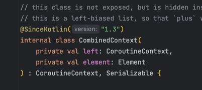
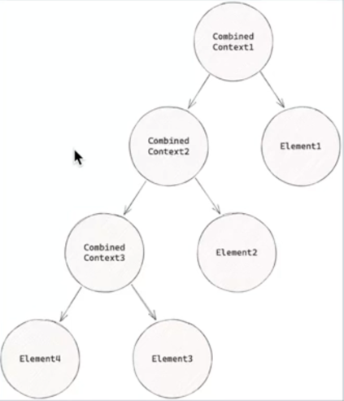
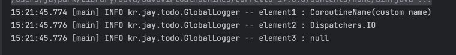

# Kotlin Coroutines

## CoroutineContext

### Coroutine과 ThreadLocal

* coroutine은 다른 쓰레드풀에서 동작 가능
    * CoroutineDispatcher (Dispatchers.IO)를 넘겨서 변경
* runBlocking은 main 함수에서 동작하기 떄문에 ThreadLocal에 접근 가능하지만 launch는 다른 쓰레드에서 동작하기 떄문에 ThreadLocal 결과가 null

```kotlin
fun main() {
    val greeting = ThreadLocal<String>()
    greeting.set("Hello")

    runBlocking {
        log.info("thread: {}", Thread.currentThread().name)
        log.info("greeting: {}", greeting.get()) // -> Hello

        launch(Dispatchers.IO) {
            log.info("thread: {}", Thread.currentThread().name)
            log.info("greeting: {}", greeting.get())  // -> null
        }
    }
}
```

### Continuation

* suspend 함수들 사이에 공유해야하는 정보가 있다면?
* suspend 함수는 다양한 쓰레드에서 실행되기 때문에 ThreadLocal 사용 불가
* Continuation은 coroutine 내의 모든 suspend 함수에 전달
* 그리고 CoroutineContext를 포함한다.


### CoroutineContext 접근

* runBlocking, launch, async와 같은 CoroutineScope 내부에 있다면 CoroutineScope.coroutineContext를 통해서 접근 가능  
  

* Continuation에 접근이 가능하다면, Continuation.coroutineContext를 통해서 접근 가능  
  

* suspend 함수 내부에서는 CoroutineContext를 통해서 접근 가능.  
  

```kotlin
import kotlin.coroutines.coroutineContext

private suspend fun child() {
    log.info("context in suspend : {}", coroutineContext)

    var result = suspendCoroutine<Int> { cont ->
        log.info("context in suspendCoroutine : {}", cont.context)
        cont.resume(100)
    }
    log.info("result : {}", result)
}

fun main() {
    runBlocking {
        log.info("context in coroutineScope : {}", this.coroutineContext)
        child()
    }
}
```


### CoroutineContext 연산자

* CoroutineContext는 get, plus, minusKey등의 연산자를 제공
* get: 특정 key를 갖는 Element 반환.
* plus: 현재 context에 다른 Context를 병합. 이미 같은 key를 갖는 Element가 다른 contest에 있다면 다른 element로 override
* minusKey: 현재 Context에서 주어진 key를 갖는 element를 제외한 context를 반환.

### CoroutineContext Key, Element

* CoroutineContext는 여러 Element를 포함
* Element의 개수에 따라 다른 객체로 존재
* EmptyCoroutineContext: Element가 하나도 없는 상태
* Element: Element가 하나인 상태. 즉 Element 그 자체
* CombinedContext: Element가 두 개 이상 일 때
* Key: Element를 구분할 때 사용하는 식별자


### EmptyCoroutineContext

* CoroutineContext를 구현
* Element를 갖지 않는 텅 빈 CoroutineContext를 가리킨다.
* 숫자의 0과 같은 객체


### Element 구현체

* Element 인터페이스를 구현하는 구현체
* CoroutineName, CoroutineDispatcher, CoroutineExceptionHandler, Job, ThreadContextElement등이 존재
* CoroutineName은 companion object로 key를 포함.
* AbstractCoroutineContextElement(CoroutineName)은 AbstractCoroutineContextElement(CoroutineName.Key)와 동일


### CombinedContext

* left와 element로 구성
* left는 또 다른 CombinedContext혹은 Element를 가리킨다.
* element는 가장 최근에 추가된 Element를 가리킨다.
* plus를 통해서 다른 Element가 추가되면
    * 이미 존재하면 element라면 override
    * 없는 element라면, 현재 combinedContext를 left로 새로운 element를 element로 하는 CombinedContext를 생성

  


### CoroutineContext plus

```kotlin

fun main() {
    val context1 = EmptyCoroutineContext
    log.info("context1 : {}", context1)

    val element1 = CoroutineName("custom name")
    val context2 = context1 + element1
    log.info("context2 : {}, class: {}", context2, context2.javaClass.simpleName)

    val element2 = CoroutineName("custom name2")
    val context3 = context2 + element2
    log.info("context3 : {}, class: {}", context3, context3.javaClass.simpleName)

    val element3 = Dispatchers.IO
    val context4 = context3 + element3
    log.info("context4 : {}, class: {}", context4, context4.javaClass.simpleName)

    val element4 = Job()
    val context5 = context4 + element4
    log.info("context5 : {}, class: {}", context5, context5.javaClass.simpleName)
}
```  


* EmptyCoroutineContext + Element = Element
* Element + Element = CombinedContext
    * 하지만 같은 key를 갖는 Element가 있다면, 뒤에 추가된 Element로 override
* CombinedContext + Element = CombinedContext

### CoroutineContext get

```kotlin
var context = CoroutineName("custom name") + Dispatchers.IO

val element1 = context[CoroutineName]
log.info("element1 : {}", element1)

val element2 = context.get(CoroutineDispatcher)
log.info("element2 : {}", element2)

val element3 = context.get(Job)
log.info("element3 : {}", element3)

```  



* CoroutineContext는 get 연산자를 구현했기 떄문에 [CoroutineContext.key] 형태로 Element에 접근 가능
* 혹은 get 메소드를 통해서 접근 가능
* key에 해당하는 Element가 없다면 null 반환

## CoroutineContext의 전파

### suspend 함수 사이에서 전파.

* suspend 함수에서 다른 suspend 함수를 호출하는 경우, 바깥 suspend 함수의 Continuation 전달.
* 이를 통해서 바깥 Continuation의 CoroutineContext가 내부 suspend 함수에 전달


### suspend 함수 사이에서 전파 예제

```kotlin
suspend fun nested() {
    log.info("context in nested : {}", coroutineContext)
}

suspend fun outer() {
    log.info("context in outer : {}", coroutineContext)
    nested()
}

fun main() {
    runBlocking {
        outer()
    }
}
```  


* outer suspend 함수에서 nested suspend 함수를 호출하기 떄문에 CoroutineContext가 그대로 전파.

### withContext

* 현재 Coroutine의 CoroutineContext에 인자로 전달된 context를 merge
* 새로운 Job을 생성해서 주입


### withContext 예제

```kotlin
fun main() {
    runBlocking {
        log.info("context in runBlocking : {}", this.coroutineContext)

        withContext(CoroutineName("withContext")) {
            val ctx = this.coroutineContext
            log.info("context in withContext : {}", ctx)
        }

        log.info("context in runBlocking : {}", this.coroutineContext)
    }
}
```  


* runBlocking 내부에서 withContext를 실행
* withContext는 runBlocking의 coroutineContext를 merge
    * CoroutineName을 override
    * UndispatchedCoroutine job을 새로 생성
* withContext의 블록이 끝나면, 원래의 context로 복구

## CoroutineContext Element

### CoroutineName

* 디버깅에 이용되는 element
* CoroutineName을 변경하면 logging에 출력
    * -Dkotlinx.coroutines.debug 필요


```kotlin
fun main() {
    runBlocking(CoroutineName("runBlocking")) {
        log.info(
            "name in runBlocking: {}",
            this.coroutineContext[CoroutineName]
        )

        withContext(CoroutineName("withContext")) {
            log.info(
                "name in withContext: {}",
                this.coroutineContext[CoroutineName]
            )
        }
    }
}
```  


* runBlocking에도 CoroutineContext 제공 가능
* withContext를 통해서 CoroutineContext를 override

### Job

* Coroutine의 생명주기를 관리
* Job은 active, completed, cancelled와 같은 여러 상태를 갖는다.
* start, cancel을 통해서 명시적으로 시작과 취소 가능.
* parent, children을 통해서 다른 Coroutine의 생명주기도 관리
* launch, async등의 coroutine builder를 통해서 자식 Job을 생성 가능

### Coroutine과 ThreadLocal

* Coroutine은 Dispatcher에 따라서 다른 쓰레드에서 동작 가능
* 따라서 ThreadLocal은 동작 불가

```kotlin
fun main() {
    val greeting = ThreadLocal<String>()
    greeting.set("hello")

    runBlocking {
        log.info("thread: {}", Thread.currentThread().name)
        log.info("greeting: {}", greeting.get())

        launch(Dispatchers.IO) {
            log.info("thread: {}", Thread.currentThread().name)
            log.info("greeting: {}", greeting.get())
        }
    }
}
```


### ThreadLocalElement

* ThreadLocalElement를 통해서 threadLocal을 전달하는 element 제공
* ThreadLocal의 asContextElement를 통해서 ThreadLocalElement 생성

```kotlin
fun main() {
    runBlocking {
        val greeting = ThreadLocal<String>()
        greeting.set("hello")

        launch(Dispatchers.IO) {
            log.info("greeting1: {}", greeting.get())
        }

        val aContext = Dispatchers.IO + greeting.asContextElement()

        launch(aContext) {
            log.info("greeting2: {}", greeting.get())
        }

        val bContext = Dispatchers.Default + greeting.asContextElement("hi")


        launch(aContext) {
            log.info("greeting3: {}", greeting.get())
            launch(aContext) {
                log.info("greeting4: {}", greeting.get())
            }
        }
    }
}
```


* asContextElement로 element로 변환해서 context 형태로 전달 -> 자식 coroutine에도 전달 ( CombinedContext )
* asContextElement에 값을 전달하여 다른 값을 갖게끔 설정 가능

### ReactorContext

* ReactorContext를 통해서 Reactor의 ContextView를 다른 suspend 함수에 전달.

```kotlin
fun main() {
    val greeting = mono {
        launch(Dispatchers.IO) {
            val context = this.coroutineContext[ReactorContext]
                ?.context
            val who = context?.get<String>("who")
                ?: "world"
            log.info("hello, $who")

            val newContext = (context ?: Context.empty()).put("who", "jay")
            launch(ReactorContext(newContext)) {
                val context = this.coroutineContext[ReactorContext]
                    ?.context

                Mono.create<String> {
                    val who = it.contextView().getOrDefault("who", "world")
                    it.success("hello, $who")
                }.contextWrite((context ?: Context.empty()))
                    .subscribe {
                        log.info(it)
                    }
            }
        }
    }

    greeting
        .contextWrite { it.put("who", "grizz") }
        .subscribe()

    Thread.sleep(1000)
}
```  


* contextWith을 통해서 context를 주입
* launch 내에서 coroutineContext의 ReactorContext로 접근
* 해당 context를 기반으로 새로운 reactor context 생성
* ReactorContext(newContext)로 launchdp wjsekf
* Mono에서 contextWrite을 통해서 coroutineContext로 전달된 reactor context를 주입하고 출력

### CoroutineContext 만들기

```kotlin
import kotlin.coroutines.AbstractCoroutineContextElement

private class GreetingContext(
  private val greeting: String,
) : AbstractCoroutineContextElement(GreetingContext){
    public companion object Key : 
        CoroutineContext.Key<GreetingContext>
  
    fun greet() {
      log.info(greeting)
    }
}
```  


* AbstractCoroutineContextElement를 상속하는 Context 생성
* 인자로 greeting을 받고
* greet 메소드를 실행하면 greeting을 출력

```kotlin

fun main() {
    runBlocking {
        val context = GreetingContext("Hello")

        launch(context) {
            coroutineContext[GreetingContext]?.greet()

            val newContext = GreetingContext("Hola")
            launch(newContext) {
                coroutineContext[GreetingContext]?.greet()

                launch {
                    coroutineContext[GreetingContext]?.greet()
                }
            }
        }

        val job = CoroutineScope(Dispatchers.IO + context).launch {
            coroutineContext[GreetingContext]?.greet()

            launch {
                coroutineContext[GreetingContext]?.greet()

                launch {
                    coroutineContext[GreetingContext]?.greet()
                }
            }
        }

        job.join()
    }
}

```  
  
* launch에 context를 전달.
* context에 key로 접근하여 greet 호출
* 중간에 Hola값을 갖는 중간 context를 생성하고 newContext로 대체 
  * 나중에 추가된 GreetingContext로 override되어 그 아래부터 Hola cnffur
* 새로운 CoroutineScope에도 context 전파


## Error handling
### Async의 exception handling

```kotlin
fun main(){
    runBlocking {
        val deferred = CoroutineScope(Dispatchers.IO).async {
            throw IllegalStateException("exception in launch")
            10
        }
        try{
            deferred.await()
        }catch (e: Exception){
            log.error("Exception caught")
        }
    }
}
```


* CoroutineScope async 내에서 exception이 발생한다면 어떤 결과가?
* try catch를 통해서 exception을 처리할 수 있다
* 즉, async는 exception이 발생한 경우 유저에게 exception을 노출

### launch의 Exception handling

```kotlin
fun main(){
    runBlocking {
        val job = CoroutineScope(Dispatchers.IO).launch {
            launch {
                launch {
                    throw IllegalStateException("exception in launch")
                }
            }
        }

        try {
            job.join()
        }catch (e: Exception){
            log.error("Exception caught")
        }
    }
}
```  
  
* CoroutineScope launch 내에서 exception이 발생한다면 어떤 결과가?
* catch에 걸리는 대신 exception이 그대로 출력
* exception이 처리되지 못하고 thread의 uncaughtExceptionHandler를 통해 출력  
---  

* 만약 launch 전체를 try catch로 감싼다면?
* 여전히 exception 출력
* 함수처럼 exception이 전파되는 구조가 아닌 
* 자식 Job에서 부모 job으로 cancellation이 전파되며 함께 exception이 전달되기 때문
* 일반적인 try catch로 exception handling 불가.

```kotlin
fun main(){
    runBlocking {
        val job = CoroutineScope(Dispatchers.IO).launch {
            try{
                launch {
                    launch {
                        throw IllegalStateException("exception in launch")
                    }
                }
            }catch (e: Exception){
                log.error("Exception caught")
            } 
        }
        job.join()
    }
}
```  


### CoroutineExceptionHandler
* CoroutineExceptionHandler를 통해서 root coroutine의 exception handling 가능
* launch에 적용 가능
  * async에는 적용 불가능
  * async는 exception을 Deferred를 통해서 전달하기 때문에

 
 
```kotlin
fun main(){
    runBlocking {
        val handler = CoroutineExceptionHandler { _, exception ->
            log.error("exception caught")
        }

        val job = CoroutineScope(Dispatchers.IO + handler).launch {
            launch {
                launch {
                    throw IllegalStateException("exception in launch")
                }
            }
        }
        job.join()
    }
}
```


* handler를 생성하여 CoroutineScope에 전달
* Job을 통해서 전달되는 exception을 root coroutine에서 context에 전달된 handler를 통해 처리

---

* 만약 handler를 root Coroutine이 아닌 중간 launch에게 제공한다면??
```kotlin

fun main(){
    runBlocking {
        val handler = CoroutineExceptionHandler { _, exception ->
            log.error("exception caught")
        }

        val job = CoroutineScope(Dispatchers.IO ).launch {
            launch ( handler){
                launch {
                    throw IllegalStateException("exception in launch")
                }
            }
        }
        job.join()
    }
}
```


* exception을 handling하지 못하고 그대로 출력  
  
---   

---  

## CoroutineDispatcher
* Coroutine이 어느 쓰레드에서 실행될지 결정하는 Element


### CoroutineDispatcher의 종류
* CoroutineDispatcher는 Default, Main, Unconfined, IO 등을 미리 만들어서 제공 

### CoroutineDispatcher Main
* Main은 사용 불가
* Main dispatcher는 library를 통해서 주입 받아야 하는데, kotlinx-coroutine-core에서는 지원하지 않는다.
* Android(kotlinx-coroutines-android)는 Handler에서 동작하는 Main dispatcher를 제공  

```kotlin
private fun CoroutineScope.dispatcher(): CoroutineDispatcher?{
    return this.coroutineContext[CoroutineDispatcher.Key]
}

fun main(){
    runBlocking{
        withContext(Dispatchers.Main){
            log.info("thread: {}", Thread.currentThread().name)
            log.info("dispatcher: {}", this.dispatcher())
        }
    }
}
```  
  

### CoroutineDispatcher IO,Default
* Default는 CPU 코어 수만큼 고정된 크기를 갖는 쓰레드 풀을 제공
  * Dispatcher가 설정되어 있지 않다면, 기본으로 사용되는 Dispatcher
  * CPU 개수만큼 동시에 실행될 수 있기 때문에, CPU bound blocking에 적합
* IO는 기본적으로 최대 64개까지 늘어나는 가변 크기를 갖는 쓰레드 풀을 제공
  * Blocking IO를 실행하기 위한 쓰레드
  * Main 쓰레드나 Default 쓰레드에 영향을 주지 않고 분리된 쓰레드풀에서 IO blocking을 격리하기 위함
  * IO bound blocking에 적합

### CoroutineDispatcher IO,Default
```kotlin
fun main(){
    runBlocking{
        log.info("thread: {}", Thread.currentThread().name)
        log.info("dispatcher: {}", this.dispatcher())

        withContext(Dispatchers.Default){
            log.info("thread1: {}", Thread.currentThread().name)
            log.info("dispatcher1: {}", this.dispatcher())
        }
        withContext(Dispatchers.IO){
            log.info("thread2: {}", Thread.currentThread().name)
            log.info("dispatcher2: {}", this.dispatcher())
        }

        CoroutineScope(CoroutineName("cs")).launch {
            log.info("thread3: {}", Thread.currentThread().name)
            log.info("dispatcher3: {}", this.dispatcher())
        }
    }
}
```  

  

* runBlocking은 BlockingEventLoop Dispatcher를 사용
* Default와 IO dispatcher는 DefaultDispatcher-worker-2에서 동일하게 동작
* CoroutineScope를 만들고 Dispatcher를 전달하지 않아서 Default로 실행

### 왜 Default와 IO Dispatcher는 같은 쓰레드를 사용할까??
* IO와 Default는 쓰레드풀 (DefaultDispatcher-worker)를 공유
* Default dispatcher로 시작하고 IO dispatcher로 전환해도 동일한 쓰레드를 사용
* 하지만 동시에 수행 가능한 쓰레드의 개수를 Default는 고정, IO는 가변으로 제공
  * CPU bound blocking 작업은 작업의 특성상 쓰레드를 CPU 숫자보다 늘려도 의미가 없다.
  * IO bound blocking 작업은 쓰레드를 늘릴수록 더 많은 작업 IO을 수행할 수 있다.

### CoroutineDispatcher Unconfined
* spring webflux에서 controller handlerMethod에 suspend function을 설정한 경우에 해당 함수는 CoroutineDispatcher.Unconfined를 사용한다.
* Unconfined로 설정되면 어떤 쓰레드에서 coroutine이 실행될지 예상하기 힘들다.
* 처음엔 caller쓰레드 기준으로 실행
* 그 이후엔 마지막으로 실행된 suspend 함수의 쓰레드를 따라간다.
* 쓰레드가 예상 불가능하기 때문에 일반적인 코드에서는 사용하면 안된다.

```kotlin
private fun threadName(): String{
    return Thread.currentThread().name
}

fun main(){
    runBlocking{
        launch(Dispatchers.Unconfined){
            log.info("thread: {}", threadName())
            withContext(Dispatchers.IO){
                log.info("thread in withContext: {}", threadName())
            }
            log.info("thread2 : {} ", threadName())
            delay(100)
            log.info("thread3 : {} ", threadName())
        }
    }
}
```  
  

* main 쓰레드에서 호출 후 main 쓰레드에서 실행
* withContext는 Dispatchers.IO로 실행
* delay는 DefaultExecutor로 실행

### ExecutorCoroutineDispatcher
```kotlin
fun main(){
    runBlocking {
        val single = newSingleThreadContext("single")
        val fixed = newFixedThreadPoolContext(4, "fixed")

        val job = launch(single) {
            log.info("thread: {}", threadName())

            withContext(fixed) {
                log.info("thread2: {}", threadName())
                withContext(Dispatchers.IO) {
                    log.info("thread3: {}", threadName())
                    withContext(single) {
                        log.info("thread4: {}", threadName())
                    }
                }
            }
        }
        job.join()
        single.close()
        fixed.close()
    }
}
```

  

* runBlocking은 main 쓰레드에서 실행
* withContext는 Dispatchers.IO로 실행
* delay는 DefaultExecutor로 실행
