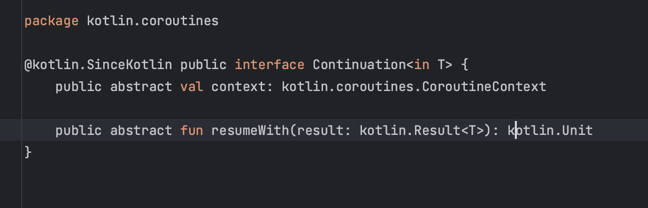
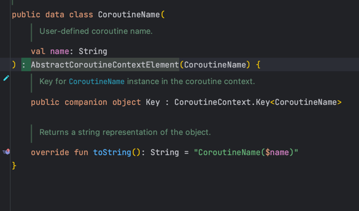
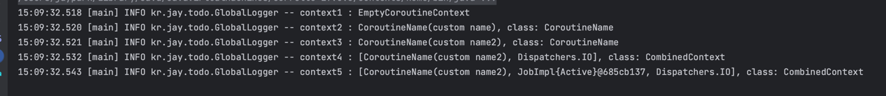
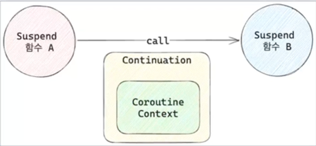
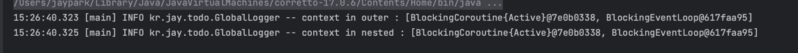

# Kotlin Coroutines

## CoroutineContext

### Coroutine과 ThreadLocal

* coroutine은 다른 쓰레드풀에서 동작 가능
    * CoroutineDispatcher (Dispatchers.IO)를 넘겨서 변경
* runBlocking은 main 함수에서 동작하기 떄문에 ThreadLocal에 접근 가능하지만 launch는 다른 쓰레드에서 동작하기 떄문에 ThreadLocal 결과가 null

```kotlin
fun main() {
    val greeting = ThreadLocal<String>()
    greeting.set("Hello")

    runBlocking {
        log.info("thread: {}", Thread.currentThread().name)
        log.info("greeting: {}", greeting.get()) // -> Hello

        launch(Dispatchers.IO) {
            log.info("thread: {}", Thread.currentThread().name)
            log.info("greeting: {}", greeting.get())  // -> null
        }
    }
}
```

### Continuation

* suspend 함수들 사이에 공유해야하는 정보가 있다면?
* suspend 함수는 다양한 쓰레드에서 실행되기 때문에 ThreadLocal 사용 불가
* Continuation은 coroutine 내의 모든 suspend 함수에 전달
* 그리고 CoroutineContext를 포함한다.



### CoroutineContext 접근

* runBlocking, launch, async와 같은 CoroutineScope 내부에 있다면 CoroutineScope.coroutineContext를 통해서 접근 가능  
  

* Continuation에 접근이 가능하다면, Continuation.coroutineContext를 통해서 접근 가능  
  

* suspend 함수 내부에서는 CoroutineContext를 통해서 접근 가능.  
  

```kotlin
import kotlin.coroutines.coroutineContext

private suspend fun child() {
    log.info("context in suspend : {}", coroutineContext)

    var result = suspendCoroutine<Int> { cont ->
        log.info("context in suspendCoroutine : {}", cont.context)
        cont.resume(100)
    }
    log.info("result : {}", result)
}

fun main() {
    runBlocking {
        log.info("context in coroutineScope : {}", this.coroutineContext)
        child()
    }
}
```


### CoroutineContext 연산자

* CoroutineContext는 get, plus, minusKey등의 연산자를 제공
* get: 특정 key를 갖는 Element 반환.
* plus: 현재 context에 다른 Context를 병합. 이미 같은 key를 갖는 Element가 다른 contest에 있다면 다른 element로 override
* minusKey: 현재 Context에서 주어진 key를 갖는 element를 제외한 context를 반환.

### CoroutineContext Key, Element

* CoroutineContext는 여러 Element를 포함
* Element의 개수에 따라 다른 객체로 존재
* EmptyCoroutineContext: Element가 하나도 없는 상태
* Element: Element가 하나인 상태. 즉 Element 그 자체
* CombinedContext: Element가 두 개 이상 일 때
* Key: Element를 구분할 때 사용하는 식별자


### EmptyCoroutineContext

* CoroutineContext를 구현
* Element를 갖지 않는 텅 빈 CoroutineContext를 가리킨다.
* 숫자의 0과 같은 객체


### Element 구현체

* Element 인터페이스를 구현하는 구현체
* CoroutineName, CoroutineDispatcher, CoroutineExceptionHandler, Job, ThreadContextElement등이 존재
* CoroutineName은 companion object로 key를 포함.
* AbstractCoroutineContextElement(CoroutineName)은 AbstractCoroutineContextElement(CoroutineName.Key)와 동일



### CombinedContext

* left와 element로 구성
* left는 또 다른 CombinedContext혹은 Element를 가리킨다.
* element는 가장 최근에 추가된 Element를 가리킨다.
* plus를 통해서 다른 Element가 추가되면
    * 이미 존재하면 element라면 override
    * 없는 element라면, 현재 combinedContext를 left로 새로운 element를 element로 하는 CombinedContext를 생성

  


### CoroutineContext plus

```kotlin

fun main() {
    val context1 = EmptyCoroutineContext
    log.info("context1 : {}", context1)

    val element1 = CoroutineName("custom name")
    val context2 = context1 + element1
    log.info("context2 : {}, class: {}", context2, context2.javaClass.simpleName)

    val element2 = CoroutineName("custom name2")
    val context3 = context2 + element2
    log.info("context3 : {}, class: {}", context3, context3.javaClass.simpleName)

    val element3 = Dispatchers.IO
    val context4 = context3 + element3
    log.info("context4 : {}, class: {}", context4, context4.javaClass.simpleName)

    val element4 = Job()
    val context5 = context4 + element4
    log.info("context5 : {}, class: {}", context5, context5.javaClass.simpleName)
}
```  



* EmptyCoroutineContext + Element = Element
* Element + Element = CombinedContext
    * 하지만 같은 key를 갖는 Element가 있다면, 뒤에 추가된 Element로 override
* CombinedContext + Element = CombinedContext

### CoroutineContext get

```kotlin
var context = CoroutineName("custom name") + Dispatchers.IO

val element1 = context[CoroutineName]
log.info("element1 : {}", element1)

val element2 = context.get(CoroutineDispatcher)
log.info("element2 : {}", element2)

val element3 = context.get(Job)
log.info("element3 : {}", element3)

```  


* CoroutineContext는 get 연산자를 구현했기 떄문에 [CoroutineContext.key] 형태로 Element에 접근 가능
* 혹은 get 메소드를 통해서 접근 가능
* key에 해당하는 Element가 없다면 null 반환

## CoroutineContext의 전파

### suspend 함수 사이에서 전파.

* suspend 함수에서 다른 suspend 함수를 호출하는 경우, 바깥 suspend 함수의 Continuation 전달.
* 이를 통해서 바깥 Continuation의 CoroutineContext가 내부 suspend 함수에 전달



### suspend 함수 사이에서 전파 예제

```kotlin
suspend fun nested() {
    log.info("context in nested : {}", coroutineContext)
}

suspend fun outer() {
    log.info("context in outer : {}", coroutineContext)
    nested()
}

fun main() {
    runBlocking {
        outer()
    }
}
```  



* outer suspend 함수에서 nested suspend 함수를 호출하기 떄문에 CoroutineContext가 그대로 전파.

### withContext

* 현재 Coroutine의 CoroutineContext에 인자로 전달된 context를 merge
* 새로운 Job을 생성해서 주입


### withContext 예제

```kotlin
fun main() {
    runBlocking {
        log.info("context in runBlocking : {}", this.coroutineContext)

        withContext(CoroutineName("withContext")) {
            val ctx = this.coroutineContext
            log.info("context in withContext : {}", ctx)
        }

        log.info("context in runBlocking : {}", this.coroutineContext)
    }
}
```  


* runBlocking 내부에서 withContext를 실행
* withContext는 runBlocking의 coroutineContext를 merge
    * CoroutineName을 override
    * UndispatchedCoroutine job을 새로 생성
* withContext의 블록이 끝나면, 원래의 context로 복구

## CoroutineContext Element

### CoroutineName

* 디버깅에 이용되는 element
* CoroutineName을 변경하면 logging에 출력
    * -Dkotlinx.coroutines.debug 필요


```kotlin
fun main() {
    runBlocking(CoroutineName("runBlocking")) {
        log.info(
            "name in runBlocking: {}",
            this.coroutineContext[CoroutineName]
        )

        withContext(CoroutineName("withContext")) {
            log.info(
                "name in withContext: {}",
                this.coroutineContext[CoroutineName]
            )
        }
    }
}
```  


* runBlocking에도 CoroutineContext 제공 가능
* withContext를 통해서 CoroutineContext를 override

### Job

* Coroutine의 생명주기를 관리
* Job은 active, completed, cancelled와 같은 여러 상태를 갖는다.
* start, cancel을 통해서 명시적으로 시작과 취소 가능.
* parent, children을 통해서 다른 Coroutine의 생명주기도 관리
* launch, async등의 coroutine builder를 통해서 자식 Job을 생성 가능

### Coroutine과 ThreadLocal

* Coroutine은 Dispatcher에 따라서 다른 쓰레드에서 동작 가능
* 따라서 ThreadLocal은 동작 불가

```kotlin
fun main() {
    val greeting = ThreadLocal<String>()
    greeting.set("hello")

    runBlocking {
        log.info("thread: {}", Thread.currentThread().name)
        log.info("greeting: {}", greeting.get())

        launch(Dispatchers.IO) {
            log.info("thread: {}", Thread.currentThread().name)
            log.info("greeting: {}", greeting.get())
        }
    }
}
```


### ThreadLocalElement

* ThreadLocalElement를 통해서 threadLocal을 전달하는 element 제공
* ThreadLocal의 asContextElement를 통해서 ThreadLocalElement 생성

```kotlin
fun main() {
    runBlocking {
        val greeting = ThreadLocal<String>()
        greeting.set("hello")

        launch(Dispatchers.IO) {
            log.info("greeting1: {}", greeting.get())
        }

        val aContext = Dispatchers.IO + greeting.asContextElement()

        launch(aContext) {
            log.info("greeting2: {}", greeting.get())
        }

        val bContext = Dispatchers.Default + greeting.asContextElement("hi")


        launch(aContext) {
            log.info("greeting3: {}", greeting.get())
            launch(aContext) {
                log.info("greeting4: {}", greeting.get())
            }
        }
    }
}
```


* asContextElement로 element로 변환해서 context 형태로 전달 -> 자식 coroutine에도 전달 ( CombinedContext )
* asContextElement에 값을 전달하여 다른 값을 갖게끔 설정 가능

### ReactorContext

* ReactorContext를 통해서 Reactor의 ContextView를 다른 suspend 함수에 전달.

```kotlin
fun main() {
    val greeting = mono {
        launch(Dispatchers.IO) {
            val context = this.coroutineContext[ReactorContext]
                ?.context
            val who = context?.get<String>("who")
                ?: "world"
            log.info("hello, $who")

            val newContext = (context ?: Context.empty()).put("who", "jay")
            launch(ReactorContext(newContext)) {
                val context = this.coroutineContext[ReactorContext]
                    ?.context

                Mono.create<String> {
                    val who = it.contextView().getOrDefault("who", "world")
                    it.success("hello, $who")
                }.contextWrite((context ?: Context.empty()))
                    .subscribe {
                        log.info(it)
                    }
            }
        }
    }

    greeting
        .contextWrite { it.put("who", "grizz") }
        .subscribe()

    Thread.sleep(1000)
}
```  


* contextWith을 통해서 context를 주입
* launch 내에서 coroutineContext의 ReactorContext로 접근
* 해당 context를 기반으로 새로운 reactor context 생성
* ReactorContext(newContext)로 launchdp wjsekf
* Mono에서 contextWrite을 통해서 coroutineContext로 전달된 reactor context를 주입하고 출력

### CoroutineContext 만들기

```kotlin
import kotlin.coroutines.AbstractCoroutineContextElement

private class GreetingContext(
  private val greeting: String,
) : AbstractCoroutineContextElement(GreetingContext){
    public companion object Key : 
        CoroutineContext.Key<GreetingContext>
  
    fun greet() {
      log.info(greeting)
    }
}
```  


* AbstractCoroutineContextElement를 상속하는 Context 생성
* 인자로 greeting을 받고
* greet 메소드를 실행하면 greeting을 출력

```kotlin

fun main() {
    runBlocking {
        val context = GreetingContext("Hello")

        launch(context) {
            coroutineContext[GreetingContext]?.greet()

            val newContext = GreetingContext("Hola")
            launch(newContext) {
                coroutineContext[GreetingContext]?.greet()

                launch {
                    coroutineContext[GreetingContext]?.greet()
                }
            }
        }

        val job = CoroutineScope(Dispatchers.IO + context).launch {
            coroutineContext[GreetingContext]?.greet()

            launch {
                coroutineContext[GreetingContext]?.greet()

                launch {
                    coroutineContext[GreetingContext]?.greet()
                }
            }
        }

        job.join()
    }
}

```  
  
* launch에 context를 전달.
* context에 key로 접근하여 greet 호출
* 중간에 Hola값을 갖는 중간 context를 생성하고 newContext로 대체 
  * 나중에 추가된 GreetingContext로 override되어 그 아래부터 Hola cnffur
* 새로운 CoroutineScope에도 context 전파

