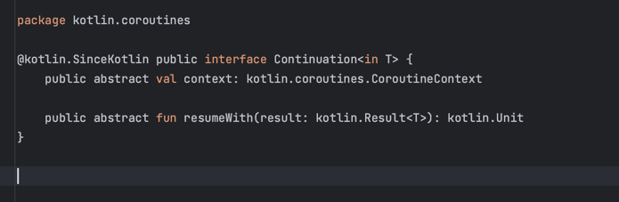
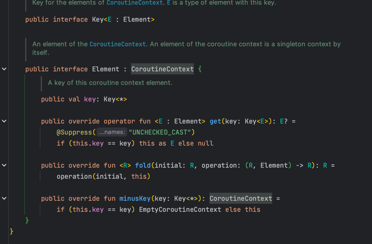

# Kotlin Coroutines
## CoroutineContext
### Coroutine과 ThreadLocal

* coroutine은 다른 쓰레드풀에서 동작 가능
    * CoroutineDispatcher (Dispatchers.IO)를 넘겨서 변경
* runBlocking은 main 함수에서 동작하기 떄문에 ThreadLocal에 접근 가능하지만 launch는 다른 쓰레드에서 동작하기 떄문에 ThreadLocal 결과가 null

```kotlin
fun main() {
    val greeting = ThreadLocal<String>()
    greeting.set("Hello")

    runBlocking {
        log.info("thread: {}", Thread.currentThread().name)
        log.info("greeting: {}", greeting.get()) // -> Hello

        launch(Dispatchers.IO) {
            log.info("thread: {}", Thread.currentThread().name)
            log.info("greeting: {}", greeting.get())  // -> null
        }
    }
}
```

### Continuation

* suspend 함수들 사이에 공유해야하는 정보가 있다면?
* suspend 함수는 다양한 쓰레드에서 실행되기 때문에 ThreadLocal 사용 불가
* Continuation은 coroutine 내의 모든 suspend 함수에 전달
* 그리고 CoroutineContext를 포함한다.


### CoroutineContext 접근

* runBlocking, launch, async와 같은 CoroutineScope 내부에 있다면 CoroutineScope.coroutineContext를 통해서 접근 가능  
  

* Continuation에 접근이 가능하다면, Continuation.coroutineContext를 통해서 접근 가능  
  

* suspend 함수 내부에서는 CoroutineContext를 통해서 접근 가능.  
  

```kotlin
import kotlin.coroutines.coroutineContext

private suspend fun child(){
    log.info("context in suspend : {}", coroutineContext)
  
    var result = suspendCoroutine<Int> { cont ->
        log.info("context in suspendCoroutine : {}", cont.context)
      cont.resume(100)
    }
    log.info("result : {}", result)
}

fun main(){
    runBlocking {
        log.info("context in coroutineScope : {}", this.coroutineContext)
        child()
    }
}
```
 


### CoroutineContext 연산자
* CoroutineContext는 get, plus, minusKey등의 연산자를 제공
* get: 특정 key를 갖는 Element 반환.
* plus: 현재 context에 다른 Context를 병합. 이미 같은 key를 갖는 Element가 다른 contest에 있다면 다른 element로 override
* minusKey: 현재 Context에서 주어진 key를 갖는 element를 제외한 context를 반환.


### CoroutineContext Key, Element
* CoroutineContext는 여러 Element를 포함
* Element의 개수에 따라 다른 객체로 존재
* EmptyCoroutineContext: Element가 하나도 없는 상태
* Element: Element가 하나인 상태. 즉 Element 그 자체
* CombinedContext: Element가 두 개 이상 일 때
* Key: Element를 구분할 때 사용하는 식별자



### EmptyCoroutineContext
* CoroutineContext를 구현
* Element를 갖지 않는 텅 빈 CoroutineContext를 가리킨다.
* 숫자의 0과 같은 객체


### Element 구현체
* Element 인터페이스를 구현하는 구현체
* CoroutineName, CoroutineDispatcher, CoroutineExceptionHandler, Job, ThreadContextElement등이 존재
* CoroutineName은 companion object로 key를 포함.
* AbstractCoroutineContextElement(CoroutineName)은 AbstractCoroutineContextElement(CoroutineName.Key)와 동일


### CombinedContext
* left와 element로 구성
* left는 또 다른 CombinedContext혹은 Element를 가리킨다.
* element는 가장 최근에 추가된 Element를 가리킨다.
* plus를 통해서 다른 Element가 추가되면
  * 이미 존재하면 element라면 override
  * 없는 element라면, 현재 combinedContext를 left로 새로운 element를 element로 하는 CombinedContext를 생성

  
  

### CoroutineContext plus
```kotlin

fun main(){
    val context1 = EmptyCoroutineContext
    log.info("context1 : {}", context1)

    val element1 = CoroutineName("custom name")
    val context2 = context1 + element1
    log.info("context2 : {}, class: {}", context2, context2.javaClass.simpleName)

    val element2 = CoroutineName("custom name2")
    val context3 = context2 + element2
    log.info("context3 : {}, class: {}", context3, context3.javaClass.simpleName)

    val element3 = Dispatchers.IO
    val context4 = context3 + element3
    log.info("context4 : {}, class: {}", context4, context4.javaClass.simpleName)

    val element4 = Job()
    val context5 = context4 + element4
    log.info("context5 : {}, class: {}", context5, context5.javaClass.simpleName)
}
```  


* EmptyCoroutineContext + Element = Element
* Element + Element = CombinedContext
  * 하지만 같은 key를 갖는 Element가 있다면, 뒤에 추가된 Element로 override
* CombinedContext + Element = CombinedContext


### CoroutineContext get

```kotlin
var context = CoroutineName("custom name") + Dispatchers.IO

val element1 = context[CoroutineName]
log.info("element1 : {}", element1)

val element2 = context.get(CoroutineDispatcher)
log.info("element2 : {}", element2)

val element3 = context.get(Job)
log.info("element3 : {}", element3)

```  


* CoroutineContext는 get 연산자를 구현했기 떄문에 [CoroutineContext.key] 형태로 Element에 접근 가능
* 혹은 get 메소드를 통해서 접근 가능
* key에 해당하는 Element가 없다면 null 반환  
