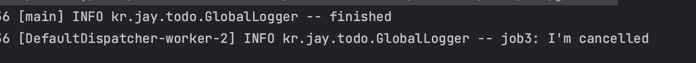
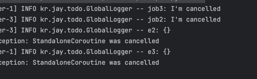
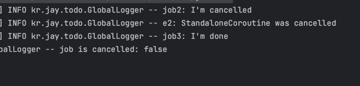
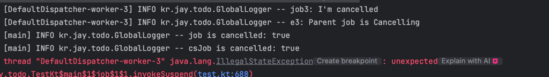
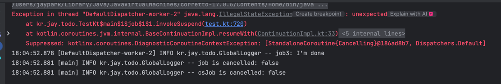
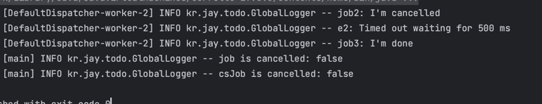

# Kotlin Coroutines

## CoroutineScope

### CoroutineScope
* CoroutineScope는 Coroutine들에 대한 scope를 정의
  * scope에는 여러 Coroutine들이 포함.
  * 자식 coroutine들에 대한 생명주기를 관리
  * 자식 coroutine들이 모두 완료되어야만 scpoe도 완료
* 이런 관리를 위해서 CoroutineScope의 CoroutineContext에는 꼭 Job을 포


### CoroutineScope 함수
* CoroutineScope 함수를 이용해서 CoroutineScope를 생성
* 인자로 주어진 context에 Job이 포함되어있는지 확인
* 포함되어있지 않다면 Job을 생성하여 추가하고 ContextScope에 전달
* ContextScope는 CoroutineScope의 단순한 구현체

  
  


```kotlin
import kotlin.coroutines.EmptyCoroutineContext

fun main() {
  val cs = CoroutineScope(EmptyCoroutineContext)
  
  log.info("context : {}" , cs.coroutineContext)
  log.info("class name :{}", cs.javaClass.name)
}
```  
  


* EmptyCoroutineContext를 통해 텅빈 CoroutineContext를 생성
* 하지만 Job을 생성하여 ContextScope를 생성하기 때문에 JobImpl 포함

### Coroutine builder
* Coroutine builder는 CoroutineScope로 부터 Coroutine을 생성
* CoroutineScope의 CoroutineContext와 인자로 전달 받은 context를 merge하여 newContext 생성
* Coroutine을 생성하여 start하고 반환
  * CoroutineScope의 Job을 부모로 갖는다.
  * Coroutine builder를 통해서 생성된 Coroutine은 비동기하게 시작
 
### Coroutine builder - launch
* standaloneCoroutine을 생성하고 start
  * isLazy가 true 라면 LazyStandaloneCoroutine을 생성
* standaloneCoroutine을 Job으로 반환
  * 외부에서 launch를 실행한 후 Job을 획득하여 cancel, join등을 실행 가능
* newCoroutineContext를 통해 CoroutineScope의 coroutineContext와 인자로 주어진 context를 merge

  


```kotlin
fun main(){
    runBlocking {
        val cs = CoroutineScope(EmptyCoroutineContext)
        log.info("job : {}", cs.coroutineContext[Job])

        val job = cs.launch {
            // coroutine created
            delay(100)
            log.info("context : {}", this.coroutineContext)
            log.info("class name : {}", this.javaClass.simpleName) 
        }
        log.info("step1")
        job.join()
        log.info("step2")
    }
}
```  


* CoroutineScope에 coroutine builder인 launch를 통해서 coroutine을 생성하고 this로 접근
* 비동기로 동작하기 때문에 join을 통해서 완료될 떄까지 suspend

### Coroutine builder - async
* DeferredCoroutine을 생성하고 start
  * isLazy가 true 라면 LazyDeferredCoroutine을 생성
* DeferredCoroutine을 Deferred로 반환
  * Deferred는 Job을 상속하고 있기 때문에 cancel,join 뿐만 아니라 
  * await을 통해서 block이 반환하는 값에 접근 가능

  


```kotlin
fun main(){
    runBlocking {
        val cs = CoroutineScope(EmptyCoroutineContext)
        log.info("job : {}", cs.coroutineContext[Job])

        val deferred = cs.async {
            delay(100)
            log.info("context : {}", this.coroutineContext)
            log.info("class name : {}", this.javaClass.simpleName)

            100
        }

        log.info("step1")
        log.info("result : {} ",deferred.await())
        log.info("step2")
    }
}
```  


* CoroutineScope에 coroutine builder인 async를 통해서 coroutine을 생성하고 this로 접근
* 비동기로 동작하기 때문에 await을 통해서 완료될 떄까지 suspend하고 값에 접근

### 정리
* 비동기 적으로 동작을 해야하고 반환값이 필요없다면 launch
* 비동기 적으로 동작을 해야하고 반환값이 필요하다면 async

---  

---

## Coroutine
* 모든 Coroutine은 AbstractCoroutine을 상속
* Coroutine은 Job이며 Continuation이고 CoroutineScope  


* Job: 작업의 단위가 되고 start, cancel로 상태를 변경할 수 있으며 join으로 완료 시점을 명시
* CoroutineScope: Coroutine builder를 통해서 자식 Coroutine을 생성하고, 자식 Coroutine들의 생명주기를 관리
 
```kotlin
fun main(){
    runBlocking {
        val cs = CoroutineScope(EmptyCoroutineContext)

        val job = cs.launch {
            delay(100)
            log.info("job : {}", this.coroutineContext[Job])

            val job2 = this.launch {
                delay(500)
                log.info("coroutine2 finished")
            }

            job2.join()
            log.info("coroutine1 finished")
        }
        log.info("step1")
        job.join()
        log.info("step2")
    }
}
```  


* CoroutineScope에 coroutine builder인 launch를 통해서 coroutine (이하 corotuine1)을 생성
* coroutine1에서 자식 coroutine(이하 coroutine2)를 생성
  * coroutine1이 CoroutineScope이기 때문에 가능
* job2의 join을 통해 완료될 때까지 suspend

### launch의 문제

```kotlin
fun main(){
  runBlocking {
    val job = CoroutineScope(EmptyCoroutineContext).launch {
      val job1 = launch {
        delay(100)
        log.info("job1 complete")
      }

      val job2 = launch {
        delay(100)
        log.info("job2 complete")
      }

      val job3 = launch {
        delay(100)
        log.info("job3 complete")
      }

      log.info("step1")
      job1.join()
      job2.join()
      job3.join()
      log.info("step2")
    }
    job.join()
  }
}
```   
  

* 여러 job들이 완료되어야 하는 시점이 중요하다면?
  * job1, job2, job3은 정확히 step1, 출력과 step2 출력 사이에 완료되어야 한다.
* job을 받아서 직접 join을 실행한다.
  * 매번 여러 job을 join하는 것이 쉽지 않다.
  * 만약 for loop를 통해서 launch를 여러번 한다면?
  

### launch 문제 해결 1
```kotlin
fun main(){
    runBlocking {
        val job = CoroutineScope(EmptyCoroutineContext).launch {
            val job1 = launch {
                launch {
                    delay(100)
                    log.info("job1 complete")
                }
                launch {
                    delay(100)
                    log.info("job2 complete")
                }
                launch {
                    delay(100)
                    log.info("job3 complete")
                }
            }
            log.info("step1")
            job1.join()
            log.info("step2")
        }
        job.join()
    }
}
```  
  

* coroutine들을 묶은 coroutine을 생성하여 join
* job1은 3개의 coroutine을 포함하고
* join을 호출하여 suspend된 후, 3개의 coroutine이 모두 완료된 후 resume
* 여전히 job1에 대한 join은 여전히 존재

### Scoping 함수 - coroutineScope
* coroutineScope는 외부 scope의 context를 상속하고 Job을 override
  * 이를 통해 분리된 환경에서 자식 coroutine들의 생명주기를 관리하고 
  * 자식 coroutine이 모두 완료되고 coroutineScope 함수가 완료됨을 보장
* ScopeCoroutine을 생성하여 block을 실행
  * ScopeCoroutine은 동기적으로 동작

  
  


### launch 문제 해결 2

```kotlin

fun main(){
    runBlocking {
        val job = CoroutineScope(EmptyCoroutineContext).launch {
            log.info("step1")
            coroutineScope{
                launch {
                    delay(100)
                    log.info("job1 complete")
                }
                launch {
                    delay(100)
                    log.info("job2 complete")
                }
                launch {
                    delay(100)
                    log.info("job3 complete")
                }
            }
            log.info("step2")
        }
        job.join()
    }
}
```  


* coroutineScope를 생성하여 step1과 step2 사이에 추가
* coroutineScope는 동기적으로 동작
* coroutineScope의 ScopeCoroutine이 launch의  standaloneCoroutine을 자식으로 두기 때문에 launch들이 모두 완료되고 coroutineScope가 종료됨이 보장

### coroutineScope와 launch의 차이

```kotlin
fun main() {
    runBlocking {
        suspend fun getResult(): Int {
            delay(100)
            return 100
        }

        val job = CoroutineScope(EmptyCoroutineContext).launch {
            log.info("context in root : {}", coroutineContext)

            val result = coroutineScope {
                log.info("context in cotoutineScope : {}", coroutineContext)
                getResult()
            }
            log.info("result : {}", result)

            launch {
                log.info("context in launch : {}", coroutineContext)
            }
        }
        job.join()
    }
}
```  


* coroutineScope는 동기적으로 launch는 비동기적으로 동작
* coroutineScope는 ScopeCoroutine을 생성하지만 ContinuationId를 override하지 않고 launch는 새로운 ContinuationId를 생성 (standaloneCoroutine은 새로운 id를 생성)
* coroutineScope는 결과를 반환하지만 launch는 Job을 반환

### async 문제

```kotlin
fun main() {
    runBlocking {
        val job = CoroutineScope(EmptyCoroutineContext).launch {
            val deferred1 = async {
                delay(100)
                log.info("deferred1 complete")
                100
            }

            val deferred2 = async {
                delay(100)
                log.info("deferred2 complete")
                200
            }

            val deferred3 = async {
                delay(100)
                log.info("deferred3 complete")
                300
            }

            log.info("step1")
            val result = deferred1.await() + deferred2.await() + deferred3.await()
            log.info("result : {}", result)
            log.info("step2")
        }
        job.join()
    }
}
```  

  

* 여러 deferred들이 완료되어야 하는 시점이 중요하다면?
  * deferred1,2,3은 정확히 step1 출력과 step2 출력 사이에 반환되어야 한다.


### async 문제 해결

```kotlin
fun main() {
    runBlocking {
        val job = CoroutineScope(EmptyCoroutineContext).launch {
            log.info("step1")
            val result = coroutineScope {
                val deferred1 = async {
                    delay(100)
                    log.info("deferred1 complete")
                    100
                }

                val deferred2 = async {
                    delay(100)
                    log.info("deferred2 complete")
                    200
                }

                val deferred3 = async {
                    delay(100)
                    log.info("deferred3 complete")
                    300
                }
                deferred1.await() + deferred2.await() + deferred3.await()
            }
            log.info("result : {}", result)
            log.info("step2")
        }
        job.join()
    }
}
```  


* coroutineScope로 async를 감싸고 마지막에 await을 호출하여 결과를 합산
  * async 함수를 호출하는 순간부터 각각의 coroutine들은 시작
  * 따라서 300ms아닌 100ms만 걸리게 된다.
* coroutineScope로 감싸고 async를 실행하기 때문에 포함하고 있는 async들만 종료되고 나면 coroutineScope도 종료
  * 즉 asynce들만 실행되고 합류하는 일종의 동기화 포인트 생성


### Scoping 함수 - withContext
* Scoping 함수는 coroutineScope뿐만 아니라 withContext도 존재
* coroutineScope와는 다르게 인자로 context를 전달
* oldContext에 인자로 전달받은 context를 merge한 newContext를 생성
* newContext와 oldContext의 상태에 따라서 ScopeCoroutine, UndispatchedCoroutine, DispatchedCoroutine을 반환
  
  

```kotlin
fun main(){
    runBlocking {
        val job = CoroutineScope(Dispatchers.Default).launch {
            log.info("context in launch : {}", coroutineContext)

            withContext(Dispatchers.IO) {
                log.info("context in withContext : {}", coroutineContext)
            }

            log.info("context in launch again: {}", coroutineContext)
        }
        job.join()
    }
}
```  


* withContext를 실행하여 DispatchedCoroutine 생성
* 동기적으로 동작
* withContext를 통해서 변경된 context는 witchContext 내부에만 영향

---  

---  

## Job Cancellation
### Job 트리

```kotlin
fun main() {
    runBlocking {
        val cs = CoroutineScope(Dispatchers.Default)
        log.info("job1: {}", cs.coroutineContext[Job])


        cs.launch {
            log.info("job2: {}", this.coroutineContext[Job])

            launch {
                log.info("job3: {}", this.coroutineContext[Job])
            }

            launch {
                log.info("job4: {}", this.coroutineContext[Job])
            }
        }
        delay(100)
    }
}
```
  

* coroutineScope에 coroutine이 추가되면 해당 coroutine은 coroutineScope의 Job을 부모로 갖는다.
* coroutine이 coroutineScope로 동작하는 상황이라면 자기 자신을 Job으로 가지고 있기 때문에 coroutine끼리 부모-자식 구조가 형성됨
* 만약 cancel이 발생한다면?

### cancel - CoroutineScope

```kotlin
fun main() {
    runBlocking {
        val cs = CoroutineScope(Dispatchers.Default)

        // launch1
        cs.launch {
            // launch2
            launch {
                delay(1000)
                log.info("job2: I'm done")
            }

            // launch3
            launch {
                try {
                    delay(1000)
                    log.info("job3: I'm done")
                } catch (e: Exception) {
                    log.info("job3: I'm cancelled")
                    log.info("e: {}", e)
                }
            }

            delay(1000)
            log.info("job1: I'm done")
        }

        delay(100)
        cs.cancel()
        log.info("finished")
    }
}
```

  

* launch2, launch3 내부의 Coroutine에서 delay에 걸려있는 동안
* 100ms가 지나고 CoroutineScope를 cancel
* root job이 cancel되고 cancellation이 전파.
* delay에서 jobCancellationException throw
  * coroutineScope는 join을 제공하지 않기 때문에 확인 불가.

### cancel - Root Coroutine

```kotlin
fun main() {
    runBlocking {
        val cs = CoroutineScope(Dispatchers.Default)

        // launch1
        val job = cs.launch {
            // launch2
            launch {
                try {
                    delay(1000)
                    log.info("job2: I'm done")
                } catch (e: Exception) {
                    log.info("job2: I'm cancelled")
                    log.info("e2: {}", e)
                }
            }

            // launch3
            launch {
                try {
                    delay(1000)
                    log.info("job3: I'm done")
                } catch (e: Exception) {
                    log.info("job3: I'm cancelled")
                    log.info("e3: {}", e)
                }
            }

            delay(1000)
            log.info("job1: I'm done")
        }

        delay(100)
        job.cancelAndJoin()
    }
}
```

  

* Root Coroutine에서 cancelAndJoin 실행
  * Root Coroutine에서 cancel을 진행하고 join을 통해서 모든 coroutine이 종료될때까지 대기
* job2, job3의 delay에서 모두 JobCancellationException throw


### cancel - Leaf Coroutine

```kotlin
fun main() {
    runBlocking {
        val cs = CoroutineScope(Dispatchers.Default)

        // launch1
        val job = cs.launch {
            // launch2
            val job2 = launch {
                try {
                    delay(1000)
                    log.info("job2: I'm done")
                } catch (e: Exception) {
                    log.info("job2: I'm cancelled")
                    log.info("e2: {}", e.message)
                }
            }

            // launch3
            launch {
                try {
                    delay(1000)
                    log.info("job3: I'm done")
                } catch (e: Exception) {
                    log.info("job3: I'm cancelled")
                    log.info("e3: {}", e.message)
                }
            }

            delay(100)
            job2.cancel()
        }

        job.join()
        log.info("job is cancelled: {}", job.isCancelled)
    }
}
```  


* leaf에 해당하는 coroutine2와 coroutine3중에 coroutine2를 job으로 받아서 cancel
* job2는 cancel되고 JobCancellationException throw
* job3는 실행
* root coroutine의 경우도 cancelled가 아님!

### cancel은 부모에서 자식으로는 전파가 되지만 자식에서 부모로는 전파가 되지 않는다.

### exception - Lead Coroutine
```kotlin
fun main() {
    runBlocking {
        val cs = CoroutineScope(Dispatchers.Default)
        val csJob = cs.coroutineContext[Job]

        // launch1
        val job = cs.launch {
            // launch2
            launch {
                delay(100)
                throw IllegalStateException("unexpected")
            }

            // launch3
            launch {
                try {
                    delay(1000)
                    log.info("job3: I'm done")
                } catch (e: Exception) {
                    log.info("job3: I'm cancelled")
                    log.info("e3: {}", e.message)
                }
            }
        }

        job.join()
        log.info("job is cancelled: {}", job.isCancelled)
        log.info("csJob is cancelled: {}", csJob?.isCancelled)
    }
}
```  



* 만약 leaf coroutine에서 exception이 발생한 다면?
* coroutine3의 delay가 JobCancellationException throw
  * message는 Parent job is Cancelling
* root coroutine, coroutineScope의 job 모두 cancelled


### exception - SupervisorJob
```kotlin
fun main() {
    runBlocking {
        val cs = CoroutineScope(Dispatchers.Default)
        val csJob = cs.coroutineContext[Job]

        // launch1
        val job = cs.launch {
            // launch2
            launch(SupervisorJob()) {
                delay(100)
                throw IllegalStateException("unexpected")
            }

            // launch3
            launch {
                try {
                    delay(1000)
                    log.info("job3: I'm done")
                } catch (e: Exception) {
                    log.info("job3: I'm cancelled")
                    log.info("e3: {}", e.message)
                }
            }
        }

        job.join()
        log.info("job is cancelled: {}", job.isCancelled)
        log.info("csJob is cancelled: {}", csJob?.isCancelled)
    }
}
```

  

* SupervisorJob을 Context로 제공하면 exception에 의한 cancel 전파가 위로 전달되지 않고 아래 방향으로만 전파.

### withTimeout

```kotlin
fun main() {
    runBlocking {
        val cs = CoroutineScope(Dispatchers.Default)
        val csJob = cs.coroutineContext[Job]

        // launch1
        val job = cs.launch {
            // launch2
            launch {
                withTimeout(500) {
                    try {
                        delay(1000)
                        log.info("job2: I'm done")
                    } catch (e: Exception) {
                        log.info("job2: I'm cancelled")
                        log.info("e2: {}", e.message)
                    }
                }
            }

            // launch3
            launch {
                try {
                    delay(1000)
                    log.info("job3: I'm done")
                } catch (e: Exception) {
                    log.info("job3: I'm cancelled")
                    log.info("e3: {}", e.message)
                }
            }
        }

        job.join()
        log.info("job is cancelled: {}", job.isCancelled)
        log.info("csJob is cancelled: {}", csJob?.isCancelled)
    }
}
```



* withTimeOut을 통해 일정 시간 대기
* 시간 초과시 해당 Coroutine을 cancel하고 TimeoutCancellationException throw
