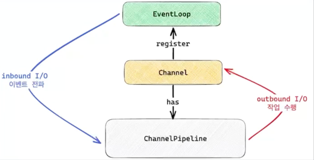
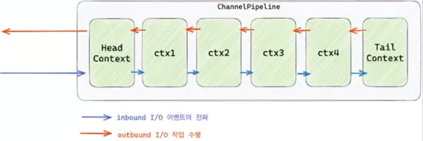
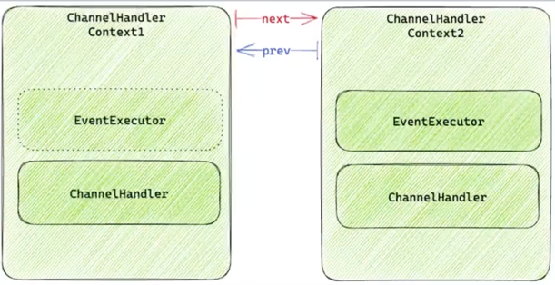
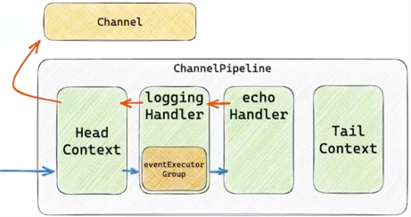
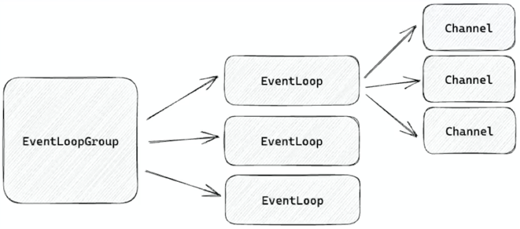
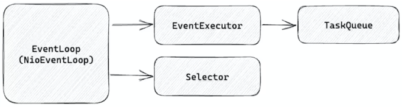
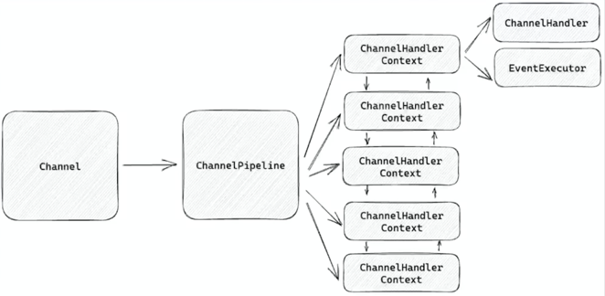

# Netty
* 비동기 이벤트 기반의 네트워크 어플리케이션 프레임워크
* HTTP 분만 아니라 다양한 프로토콜 지원
* Java IO, NIO, selector 기반으로 적은 리소스로 높은 성능 보장
* 불필요한 메모리 copy를 최소한으로
* 유연하며 확장 가능한 이벤트 모델 기반
* 서버와 클라이언트 모두 지원

## NIOEventLoop
* EventExecutor. TaskQueue, Selector를 포함
* EventExecutor : task를 실행하는 쓰레드풀
* TaskQueue : task를 저장하는 큐, eventExecutor가 즉시 task를 수행하지 않고 taskQueue에 넣은 후, 나중에 꺼내서 처리 가능
* Selector : I/O Multiplexing을 지원

## NIOEventLoop의 task
* I/O task와 Non-I/O task로 구분
* I/O task : register를 통해서 내부의 selector에 channel을 등록하고 I/O 준비 완료 이벤트가 발생하면 channel의 pipeline 실행
* Non-I/O task : task queue에서 Runnable 등 실행 가능한 모든 종류의 task를 꺼내서 실행

## NIOEventLoop의 ioRatio
* ioRatio를 설정하여 각각 task 수행에 얼마나 시간을 사용할지 설정 가능
* 기본값은 50
  * I/O task와 Non-I/O task를 1:1로 처리 동일한 시간을 사용
  * 100이면 시간을 측정하지 않고 task 수행

## NIOEventLoop의 I/O task
* NIOEventLoop를 직접 생성할 수 없기 때문에 NIOEventLoopGroup 사용
* NIO를 수행하는 ServerSocketChannel을 생성하고 accept network I/O 이벤트를 eventLoop에 등록
* 하나의 eventLoopGroup에 여러 개의 channel등록 가능
* I/O 이벤트 완료시 channel의 pipeline 실행

```java
var channel = new NioServerSocketChannel();
var eventLoopGroup = new NioEventLoopGroup(1); // 1개의 eventLoop를 가진 eventLoopGroup 생성
eventLoopGroup.register(channel); // 위에서 생성한 channel의 accept network I/O 이벤트를 eventLoop에 등록

channel.bind(new InetSocketAddress(8080))
        .addListener((ChannelFutureListener) future -> {
          if (future.isSuccess()) {
            System.out.println("Server bound");
          } else {
            System.out.println("Bound attempt failed");
            eventLoopGroup.shutdownGracefully();
          }
        });
```

## NIOEventLoop의 Non I/O task
* 일반적인 Executor처럼 Non I/O task 수행
* 하나의 쓰레드에서 돌기 때문에 순서 보장
* NioEventLoopGroup은 별도의 쓰레드풀을 가지고 있음
* execute()를 실행하는 쓰레드와 NioEventLoopGroup의 쓰레드가 다른 경우 execute를 즉각 적으로 실행하지 않고 taskQueue에 저장 후 NioEventLoopGroup의 쓰레드가 taskQueue에서 꺼내서 실행
```java
EventLoopGroup eventLoopGroup = new NioEventLoopGroup(1);

for (int i = 0; i < 10; i++) {
  final int idx = i;
  eventLoopGroup.execute(() -> {
    System.out.println(idx);
  });
}

eventLoopGroup.shutdownGracefully();
```

## EventLoopGroup
* EventLoop를 가지고 있는 group
* 생성자를 통해서 내부에 몇 개의 eventLoop를 포함할지 설정 가능
* group에서 execute는 eventLoopGroup내의 eventLoop를 순회하면서 execute 실행
* 각각의 eventLoop에 순차적으로 task가 추가되고 실행하기 때문에 eventExecutor 단위로 놓고 보면 순서가 보장.
```java
EventLoopGroup eventLoopGroup = new NioEventLoopGroup(5);
        
for (int i = 0; i < 12; i++) {
  final int idx = i;
  eventLoopGroup.execute(() -> {
    System.out.println(idx);
  });
}

eventLoopGroup.shutdownGracefully();
```  

---

## ChannelFuture
* Channel I/O 작업이 완료되면 isDone이 true가 되는 Future
* futureListener 등록/삭제를 지원하여 비동기 가능.
* addListener : Channel I/O 작업이 완료되면 수행할 futureListener 등록
* removeListener : 등록된 futureListener 삭제
* sync : Channel I/O 작업이 완료될 때까지 대기 blocking

## NioServerSocketChannel
* netty에서는 Java nio의 channel을 사용하지 않고 거의 자체 구현
* Channel, ServerSocketChannel 모두 자체 구현
* AbstractChannel : ChannelPipeline을 갖는다.
* AbstractNioChannel : 내부적으로 java.nio.ServerSocketChannel을 저장하고 register 할 때 java nio Selector에 등록

## ChannelPipeline
* Channel의 I/O 이벤트가 준비되면, EventLoop가 pipeline 실행
  * I/O task에 해당
* pipeline에서는 결과로 I/O 작업을 수행  



## ChannelPipeline 구성
* pipeline은 ChannelHandlerContext의 연속
* Head Context와 Tail Context를 기본적으로 포함.
* 각각의 context는 linkedList 형태로 next, prev를 통해서 이전 혹은 다음 context에 접근 가능.
* 모든 inbound I/O 이벤트는 next로
* 모든 outbound I/O 작업은 prev로   



## ChannelHandlerContext 구성
* ChannelHandlerContext는 EventExecutor와 ChannelHandler를 포함
* ChannelHandler는 I/O 이벤트를 받아서 
  * 다음 context로 전달할 수도 있고
  * 다음 context로 전달하지 않고 I/O 작업을 수행할 수도 있다.
* ChannelHandlerContext는 EventExecutor를 포함할 수도 있고 포함하지 않을 수도 있다.  




## ChannelHandlerContext
* ChannelHandler에서 시간이 오래 걸리는 연산을 진행한다면?
  * EventLoop 쓰레드에서 해당 ChannelHandler에서 Blocking
  * EventLoop에 등록된 다른 Channel의 I/O 처리 또한 Blocking
  * 해당 ChannelHandler에서는 EventLoop 쓰레드가 아닌 다른 쓰레드풀을 사용한다면?
* 이를 위해서 ChannelHandlerContext에 등록된 EventExecutor가 있다면?
  * next context가 다른 쓰레드풀에서 동작해야하는구나 라고 판다.
  * 직접 이벤트 처리를 호출하지 않고 executor.execute 로 taskQueue에 넣고 EventLoop 쓰레드는 복귀


## EventExecutor
* 특정 context에서 next context로 이벤트를 전파하는 상황에서
  * 쓰레드가 다르다면 next executor의 task queue에 이벤트 처리를 추가.
  * 쓰레드가 같다면 해당 쓰레드가 직접 이벤트 처리를 실행

```java
void invokeChannelRead(final AbstractChannelHandlerContext next, final Object msg) {
  final Object m = pipeline.touch(ObjectUtil.checkNotNull(msg, "msg"), next);
  EventExecutor executor = next.executor();
  if (executor.inEventLoop()) {
    next.invokeChannelRead(m);
  } else {
    executor.execute(() -> next.invokeChannelRead(m));
  }
}
```

## ChannelInboundHandler
* inbound I/O 이벤트를 처리하는 handler
* ChannelRegistered : channel이 eventLoop에 등록되었을 때
* ChannelUnregistered : channel이 eventLoop에서 등록 해제되었을 때
* ChannelActive : channel이 active 상태가 되었을 때
* ChannelInactive : channel이 inactive 상태가 되고 close가 되었을 때
* ChannelRead : channel로부터 메시지를 읽을 준비가 되었을 때
* ChannelReadComplete : channel로부터 메시지를 모두 읽었을 때
* userEventTriggered : user event가 트리거되었을 때
* ChannelWritabilityChanged : channel이 쓸 수 있는 상태가 변경된 경우, 딱 한번 호출

> channelRegistered(eventLoop에 channel 등록)   
> ->  channelActive(channel이 active 상태가 됨)  
> ->  channelRead(channel로부터 메시지를 읽을 준비가 됨)   
> ->  channelReadComplete(channel로부터 메시지를 모두 읽음)   
> ->  channelInactive(channel이 inactive 상태가 되고 close가 됨)   
> ->  channelUnregistered(eventLoop에서 channel 등록 해제)
> 

## ChannelOutboundHandler
* outbound I/O 이벤트를 처리하는 handler
* bind : channel을 bind 요청 시 호출
* connect : channel을 connect 요청 시 호출
* disconnect : channel을 disconnect 요청 시 호출
* deregister : eventLoop로 부터 deregister되면 호출
* read : channel을 read 요청 시 호출
* write : channel에 대한 write 요청 시 호출, 나중에 작업하는 handler가 이전 메시지를 다른 값으로 변경할 수 있다.
* flush : flush 작업이 수행된 경우 호출
* close : channel이 닫히면 호출

## Pipeline read 이벤트 전파

```java
import java.lang.ref.Reference;
import java.nio.ByteBuffer;
import java.nio.charset.StandardCharsets;

public class SampleInboundChannelHandler extends ChannelInboundHandlerAdapter {

  @Override
  public void channelRead(ChannelHandlerContext ctx, Object msg) {
    if (msg instanceof String) {
      // 다음 context로 전달하지 않고 I/O 작업을 수행 수 채널 닫기
      ctx.writeAndFlush("hello," + msg)
              .addListener(ChannelFutureListener.CLOSE);
    } else if (msg instanceof ByteBuffer) {
      // 별도의 outbound I/O 작업을 수행하지 않고 다음 context로 이벤트를 전달
      // msg 변경해서 전달 가능.
      try {
        var buf = (ByteBuffer)msg;
        var len = buf.readableBytes();
        var charset = StandardCharsets.UTF_8;
		var body = buf.readCharSequence(len, charset);
        ctx.fireChannelRead(body);
      } finally {
        ReferenceCountUtil.release(msg);
      }
    }
  }
}
```

* fireChannelRead : 다음 context로 Read 이벤트를 전달 
* writeAndFlush : 다음 context로 Write 이벤트를 전달 

## Pipeline write 이벤트 전파 수

```java
public class SampleChannelOutboundHandler extends ChannelOutboundHandlerAdapter{

  @Override
  public void write(
          ChannelHandlerContext ctx, Object msg, ChannelPromise promise
  ) {
	  if (msg instanceof String) {
		  ctx.write(msg, promise);
	  } else if (msg instanceof ByteBuffer) {
		  var buf = (ByteBuffer)msg;
		  var len = buf.readableBytes();
		  var charset = StandardCharsets.UTF_8;
		  var body = buf.readCharSequence(len, charset);
		  ctx.write(body, promise);
	  }
  }
}
```

* outbound로 수행하는 I/O를 가로챌 수 있다.
* 메세지를 변경하여 write 가능

## Echo 서버 구현
### channel에 Acceptor 등록
* accept 이벤트를 처리하는 eventLoopGroup(parentGroup)와 read 이벤트를 처리하는 eventLoopGroup(childGroup)을 분리
* parentGroup에 serverSocketChannel등록
* channel의 pipeline에 Acceptor 등록

```java
EventLoopGroup parentGroup = new NioEventLoopGroup();
EventLoopGroup childGroup = new NioEventLoopGroup(4);

NioServerSocketChannel serverSocketChannel = new NioServerSocketChannel();
parentGroup.register(serverSocketChannel);
serverSocketChannel.pipeline().addLast(acceptor(childGroup));

serverSocketChannel.bind(new InetSocketAddress(8080))
        .addListener(future ->{
			if(future.isSuccess()){
			    log.info("server bound to port 8080");	
            }
        })
```

### socketChannel에 Handler 등록
* serverSocketChannel에 등록된 channelRead는 java nio에서 accept()를 통해서 socketChannel을 얻는 것과 동일
* socketChannel에 LoggingHandler를 먼저 등록하고 
* echoHandler를 등록
* childGroup(read 이벤트 담당)에 socketChannel 등록

```java
private ChannelInboundHandler acceptor(EventLoopGroup childGroup){
	var executorGroup = new DefaultEventExecutorGroup(4);
    
	return new ChannelInboundHandlerAdapter(){
        @Override
        public void channelRead(ChannelHandlerContext ctx, Object msg) {
			log.info("Acceptor channel read");
            if(msg instanceof SocketChannel){
			    SocketChannel socketChannel = (SocketChannel)msg;
                socketChannel.pipeline()
                        .addLast(executorGroup, new LoggingHandler(LogLevel.INFO))
                SocketChannel.pipeline()
                        .addLast(echoHandler());
                childGroup.register(socketChannel);	
            }   
        }
    }
}
```

### echoHandler 구현
* inbound된 message를 읽어서 출력하고 
* copy를 통해서 새로운 ByteBuf생성
* ChannelHandlerContext의 writeAndFlush를 통해서 다음 handler에게 메시지 전달
* 메시지 전달 이후 리소스 해제
* ChannelHandlerContext의 writeAndFlush는 channelFuture를 반환
* writeAndFlush가 완료되면 listener를 통해서 channel close 수행

```java
 
private static ChannelInboundHandler echoHandler() {
  return new ChannelInboundHandlerAdapter() {
    @Override
    public void channelRead(ChannelHandlerContext ctx, Object msg) {
      if (msg instanceof ByteBuf) {
        try {
          var buf = (ByteBuf)msg;
          var len = buf.readableBytes();
          var charset = StandardCharsets.UTF_8;
          var body = buf.readCharSequence(len, charset);
          log.info("echoHandler message : {}", body);

          buf.readerIndex(0); // rewind
          var result = buf.copy();
          ctx.writeAndFlush(result)
                  .addListener(ChannelFutureListener.CLOSE);

        } finally {
          ReferenceCountUtil.release(msg);
        }
      }
    }
  }
}

```

### I/O 이벤트 흐름
* echoHandler에서 ctx.fireChannelRead를 호출하지 않았기 때문에 Tail context에게 read event전달 중단
* Head는 ChannelOutboundHandler를 구현 했기 때문에 최종적으로 channel에 write하는 역할을 담당
* I/O 이벤트는 Head -> loggingHandler -> echoHandler 순으로 전달
* I/O 작업은 echoHandler -> loggingHandler -> Head 순으로 전달  



### echo handler 분리하기
* Request, Response 전용 handler
* 들어오는 ByteBuf를 String으로 바꿔 전달하는 ChannelInboundHandler 기반의 requestHandler 추가.
* 나가는 String을 ByteBuf로 바꿔서 전달하는 ChannelOutboundHandler 기반의 responseHandler 추가.


### requestHandler
* ByteBuf로 부터 CharSequence를 읽어서 ctx.fireChannelRead로 다음(next) inboundHandler에게 전달.
* finally를 통해서 ByteBuf를 release 하여 리소스 해제

```java
private static ChannelInboundHandler requestHandler(){
	    return new ChannelInboundHandlerAdapter(){
			@Override
            public void channelRead(ChannelHandlerContext ctx, Object msg) {
                if(msg instanceof ByteBuf){
                    try{
                        var buf = (ByteBuf)msg;
                        var len = buf.readableBytes();
                        var charset = StandardCharsets.UTF_8;
                        var body = buf.readCharSequence(len, charset);
                        log.info("requestHandler message : {}", body);
						
                        ctx.fireChannelRead(body);
                    }finally {
                        ReferenceCountUtil.release(msg);
                    }
                }
            }
        }
}
```

### 변경된 echoHandler
* 이전 handler로 부터 String 타입의 msg를 수신.
* 그래도 ctx.writeAndFlush를 통해서 다음(prev) outboundHandler에게 전달.
* addListener를 통해서 write가 모두 끝나면 channel을 close

```java
private static ChannelInboundHandler echoHandler(){
	    return new ChannelInboundHandlerAdapter(){
			@Override
            public void channelRead(ChannelHandlerContext ctx, Object msg) {
                if(msg instanceof String){
                  var request = (String)msg;
                  log.info("echoHandler message : {}", request);
				  
                  ctx.writeAndFlush(request)
                          .addListener(ChannelFutureListener.CLOSE);
                }
            }
        }
}
```

### responseHandler
* 이전 handler로 부터 String을 받아서 
* buffer를 생성해서 값을 집어 넣고
* ctx.write를 호출하여 데이터를 다음 handler에 전달

```java
private static ChannelOutboundHandler responseHandler(){
	    return new ChannelOutboundHandlerAdapter(){
			@Override
            public void write(ChannelHandlerContext ctx, Object msg, ChannelPromise promise) {
                if(msg instanceof String){
                    log.info("responseHandler message : {}", msg);
					
					var response = (String)msg;
                    var charset = StandardCharsets.UTF_8;
                    var buf = ctx.alloc().buffer();
                    buf.writeCharSequence(response, charset);
                    ctx.write(buf, promise);
                }
			}
        }
}
```

### echo handler 코드 줄이기
* String Encoder/Decoder
* StringDecoder: ByteBuf 객체를 String으로 변경하여 다음 handler에게 제공
* StringEncoder: String 객체를 ByteBuf로 변경하여 다음 handler에게 제공

```java
public class StringDecoder extends MessageToMessageDecoder<ByteBuf> {

  ...
    @Override
    protected void decode(ChannelHandlerContext ctx, ByteBuf msg, List<Object> out) throws Exception {
        out.add(msg.toString(charset));
    }
}
public class StringEncoder extends MessageToMessageEncoder<CharSequence> {

	    ...
        @Override
        protected void encode(ChannelHandlerContext ctx, CharSequence msg, List<Object> out) throws Exception {
            if(msg.length() == 0){
                return;
            }
            out.add(ByteBufUtil.encodeString(ctx.alloc(), CharBuffer.wrap(msg), charset));
        }
}
```
### StringEncoder/Decoder 적용
* echoHandler 앞에 StringEncoder,StringDecoder 적용
* StringEncoder/Decoder는 Sharable annotation이 붙어있기 때문에 channel마다 재사용 가능

```java
private static ChannelInboundHandler acceptor(EventLoopGroup childGroup){
	var executorGroup = new DefaultEventExecutorGroup(4);
    var stringEncoder = new StringEncoder();
	var stringDecoder = new StringDecoder();
	
	return new ChannelInboundHandlerAdapter(){
		@Override
        public void channelRead(ChannelHandlerContext ctx, Object msg) {
            log.info("Acceptor.channelRead");
			if (msg instanceof SocketChannel) {
                SocketChannel socketChannel = (SocketChannel)msg;
                socketChannel.pipeline()
                        .addLast(executorGroup, new LoggingHandler(LogLevel.INFO));
                socketChannel.pipeline()        
                        .addLast(stringEncoder, stringDecoder, echoHandler());
                        
                childGroup.register(socketChannel);
        }
	}
}

```

### ServerBootstrap 적용
* Bootstrap 객체는 netty 서버, 클라이언트를 쉽게 만들 수 있게 편의 method 제공
* group : EventLoopGroup 등록, 각각 parent(accept 이벤트),child(read 이벤트)
* channel : Channel class를 기반으로 instance 자동으로 생성
* childHandler : connect 되었을때 실행할 코드
* bind : 특정 호스트, 포트에 bindgkrh channelFuture반환
* ChannelInitializer : socketChannel이 등록되면 initChannel 실행

```java
EventLoopGroup parentGroup = new NioEventLoopGroup();
EventLoopGroup childGroup = new NioEventLoopGroup(4);

var bootstrap = new ServerBootstrap();
var executorGroup = new DefaultEventExecutorGroup(4);
var stringEncoder = new StringEncoder();
var stringDecoder = new StringDecoder();

var bind = bootstrap
        .group(parentGroup, childGroup)
        .channel(NioServerSocketChannel.class)
        .childHandler(new ChannelInitializer<SocketChannel>() {
            @Override
            protected void initChannel(SocketChannel ch) throws Exception {
                ch.pipeline()
                        .addLast(executorGroup, new LoggingHandler(LogLevel.INFO))
                        .addLast(stringEncoder, stringDecoder, echoHandler());
            }
        })
        .option(ChannelOption.SO_BACKLOG, 120)
        .childOption(ChannelOption.SO_KEEPALIVE, true)
        .bind(8080);

bind.sync().addListener(future ->{
	if(future.isSuccess()){
		log.info("bind success");
	}
})
```
### EventLoopGroup과 EventLoop  



### EventLoop와 EventExecutor, Selector  



### Channel과 ChannelPipeline, ChannelHandlerContext  
  
