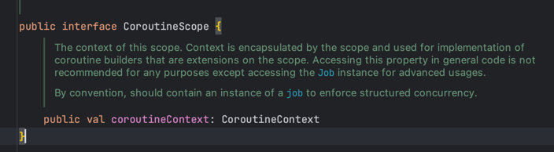

# R2dbc 
## Spring data
* 데이터저장소의특성을유지하면서
* Spring 기반의 프로그래밍 모델을 제공 
* 다양한 데이터 접근 기술을 지원
  * 관계형db, 비관계형db
  * map-reduce 프레임워크
  * 클라우드 기반의 data서비스

## Spring data reactive
* Reactive streams, Reactor, Netty client, Java NIO, Selector를 사용하여 비동기 non- blocking을 지원
* Reactive client를 제공하고 이를 기반으로 ReactiveTemplate 혹은 ReactiveRepository를 구현
* 데이터베이스에대한대한작업의결과로대부 분 Publisher를 반환

## 왜 JDBC, JPA는 non-blocking을 지원할 수 없나
### JDBC, JPA
* JDBC는 동기 blocking I/O 기반으로 설계
* Socket에 대한 연결과 쿼리 실행 모두 동기 blocking 으로 동작
* 이미 널리 사용되고 있기 때문에 JDBC를 수정 하는 것은 사실상 불가능
* JPA 또한 jdbc 기반이기 때문에 비동기 non-blocking 지원 불가능
* ->비동기 non-blocking 기반의 API,드라이 버를 새로 만들자!

## spring data r2dbc 스택 

## R2dbc
* Reactive Relational Database Connectivity
* 2017년 Pivotal사에서 개발이 시작되어 2018년부터 공식 프로젝트로 후원
* 비동기, non-blocking 관계형 데이터베이스 드라이버
* Reactive streams 스펙을 제공하며 Project reactor 기반으로 구현

## R2dbc 지원 데이터베이스
* 공식지원
  * r2dbc-h2:테스트 데이터 베이스로 사용되는 h2
  * r2dbc-mssql: Microsoft SQL Server
  * r2dbc-pool: Reactor pool로 컨넥션풀 제공
* 벤더지원
  * oracle-r2dbc: oracle사에서 oracle db 지원
  * r2dbc-mariadb: mariadb 재단에서 mariadb 지원
  * r2dbc-postgresql: postgre 개발 그룹에서 postgresql 지원
* 커뮤니티지원
  * r2dbc-mysql: MySQL 지원

## R2dbc MySql 구조
* r2dbc-spi와 Reactor Netty 기반
* Reactor Netty를 이용하여 r2dbc-spi 스펙을 구현
* Reactor Netty client로 성능과 확장성 모두 제공
* r2dbc-spi스펙을 구현하여 여러 데이터베이스 시스템과 호환

## R2dbc SPI
* R2dbc Service Provider Interface
* Connection, ConnectionFactory 등 db connection 스펙
* R2dbcException, R2dbcTimeoutException, R2dbcBadGrammarException 등의 exception 스펙
* Result, Row, RowMetadata 등 result 스펙
* Statement등 statment스펙

## R2dbc SPI Connection
* 데이터베이스에 대한 연결을 가리킨다 
* Closable을 구현하여 close 메소드로 connection을 닫을 수 있다
* ConnectionMetadata를 제공
* database의 version과 productName을 제공
* createStatement를 통해서 sql을넘기고 Statement를 생성
* transaction 관련된 기능을 제공 
* transaction을 시작
  * TransactionDefinition으로 고립수준,읽기 전용 여부, 이름, lockWaitTime 등을 설정
* transaction savepoint를 생성
  * transaction중간에 savepoint를 만들고 rollback 가능
* transaction을 commit하거나 rollback