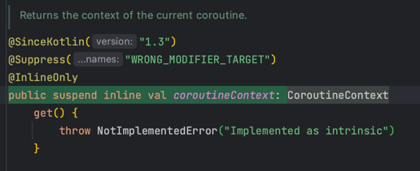

# R2dbc 
## Spring data
* 데이터저장소의특성을유지하면서
* Spring 기반의 프로그래밍 모델을 제공 
* 다양한 데이터 접근 기술을 지원
  * 관계형db, 비관계형db
  * map-reduce 프레임워크
  * 클라우드 기반의 data서비스

## Spring data reactive
* Reactive streams, Reactor, Netty client, Java NIO, Selector를 사용하여 비동기 non- blocking을 지원
* Reactive client를 제공하고 이를 기반으로 ReactiveTemplate 혹은 ReactiveRepository를 구현
* 데이터베이스에대한대한작업의결과로대부 분 Publisher를 반환

## 왜 JDBC, JPA는 non-blocking을 지원할 수 없나
### JDBC, JPA
* JDBC는 동기 blocking I/O 기반으로 설계
* Socket에 대한 연결과 쿼리 실행 모두 동기 blocking 으로 동작
* 이미 널리 사용되고 있기 때문에 JDBC를 수정 하는 것은 사실상 불가능
* JPA 또한 jdbc 기반이기 때문에 비동기 non-blocking 지원 불가능
* ->비동기 non-blocking 기반의 API,드라이 버를 새로 만들자!


## spring data r2dbc 스택 


## R2dbc
* Reactive Relational Database Connectivity
* 2017년 Pivotal사에서 개발이 시작되어 2018년부터 공식 프로젝트로 후원
* 비동기, non-blocking 관계형 데이터베이스 드라이버
* Reactive streams 스펙을 제공하며 Project reactor 기반으로 구현

## R2dbc 지원 데이터베이스
* 공식지원
  * r2dbc-h2:테스트 데이터 베이스로 사용되는 h2
  * r2dbc-mssql: Microsoft SQL Server
  * r2dbc-pool: Reactor pool로 컨넥션풀 제공
* 벤더지원
  * oracle-r2dbc: oracle사에서 oracle db 지원
  * r2dbc-mariadb: mariadb 재단에서 mariadb 지원
  * r2dbc-postgresql: postgre 개발 그룹에서 postgresql 지원
* 커뮤니티지원
  * r2dbc-mysql: MySQL 지원


## R2dbc MySql 구조
* r2dbc-spi와 Reactor Netty 기반
* Reactor Netty를 이용하여 r2dbc-spi 스펙을 구현
* Reactor Netty client로 성능과 확장성 모두 제공
* r2dbc-spi스펙을 구현하여 여러 데이터베이스 시스템과 호환


## R2dbc SPI
* R2dbc Service Provider Interface
* Connection, ConnectionFactory 등 db connection 스펙
* R2dbcException, R2dbcTimeoutException, R2dbcBadGrammarException 등의 exception 스펙
* Result, Row, RowMetadata 등 result 스펙
* Statement등 statment스펙



## R2dbc SPI Connection
* 데이터베이스에 대한 연결을 가리킨다 
* Closable을 구현하여 close 메소드로 connection을 닫을 수 있다
* ConnectionMetadata를 제공
* database의 version과 productName을 제공
* createStatement를 통해서 sql을넘기고 Statement를 생성
* transaction 관련된 기능을 제공 
* transaction을 시작
  * TransactionDefinition으로 고립수준,읽기 전용 여부, 이름, lockWaitTime 등을 설정
* transaction savepoint를 생성
  * transaction중간에 savepoint를 만들고 rollback 가능
* transaction을 commit하거나 rollback

## R2dbc SPI ConnectionFactory
* connection을 생성하는 factory
* ConnectionFactoryMetadata를 통해서 ConnectionFactory의 정보를 제공
  * ConnectionFactoryMetadata는 name을 제공

## R2dbc SPI Statement
* Statement는 Connection으로부터 createStatement 을 통해서 생성
* bind: sql에 parameter를 bind
* index, name 단위로 parameter를 bind
* add:이전까지 진행한 binding을저 장하고 새로운 binding을 생성
* execute:생성된 binding수 만큼 쿼리를 실행 하고 Publisher로 반환

## R2dbc MySqlConnection
* Connection을 구현한 MySqlConnection 
* ConnectionMetadata을 구현한 MySqlConnectionMetadata
* Statement를 구현한 MySqlStatement


## MySqlConnectionFactory
* MySqlConnection을 Mono형태로 포함
* MySqlConnectionFactoryMetadata를 반환
* MySqlConnectionConfiguration을 인자로 받아서 MySqlConnectionFactory 생성

## MySqlConnectionFactory
* MySqlConnectionFactory로 MySqlConnection을 생성
* MySqlConnection으로 MySqlStatement를 생성
* MySqlConnection으로 transaction을 start, rollback, commit


## MySqlConnectionConfiguration
* MySql 연결의 설정을 포함하는 객체
* Builder 패턴으로 쉽게 MySql 설정
* host, port, database, username, password 등의 기본 설정 제공
* connectTimeout, socketTimeout등의 timeout 설정
  * 디폴트는 둘 다 timeout 제한 x
* serverZonedId 설정
  * 디폴트 쿼리를 보내는 서버의 zone

## MySqlConnection 생성
* MySqlConnectionConfiguration builder를 이용하여 config todtjd
* MySqlConnectionFactory의 from static 메소드를 이용하여 connectionFactory 생성

```java
var config = MySqlConnectionConfiguration.builder()
    .host("localhost")
    .port(3306)
    .database("test")
    .username("test")
    .password("test")
    .build();

var connectionFactory = MySqlConnectionFactory.from(config);
```

## Sql 준비
* person table 생성
  * name, gender, age 필드 
* person에 새로운 row 생성
  * parameter를 받을 수 있게 ?를 이용해서 prepared statement 생성
* person 모든 row 조회

```java
var tableSql = "CREATE TABLE IF NOT EXISTS person " 
        + "(id INT AUTO_INCREMENT PRIMARY KEY, " 
        + "name VARCHAR(255)," 
        + "gender VARCHAR(10), " 
        + "age INT)";

var insertSql = "INSERT INTO person(name, age, gender) VALUES(?name, ?age, ?gender)";

var selectSql = "SELECT * FROM person";
```

## Sql 실행
* connectionFactory의 create를 통해서 connection에 접근
* connection의 createStatement를 통해서 sql wnsql
* thenMany Chaining을 통해서 순차적으로 실행하고 selectPeople의 결과를 아래로 전달
* result의 map으로 row에 접근하고 Person으로 변환

```java
connectionFatory.create().flatMapMany(conn ->{
	Flux<MySqlResult> createTable = conn.createStatement(tableSql).execute();
	Flux<MySqlResult> insert = conn.createStatement(insertSql)
        .bind("name", "test")
        .bind("age", 10)
        .bind("gender", "M")
        .add()
        .bind("name", "test2")
        .bind("age", 20)
        .bind("gender", "F")
        .execute();
	Flux<MySqlResult> selectPeople = conn.createStatement(selectSql).execute();
	
	return createTable.thenMany(insert).thenMany(selectPeople);
}).flatMap(result ->{
	return result.map((row, rowMetadata) ->{
		Long id = row.get("id", Long.class);
		String name = row.get("name", String.class);
		Integer age = row.get("age", Integer.class);
		String gender = row.get("gender", String.class);
		return new Person(id, name, age, gender)
        });
}).subscribe(person -> log.info("person: {}", person));
```

## MySqlConnection의 한계
* SQL 쿼리를 명시적으로 전달.
  * 개발 편의성이 떨어지고 SQL 쿼리를 재사용할 수 없다.
* 반환된 결과를 수동으로 파싱
  * 별도의 mapper를 만들어야 하고 확장성이 떨어진다.
  
## Transaction 실행
* connection의 beginTransaction과 commitTransaction으로 transaction 시작과 commit 수행
* onErrorResume으로 exception이 발생하면 rollbackTransaction 수행


```java
connectionFatory.create().flatMapMany(conn ->{
	Flux<MySqlResult> createTable = conn.createStatement(tableSql).execute();
	Flux<MySqlResult> insert = conn.createStatement(insertSql)
        .bind("name", "test")
        .bind("age", 10)
        .bind("gender", "M") 
        .execute();
	Flux<MySqlResult> selectPeople = conn.createStatement(selectSql).execute();
	
	return createTable
        .then(conn.beginTransaction())
        .thenMany(insert)
        .thenMany(selectPeople)
        .then(conn.commitTransaction())
        .onErrorResume(e -> conn.rollbackTransaction());
}).subscribe();
```


---   

---

# Spring data R2dbc
## R2dbcEntityTemplate
* R2dbcEntityTemplate은 Spring data r2dbc의 추상화 클래스
* SQL 쿼리들을 문자열 형태로 넘기거나 결과를 직접 처리하지 않아도 
* 메소드 체이닝을 통해서 쿼리를 수행하고 결과를 entity 객체로 받을 수 있다.
* R2dbcEntityOperations를 구현


## R2dbcEntityOperations
* DatabaseClient와 R2dbcConverter를 제공
  * DatabaseClient:
    * connectionFactory를 wrapping하여 결과를 Map이나 integer로 반환
  * R2dbcConverter:
    * 주어진 Row를 entity로 만드는 Converter
* R2dbcEntityTemplate에서는 이 databaseClient와 R2dbcConverter를 이용해서 쿼리를 수행하고 결과를 entity로 반환

## DatabaseClient 실행
* sql을 실행해서 GenericExecuteSpec을 반환
* GenericExecuteSpec에 bind를 한 후 
* fetch를 호출하여 FetchSpec을 반환
* rowsUpdated를 호출하여 영향을 받은 Row수 조회
* 혹은 all을 호출하여 결과 row 조회
* 여전히 직접 mapping

```java
var createTableMono = client.sql(tableSql).fetch().rowsUpdated();

var insertMono = client.sql(insertSql)
        .bind("name", "test")
        .bind("age", 10)
        .bind("gender","M")
        .fetch()
        .rowsUpdated();

var selectAllFlux = client.sql(selectSql)
        .fetch()
        .all();

createTableMono.then(insertMono)
        .thenMany(selectAllFlux)
        .doOnNext(result ->{
			var id = (Integer) result.get("id");
			var name = (String) result.get("name");
			var age = (Integer) result.get("age");
			var gender = (String) result.get("gender");
			log.info("id: {}, name: {}, age: {}, gender: {}",
                    id, name, age, gender);
        })
        .subscribe();
```

## ReadConverter
* Row를 source로 Entity를 target으로 하는 converter
* Row로부터 name 혹은 index로 column에 접근할 수 있고 변환하고자 하는 type을 class로 전달.

```java
@ReadingConverter
public class PersonReadConverter implements Converter<Row, Person>{
	
	@Override
    public Person convert(Row source) {
		var id = source.get("id", Integer.class);
		var name = source.get("name", String.class);
		var age = source.get("age", Integer.class);
		var gender = source.get("gender", String.class);

      return new Person(id, name, age, gender);
    }
}
```

## WriteConverter
* Entity를 source로 Row를 target으로 하는 converter
* outboundRow에 값을 추가.
* key에는 column의 이름, value에는 Parameter.from을 이용해서 entity의 속성을 전달.
* DefaultDatabaseClient에서 OutboundRow를 이용해서 SQL 생성

```java

@WritingConverter
public class PersonWriteConverter implements Converter<Person, OutboundRow> {
	
	@Override
    public OutboundRow convert(Person source) {
		var row = new OutboundRow();
        row.put("id", Parameter.from(source.getId()));
		row.put("name", Parameter.from(source.getName()));
		row.put("age", Parameter.from(source.getAge()));
		row.put("gender", Parameter.from(source.getGender()));
        return row;
	}
}
```

## CustomConverter 등록
* AbstractR2dbcConfiguration을 상속하는 Configuration 생성
* AbstractR2dbcConfiguration의 getCustomConverters에 custom converter들을 list 형태로 제공


## ReactiveSelectOperation

```java
var r2dbcEntityTemplate = new R2dbcEntityTemplate(connectionFactory);

var query = Query.query(
	Criteria.where("name").is("test"));

r2dbcEntityTemplate.select(PersonEntity.class)
        .from("person")
        .as(PersonNameOnly.class )
        .matching(query)
        .first()
        .doOnNext(person -> log.info("person: {}", person))
        .subscribe();

public record PersonNameOnly(
	String name
) {
}
```
* ConnectionFactory를 이용해 R2dbcEntityTemplate 생성
* Query와 Criteria를 이용해 query 생성
* PersonNameOnly class를 이용해서 name만 projection

## ReactiveInsertOperation

```java
var r2dbcEntityTemplate = new R2dbcEntityTemplate(connectionFactory);

var newPerson = new PersonEntity(null, "jay", 20, "M");

r2dbcEntityTemplate.insert(PersonEntity.class)
        .into("person")
        .using(newPerson)
        .doOnNext(person -> log.info("person: {}", person))
        .subscribe();
```
* into를 통해서 insert할 table 명시
* entity를 생성해서 using에 전달.

## ReactiveUpdateOperation
```java
var r2dbcEntityTemplate = new R2dbcEntityTemplate(connectionFactory);

var query = Query.query(
	Criteria.where("name").is("test"));

var update = Update.update("name", "test2");

r2dbcEntityTemplate.update(PersonEntity.class)
        .inTable("person")
        .matching(query)
        .apply(update)
        .doOnNext(person -> log.info("person: {}", person))
        .subscribe();
```

* inTable을 통해서 update할 table 명시
* matching으로 update 영향을 받는 Row 제한
* update를 생성해서 apply에 전달.


## ReactiveDeleteOperation
```java
var r2dbcEntityTemplate = new R2dbcEntityTemplate(connectionFactory);

var query = Query.query(
	Criteria.where("name").is("test"));
 
r2dbcEntityTemplate.update(PersonEntity.class)
        .from("person")
        .matching(query)
        .all()
        .doOnNext(person -> log.info("person: {}", person))
        .subscribe(); 
```

* from을 통해서 delete할 table 명시
* matching으로 delete 영향을 받는 Row 제한
* all을 실행하여 결과 출력

## R2dbcRepository  


## R2dbcRepository 등록
* R2dbcRepositoriesAutoConfiguration이 활성화되어 있다면 SpringBootApplication기준으로 자동 scan
* 혹은 EnableR2dbcRepositories를 통해서 repository scan
  * 만약 여러 r2dbcEntityTemplate이 존재하거나 여러 데이터베이스를 사용하는 경우, basePackages, entityOperationRef등을 통해서 다른 경로, 다른 entityTemplate 설정 가능

### R2dbcRepository 한계
* R2dbcRepository는 기본적으로 CRUD를 수행할 수 있는 메소드를 제공
  * 모두 혹은 id기반으로 CRUD 제공
  * 특정 필드로 탐색을 하거나 상위 n개만 조회 등의 기능은 제공되지 않는다.
* join이나 집계와 관련된 함수들은 제공되지 않는다.

## Transactional Operator
* transactional 메소드를 통해서 주어진 Flux혹은 Mono를 transactional안에서 실행


```java
public Flux<PersonEntity> savePerson(){
	var person = new PersonEntity(null, "test", 10, "M");
	
	var jobs = personRepository.save(person)
        .flatMap(savedPerson->{
			var personToUpdate = savedPerson.withAge(10)
            return personRepository.save(personToUpdate);
        }).thenMay(personRepository.findAll());
	
	return transactionalOperator.execute(status -> jobs);
	return transactionalOperator.transactional(jobs);
}
```