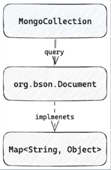

# Reactive Mongo DB
## MongoDB driver
* MongoDB사에서 공식적인 2가지 java driver제공
  * Sync Driver
    * 동기적으로 동작하는 어플리케이션을 위한 MongoDB 드라이버
    * 클라이언트가 요청을 보내면 응답이 돌아오기 전까지 쓰레드가 blocking  


  * Reactive Streams Driver
    * 비동기적으로 동작하는 어플리케이션을 위한 MongoDB 드라이버
    * 클라이언트가 요청을 보내면 쓰레드는 non-blocking
    * 모든 응답이 Publisher를 이용해서 전달되기 때문에 처리하기 어렵다.
    * Spring reative stack과 함께 사용되어 높은 성능과 안정성 제공  


## Spring data MongoDB reactive stack
* Spring data MongoDB reactive 
  * Reactive MongoRepository
  * ReactiveMongoTemplate
  * ReactiveMongoDatabaseFactory
* Reactive Streams MongoDB Driver
  * ReactiveMongoClient
  * ReactiveMongoDatabase
  * ReactiveMongoCollection

## Mongo Reactive streams driver
### MongoCollection 획득 


```java
var connection = new ConnectionString("mongodb://localhost:27017/jay");
var settings = MongoClientSettings.builder()
        .applyConnectionString(connection)
        .build();

try (MonogClient mongoClient = MonoClients.create(settings)) {
    MongoDatabase database = mongoClient.getDatabase("jay");
	log.info("database: {}", database.getName());
	
    MongoCollection<Document> collection = database.getCollection("test");
	log.info("collection: {}", collection.getNamespace().getCollectionName());
}
```

### MongoCollection - ClientSession
```java
Publisher<Long> countDocuments(ClientSession clientSession, 
    Bson filter, CountOptions options);
```
* ClientSession을 통해서 multi document transaction 제공

### Document 
* MongoCollection에 query를 실행하여 bson의 Document를 반환
* bson의 Document는 Map<String, Object>를 구현하고 내부에 LinkedHashMap을 저장하여 Map 메소드 override  



```java
try (MonogClient mongoClient = MonoClients.create(settings)) {
    MongoDatabase database = mongoClient.getDatabase("jay"); 
    MongoCollection<Document> collection = database.getCollection("test");
	
	collection.find()
    .subscribe(new SimpleSubscriber<>());
	Thread.sleep(1000);
}
``` 