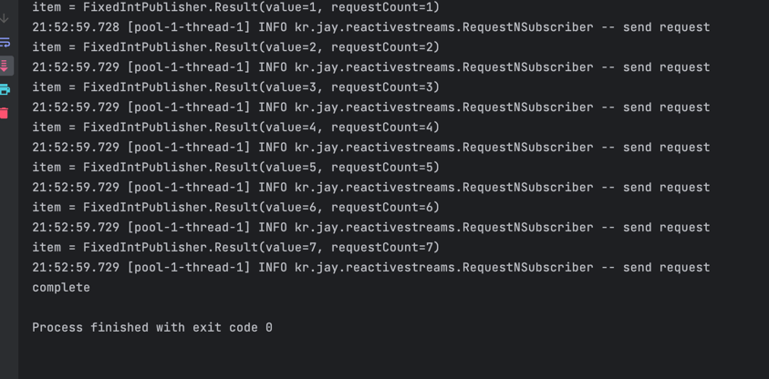
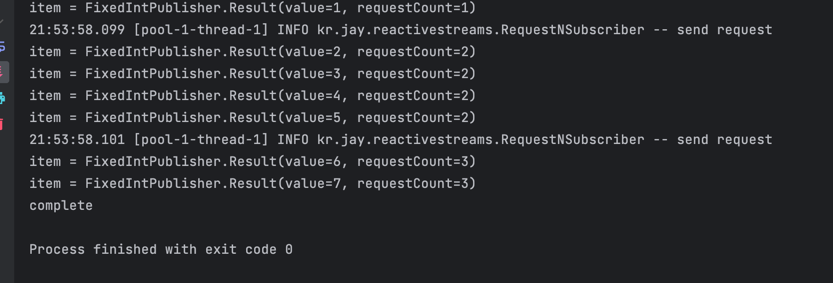
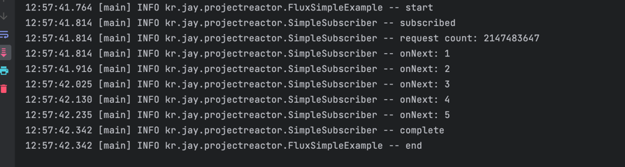
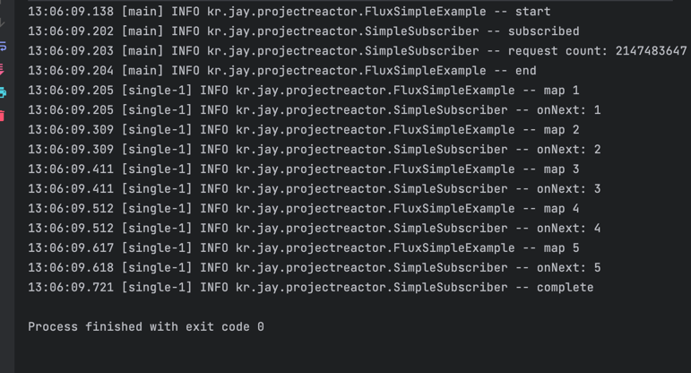
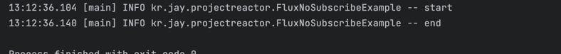
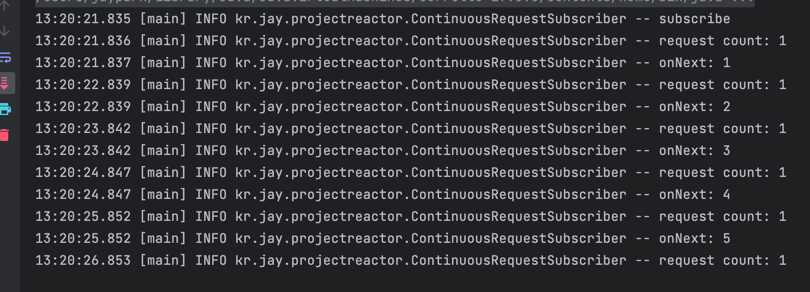
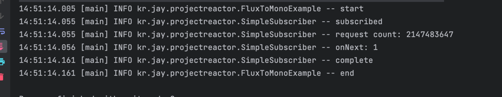
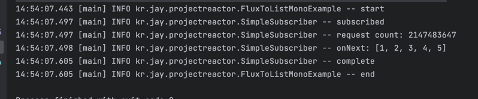
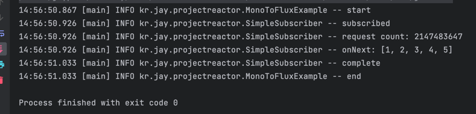
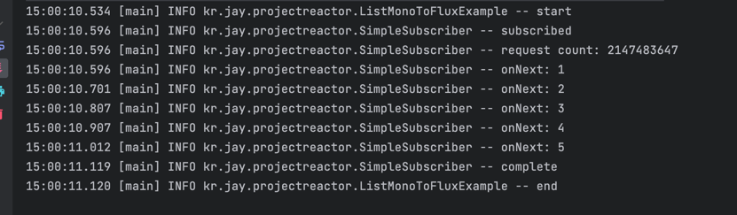

# Reactive Streams
## Reactive Streams의 구조
* 데이터 혹은 이벤트를 제공하는 publisher
* 데이터 혹은 이벤트를 제공받는 subscriber
* 데이터 흐름을 조절하는 subscription

## Publisher
* subscribe 함수를 제공해서 publisher에 다수의 subscriber 등록 지원
* subscription을 포함하고 subscriber가 추가 되면 subscription 제공

```java
@FunctionalInterface
public static interface Publisher<T> {
  public void subscribe(Subscriber<? super T> subscriber);
}
```

## Subscriber
* subscribe 하는 시점에 publisher로 부터 subscription을 받을 수 있는 인자 제공
* onNext, onError, onComplete 함수를 통해서 값이나 이벤트를 받을 수 있다.
* onNext는 여러번, onError나 onComplete는 딱 한 번만 호출된다.

```java
public static interface Subscriber<T>{
    public void onSubscribe(Subscription subscription);
    public void onNext(T item);
    public void onError(Throwable throwable);
    public void onComplete();
}
```

## Subscription
* back-pressure를 조절할 수 있는 request 함수
* Publisher가 onNext를 통해서 값을 전달하는 것을 취소할 수 있는 cancel 함수

```java
public static interface Subscription{
    public void request(long n);
    public void cancel();
}
```

## Publisher, Subscriber 연동하기
```java
public class FixedIntPublisher implements Flow.Publisher<FixedIntPublisher.Result>{

	@Data
	public static class Result{
		private final Integer value;
		private final Integer requestCount;
	}

	@Override
	public void subscribe(final Flow.Subscriber<? super Result> subscriber) {
		var numbers = Collections.synchronizedList(new ArrayList<>(List.of(1, 2, 3, 4, 5, 6, 7)));
		Iterator<Integer> iterator = numbers.iterator();
		var subscription = new IntSubscription(subscriber, iterator);
		subscriber.onSubscribe(subscription);
	}

} 
```
* Flow.Publisher를 구현
* 고정된 숫자의 integer를 전달하는 publisher
* 8개의 integer를 전달 후 complete
* iterator를 생성해서 subscription을 생성하고 subscriber에게 전달
* requestCount를 세기 위해서 Result객체 사용

```java
@RequiredArgsConstructor
public class IntSubscription implements Flow.Subscription {

	private final Flow.Subscriber<? super FixedIntPublisher.Result> subscriber;
	private final Iterator<Integer> numbers;
	private final ExecutorService executor = Executors.newSingleThreadExecutor();
	private final AtomicInteger count = new AtomicInteger(1);
	private final AtomicBoolean isCompleted = new AtomicBoolean(false);
	
	@Override
	public void request(long n) {
		executor.submit(() -> {
            for (int i = 0 ; i < n ; i++) {
                if (numbers.hasNext()) {
                    int number = numbers.next();
					numbers.remove();
                    subscriber.onNext(new FixedIntPublisher.Result(number, count.get()));
                } else {
					var isChanged = isCompleted.compareAndSet(false, true);
					if (isChanged) {
						executor.shutdown();
						subscriber.onComplete();
						isCompleted.set(true);
					}
                    break;
                }
            }
			count.incrementAndGet();
		});
	}

	@Override
	public void cancel() {
		subscriber.onComplete();
	}

}
```
* Flow.Subscription을 구현
* subscriber의 onNext와 subscription의 request가 동기적으로 동작하면 안되기 때문에 executor를 이용해 별도의 쓰레드에서 실행
* 요청 횟수를 count에 저장하고 결과에 함께 전달
* 더 이상 iterator에 값이 없으면, onComplete호출

```java
public class RequestNSubscriber<T> implements Flow.Subscriber<T>{
	private final Integer n;
	private Flow.Subscription subscription;
	private int count = 0;
	
	@Override
    public void onSubscribe(Flow.Subscription subscription) {
        this.subscription = subscription;
        this.subscription.request(1);
    }
	
	@Override
    public void onNext(T item) {
        System.out.println("item = " + item);
        
        if (count++ % n == 0 ) {
			log.info("send request");
            subscription.request(n);
        } 
    }
	
	@Override
    public void onError(Throwable throwable) {
        System.out.println("error : {} " + throwable.getMessage());
    }
	
	@Override
    public void onComplete() {
        System.out.println("complete");
    }
}
```
* Flow.Subscriber를 구현
* 최초 연결시 1개를 고정적으로 요청
* onNext에서 count를 세고 n번째 onNext마다 request
* onNext, onComplete, onError를 받으면 로그

### Publisher, Subscriber 연동
```java
public static void main(String[] args) {
    Flow.Publisher = new FixedIntPublisher();
    Flow.Subscriber = new RequestNSubscriber<>(1);
    
	publisher.subscribe(subscriber);
	
	Thread.sleep(100);
}
```
* n == 1


* n == 4


* publisher와 subscriber를 생성
* publisher에 subscriber를 등록

## Hot Publisher
* subscriber가 없더라도 데이터를 생성하고 stream에 push하는 publisher
* 트위터 게시글 읽기, 공유 리소스 변화등
* 여러 subscriber에게 동일한 데이터 전달

## Cold Publisher
* subscribe이 시작되는 순간부터 데이터를 생성하고 전송
* 파일 읽기, 웹 API요청 등
* subscriber에 따라 독립적인 데이터 스트림 제공
  
---

## Reactive Streams 구현 라이브러리
* Project reactor
* RxJava
* Mutiny
 
## Project reactor
* Pivotal사에서 개발
* Spring reactor에서 사용
* Mono와 Flux publisher 제공


### Project reactor - Flux
* 0...n 개의 item을 전달
* 에러가 발생하면 error signal 전달하고 종료
* 모든 item을 전달했다면 complete signal 전달 하고 종료
* backPressure 지원

```java
@Slf4j
public class FluxSimpleExample {

	public static void main(String[] args) {
		log.info("start");
		getItems().subscribe(new SimpleSubscriber<>(Integer.MAX_VALUE));
		log.info("end");
	}

	private static Flux<Integer> getItems(){
		return Flux.fromIterable(List.of(1, 2, 3, 4, 5));
	}
}
```

```java
@Slf4j
@RequiredArgsConstructor
public class SimpleSubscriber<T> implements Subscriber<T> {

	private final Integer count;

	@Override
	public void onSubscribe(final Subscription s) {
		log.info("subscribed");
		s.request(count);
		log.info("request count: {}", count);
	}

	@SneakyThrows
	@Override
	public void onNext(final T t) {
		log.info("onNext: {}", t);
		Thread.sleep(100);

	}

	@Override
	public void onError(final Throwable t) {
		log.error("error: {}", t.getMessage());
	}

	@Override
	public void onComplete() {
		log.info("complete");
	}
}

```


### Flux - subscribeOn
```java
@Slf4j
public class FluxSimpleExample {

	@SneakyThrows
	public static void main(String[] args) {
		log.info("start");
		getItems()
			// .subscribe(new SimpleSubscriber<>(Integer.MAX_VALUE));
			.map(i -> {
				log.info("map {}", i);
				return i;
			})
			.subscribeOn(Schedulers.single())
			.subscribe(new SimpleSubscriber<>(Integer.MAX_VALUE));
		log.info("end");

		Thread.sleep(1000);
	}

	private static Flux<Integer> getItems(){
		return Flux.fromIterable(List.of(1, 2, 3, 4, 5));
	}
}

```


### Flux - subscribe
* subscribe하지 않으면, 아무일도 일어나지 않는다.
```java
@Slf4j
public class FluxNoSubscribeExample {

	public static void main(String[] args) {
		log.info("start");
		getItems();
		log.info("end");
	}

	private static Flux<Integer> getItems(){
		return Flux.create(fluxSink -> {
			log.info("start getItems");
			for (int i = 0; i < 5; i++) {
				fluxSink.next(i);
			}
			fluxSink.complete();
			log.info("end getItems");
		});
	}
}
```


### Flux - backPressure
```java
@Slf4j
public class ContinuousRequestSubscriber<T> implements Subscriber<T> {
	private final Integer count = 1;
	private Subscription subscription = null;

	@Override
	public void onSubscribe(final Subscription s) {
		this.subscription = s;
		log.info("subscribe");
		s.request(count);
		log.info("request count: {}", count);
	}

	@SneakyThrows
	@Override
	public void onNext(final T t) {
		log.info("onNext: {}", t);

		Thread.sleep(1000);
		subscription.request(count);
		log.info("request count: {}", count);
	}
}
```

```java
public class FluxContinuousRequestExample {

	public static void main(String[] args) {
		getItems()
			.subscribe(new ContinuousRequestSubscriber<>());
	}

	private static Flux<Integer> getItems(){
		return Flux.fromIterable(List.of(1, 2, 3, 4, 5));
	}
}
```

* Subscriber가 request를 하지 않으면, 데이터를 전달하지 않는다. -> 원하는 만큼만 처리할 수 있다.

---  

### Project reactor - Mono
* 0 또는 1개의 item을 전달
* 에러가 발생하면 error signal 전달하고 종료
* 모든 item을 전달했다면 complete signal 전달 하고 종료
* 1개의 tiem만 전잘하기 때문에 next 하나만 실행하면 complete가 보장
* 혹은 전달하지 않고 complete를 하면 값이 없다는 것을 의미
* 하나의 값이 있거나 없다.

#### Mono와 Flux
* Mono<T> , Optional<T>
* 없거나 혹은 하나의값
* Mono<Void>로 특정 사건이 완료되는 시점을 가리킬 수도 있다.  

<br />  

* Flux<T> , Collection<T>
* 무한하거나 유한한 여러 개의 값

#### Flux를 Mono로
* Mono.from으로 Flux를 Mono로
* 첫 번째 값만 전달
```java
@Slf4j
public class FluxToMonoExample {
	public static void main(String[] args) {
		log.info("start");
		Mono.from(getItems())
			.subscribe(new SimpleSubscriber<>(Integer.MAX_VALUE));
		log.info("end");
	}
	
	private static Flux<Integer> getItems(){
		return Flux.fromIterable(List.of(1, 2, 3, 4, 5));
	}
}
```
  

<br />  

* collectList()
* Flux의 값들을 collect하고 `complete 이벤트가 발생하는 시점에 모은 값들을 전달

```java
@Slf4j
public class FluxToListMonoExample {
	public static void main(String[] args) {
		log.info("start");
		getItems()
			.collectList()
			.subscribe(new SimpleSubscriber<>(Integer.MAX_VALUE));
		log.info("end");
	}

	private static Flux<Integer> getItems(){
		return Flux.fromIterable(List.of(1, 2, 3, 4, 5));
	}
}
```



#### Mono를 Flux로
* flux()
* Mono를 next 한 번 호출하고 onComplete를 호출하는 Flux로 변환
```java
@Slf4j
public class MonoToFluxExample {

	public static void main(String[] args) {
		log.info("start");
		getItem()
			.flux()
			.subscribe(new SimpleSubscriber<>(Integer.MAX_VALUE));
		log.info("end");
	}

	private static Mono<Iterable<Integer>> getItem(){
		return Mono.just(List.of(1,2,3,4,5));
	}
}

```


<br />  

* flatMapMany
* Mono의 값으로 여러 개의 값을 전달하는 Flux를 만들고 연결
```java
@Slf4j
public class ListMonoToFluxExample {

	public static void main(String[] args) {
		log.info("start");
		getItem()
			.flatMapMany(value-> Flux.fromIterable(value))
			.subscribe(new SimpleSubscriber<>(Integer.MAX_VALUE));
		log.info("end");
	}

	private static Mono<Iterable<Integer>> getItem(){
		return Mono.just(List.of(1,2,3,4,5));
	}
}

```


  
---
 