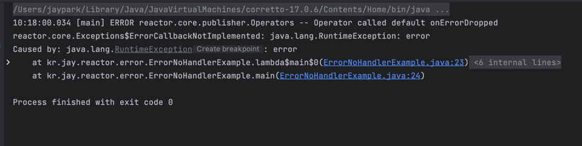
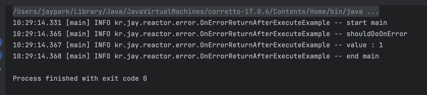
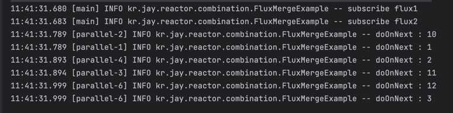

# Reactor
## recap
* Reactive streams
* 비동기 데이터 스트림 처리를 위한 표준
* publisher는 subscriber에게 비동기 적으로 이벤트 전달.
* onSubscribe: subscriber가 publisher 사이에 연결이 시작될때 호출, Subscription 객체를 전달.
* onNext: publisher가 데이터를 생성하고 Subscriber에게 전달. Subscriber는 데이터를 받고 처리  

<br />

* Subscription
* request : subscriber가 publisher에게 n개의 데이터 요청. Subscriber가 처리 가능한 만큼만 요청
* cancel : Subscriber가 데이터 요청을 취소하고 연결을 종료. Subscriber가 더이상 데이터를 받지 않거나 에러가 발생한 경우 호출

# Reactor
* Reactive Streams를 구현한 비동기 데이터 스트림 처리를 지원
* Spring webflux에서 메인으로 사용
* backpressure를 제공하여 안정성을 높이고
* 다양한 메소드로 다양한 연산을 조합하여 가독성 증대

## Reactor와 컨베이어 벨트
* 컨베이어 벨트에 비유
* 데이터는 소스(Publisher)에서 나와서 소비자(Subscriber)에게 전달
* 원재료는 다양한 변형과 중간 단계를 거치고 중간 부품을 모으는 더 큰 조립 라인의 일부가 되기도.
* 한 지점에서 결함이 발생하거나 벨트가 막히게 되면 업스트림에 신호를 보내서 흐름을 제한. 

## Reactor Publisher
* Reactor에서 Mono와 Flux 제공
* CorePublisher는 reactive streams의 Publisher를 구현
* reactive streams와 호환

## Flux
* 0...n개의 item을 subscriber에게 전달
* subscriber에게 onComplete, onError signal을 전달하면 연결 종료
* 모든 event가 optional하기 때문에 다양한 flux정의 가능. 심지어 onComplete도 optional
* onComplete를 호출하지 않으면 infinite한 sequence 생성 가능

## Mono
* 0...1개의 item을 subscriber에게 전달
* subscriber에게 onComplete, onError signal을 전달하면 연결 종료
* 모든 event가 optional
* onNext가 호출되면 곧바로 onComplete가 이벤트 전달.
* Mono<Void>를 통해서 특정 사전의 완료를 전달 가능

## Mono는 언제 사용할까?
* 반드시 하나의 값 혹은 객체를 필요로 하는 경우
  * 유저가 작성한 게시글의 숫자.
  * http 응답 객체
* 있거나 혹은 없거나 둘 중 하나인 경우
  * 특정 id를 갖는 유저 객체
* 완료된 시점을 전달해야 하는 경우
  * 유저에게 알림을 보내고 완료된 시점을 전달.  

<br />  

* Publisher에서는 onNext 이후 바로 onComplete를 호출하면 되기 때문에 구현이 더 간단.
* Subscriber의 경우도 최대 1개의 item이 전달된다는 사실을 알고 있기 때문에 더 간결한 코드 작성 가능

* Mono like Optional & Flux like List


## Subscribe
* Publisher에 subscribe하지 않으면 아무 일도 생기지 않는다.
* 컵 속의 빨대에 비유
* consumer를 넘기지 않는 subscribe
  * 별도로 consume을 하지 않고 최대한으로 요청
* 함수형 인터페이스 기반의 subscribe
  * Disposable을 반환하고 disposable을 통해서 언제든지 연결 종료 가능
* Subscriber 기반의 subscribe
  * subscriber는 subscription을 받기 때문에 request와 cancel을 통해서 backpressure조절과 연결 종료 가능.  

<br />  

```java
Flux.fromIterable(List.of(1,2,3,4,5))
        .doOnNext(value ->{
			log.info("value : {}", value);
        })
        .subscribe();
```
* 위 코드와 같이 subscribe만 하고 별도의 consume을 하지않는 경우 결과를 이용하기 보단. 
* Publisher에서 아이템을 만드는 것이 중요한 경우.
* 결과 확인위해 doOnNext를 이용
* doOnNext : 파이프 라인에 영향을 주지 않고 지나가는 값을 확인
 

### Subscribe - 함수형 인터페이스
* 함수형 인터페이스를 subscribe에 제공
* 각각의 consumer는 null 가능

* consumer :  값을 인자로 받아야 하기 때문에 Consumer 함수형 인터페이스 구현
* errorConsumer : 에러를 인자로 받아야 하기 때문에 Consumer 구현
* completeConsumer : 받을 인자가 없기 때문에 Runnable 구현
* ititialContext : upstream에 전달할 context


### Subscribe - Subscriber
* Subscriber 구현체를 subscribe에 전달
* onSUbscribe를 통해서 subscription을 받고 즉시 Long.MAX_VALUE개 만큼 request
* unbounded request: Publisher에서 제공 할 수 있는 데이터를 최대한 요청

### Subscribe - BaseSubscriber
* reactor에서 BaseSubscriber를 제공
* onNext, onComplete, onError, onSubscribe를 직접 호출하는 대신
* hookOnNext, hookOnComplete, hookOnError, hookOnSubscribe를 구현
* subscriber 외부에서 request와 cancel을 호출 가능
* 기본적으로 unbounded request
 

### Subscribe - backPressure
* unbounded request는 Publisher에게 가능한 빠르게 아이템을 전달해달라는 요청
* request(Long.MAX_VALUE)로 실행
* backPressure를 비 활성화
* 아무것도 넘기지 않는 그리고 lambda 기반의 subscribe()
* BaseSubscriber의 hookOnSubscribe를 그대로 사용
* block(), blockFirest(), blockLast()등의 blocking 연산자 
* tolterable(), toStream()등의 toCollect 연산자

```java
var subscriber = new BaseSubscriber<Integer>(){
    @Override
    protected void hookOnSubscribe(Subscription subscription) {
        request(1);
    }
	
	@Override
    protected void hookOnNext(Integer value) {
        log.info("value : {}", value);
        request(1);
    }
	
	@Override
    protected void hookOnComplete() {
        log.info("complete");
    }
};

Flux.fromIterable(List.of(1,2,3,4,5))
        .subscribe(subscriber);
```

* hookOnSubscribe을 override해서 1개만 request
* onNext 이벤트가 발생하면 cancel을 실행

### Subscribe - buffer
```java
var subscriber = new BaseSubscriber<List<Integer>>(){
	private Integer count = 0;
	
	@Override
    protected void hookOnSubscribe(Subscription subscription) {
        request(2);
	}
	
	@Override
    protected void hookOnNext(List<Integer> value) {
        log.info("value : {}", value);
		if(++count == 2) cancel();
    }
	@Override
    protected void hookOnComplete() {
        log.info("complete");
    }
}

Flux.fromStream(IntStream.range(0,10).boxed())
        .buffer(3)
        .subscribe(subscriber);
```

* buffer(N) 호출시 N개 만큼 모아서 Listfh wjsekf
* buffer(3) 호출 후 request(2)를 하는 경우, 3개가 담긴 List 2개가 Subscriber에게 전달 
* 즉 6개의 item을 전달

### Subscribe - take(n, limitRequest)
* subscriber 외부에서 연산자를 통해서 최대 개수를 제한.
* limitRequest가 true인 경우, 정확히 n개 만큼 요청후 complete 이벤트를 전달.
* BaseSubscriber의 기본 전략이 unbounded request이지만 take(5,true)로 인해서 5개 전달 후 complete 이벤트  

```java
var subscriber = new BaseSubscriber<Integer>(){
    @Override
    protected void hookOnNext(Integer value){
        log.info("value : {}", value);
	}
	@Override
    protected void hookOnComplete() {
        log.info("complete");
    }
};

Flux.fromStream(IntStream.range(0,10).boxed())
        .take(5,true)
        .subscribe(subscriber);
```

## Sequence
### Sequence - just
* Mono.just 혹은 Flux.just 를 통해서 주어진 객체를 Subscriber에게 전달
```java
Mono.just(1)
        .subscribe(value -> log.info("value : {}", value));

Flux.just(1,2,3,4,5)
        .subscribe(value -> log.info("value : {}", value));

```

### Sequence - error
* Mono.error 혹은 Flux.error 를 통해서 Subscriber에게 onError 이벤트만 전달
```java
Mono.error(new RuntimeException("mono error"))
        .subscribe(value -> log.info("value : {}", value),
                error -> log.error("error : {}", error.getMessage())
        );

Flux.error(new RuntimeException("flux error"))
        .subscribe(value -> log.info("value : {}", value),
                error -> log.error("error : {}", error.getMessage())
        );
```

### Sequence - empty
* Mono.empty 혹은 Flux.empty 를 통해서 Subscriber에게 onComplete 이벤트만 전달
```java
Mono.empty()
        .subscribe(value -> log.info("value : {}", value),
                null,
                () -> log.info("complete")
        );

Flux.empty()
        .subscribe(value -> log.info("value : {}", value),
                null,
                () -> log.info("complete")
        );
```

### Sequence - mono from
* fromCallable : Callable 함수형 인터페이스를 실행하고 반환값을 onNext로 전달.
* fromFuture : Future를 받아서 done 상태가 되면 반환값을 onNext로 전달
* fromSupplier : Supplier 함수형 인터페이스를 실행하고 반환값을 onNext로 전달.
* fromRunnable : Runnable 함수형 인터페이스를 실행하고 끝난후 onComplete 전달.

```java
Mono.fromCallable(()->{
	return 1;
        }).subscribe(value -> log.info("value : {}", value));

Mono.fromFuture(CompletableFuture.supplyAsync(()->{
	return 1;
        })).subscribe(value -> log.info("value : {}", value));

Mono.fromSupplier(()->{
    return 1;
        }).subscribe(value -> log.info("value : {}", value));

Mono.fromRunnable(()->{
    log.info("runnable");
        }).subscribe(null, null, () -> {
			log.info("complete fromRunable");
        });
```
### Sequence - flux from
* fromIterable : Iterable을 받아서 각각의 item을 onNext로 전달
* fromStream : stream을 받아서 각각의 item을 onNext로 전달
* fromArray : array를 받아서 각각의 item을 onNext로 전달
* range(start, n) : start부터 시작해서 한개씩 커진 값을 n개 만큼 onNext로 전달.

```java
Flux.fromIterable(List.of(1,2,3,4,5))
        .subscribe(value -> log.info("value : {}", value));

Flux.fromStream(IntStream.range(1,6).boxed())
        .subscribe(value -> log.info("value : {}", value));

Flux.fromArray(new Integer[]{1,2,3,4,5})
        .subscribe(value -> log.info("value : {}", value));

Flux.range(1,5)
        .subscribe(value -> log.info("value : {}", value));
```

### Sequence - generate
* 동기적으로 Flux를 생성
* stateSupplier : 초기값을 제공하는 Callable
* generator
  * 첫 번째 인자로 state를 제공. 변경된 state를 반환. 이 state로 종료 조건을 지정
  * 두 번쨰 인자로 SynchronousSink를 제공 명시적으로 next, error, complete 호출 가능.
  * 한 번의 generator에서 최대 한 번만 next 호출 가능

```java
Flux.generate(
        ()-> 0,
        (state, sink) ->{
			sink.next(state);
			if(state == 9){
				sink.complete();
        }
			return state + 1;
        })
        .subscribe(
			value -> log.info("value : {}", value),
            error -> log.error("error : {}", error.getMessage()),
            () -> log.info("complete")
        );
```
* 초기값을 0으로 세팅
* generator에서 현재 state를 next로 전달
* 만약 state가 9라면 complete 이벤트 전달
* state + 1 반환


### Sequence - create
* 비동기적으로 Flux를 생성
* FluxSink를 노출
  * 명시적으로 next, error, complete 호출 가능
  * SynchronousSink와 다르게 여러 번 next 가능
  * 여러 thread에서 동시에 호출 가능
  
```java
Flux.create(sink ->{
	var task1 = CompletableFuture.runAsync(()->{
		for(int i = 0; i < 5; i++){
			sink.next(i);
        }
	});
	
	var task2 = CompletableFuture.runAsync(()->{
		for(int i = 5; i < 10; i++){
			sink.next(i);
        }
	});
	CompletableFuture.allOf(task1, task2)
        .thenRun(sink::complete);
	
}).subscribe(
        value -> log.info("value : {}", value),
        error -> log.error("error : {}", error.getMessage()),
        () -> log.info("complete")
);
```
* 2개의 쓰레드 에서 sink.next를 수행
* CompletableFuture의 allOf를 활용하여 두개의 작업이 끝난 후 complete 이벤트 전달


### Sequence - handle
* 독립적으로 sequence를 생성할 수는 없고 존재하는 source에 연결
* handler
  * 첫 번쨰 인자로 source의 item이 제공
  * 두 번째 인자로 SynchronousSink를 제공
  * sink의 next를 이용해서 현재 주어진 item을 전달할지 말지를 결정
  * 일종의 interceptor로 source의 item을 필터 하거나 변경할 수 있다.
  
```java
Flux.fromStream(IntStream.range(0, 10).boxed())
        .handle((value, sink) ->{
			if(value % 2 == 0){
				sink.next(value);
            }
        }).subscribe(
			value -> log.info("value : {}", value),
            error -> log.error("error : {}", error.getMessage()),
            () -> log.info("complete")
        );

```  

<br />  

---

## Thread
* 아무런 설정을 하지 않았다면, publisher는 subscribe를 호출한 caller의 쓰레드에서 실행
* subscribe에 제공된 lambda혹은 scheduler 또한 caller의 쓰레드에서 실행.

```java
@Slf4j
public class SingleThreadRunExample {

	public static void main(String[] args) {
		log.info("start main");
		final ExecutorService executor = Executors.newSingleThreadExecutor();

		try{
			executor.submit(() -> {
				Flux.create(sink -> {
					for (int i = 1; i < 5; i++) {
						log.info("next : {}", i);
						sink.next(i);
					}
				}).subscribe(value -> log.info("value : {}", value));
			});
		}finally {
			executor.shutdown();
		}
		log.info("end main");
	}
}

```  


## Scheduler
* Publish 혹은 Subscribe에 어떤 Scheduler가 적용되었는가에 따라서 task를 실행하는 쓰레드풀이 결정
* 즉시 task를 실행하거나 delay를 두고 실행 가능.

### Scheduler - Schedulers.immediate()
* subscribe를 호출한 caller 쓰레드에서 즉시 실행
* 별도로 Schedulers를 넘기지 않았을 때, Schedulers.immediate 사용

```java
@Slf4j
public class ImmediateSchedulerExample {
	public static void main(String[] args) {
		Flux.create(sink -> {
			for (int i = 1; i <= 5; i++) {
				log.info("next : {}", i);
				sink.next(i);
			}
		}).subscribeOn(
			Schedulers.immediate()
		).subscribe(value->log.info("value : {}", value));
	}
}
```  


### Scheduler - Schedulers.single()
* 캐싱된 1개 크기의 쓰레드풀을 제공
* 모든 publish, subscribe가 하나의 쓰레드에서 실행

```java
@Slf4j
public class SingleSchedulerExample {
	@SneakyThrows
	public static void main(String[] args) {
		log.info("start main");
		for (int i = 0; i < 10; i++) {
			final int idx = i;
			Flux.create(sink -> {
				log.info("next : {}", idx);
				sink.next(idx);
			}).subscribeOn(
				Schedulers.single()
			).subscribe(value -> log.info("value : {}", value));
		}
		Thread.sleep(100);
		log.info("end main");
	}
}

```


### Scheduler - Schedulers.parallel()
* 캐싱된 n개 크기의 쓰레드풀을 제공
* 기본적으로 CPU 코어 수만큼의 크기를 갖는다.

```java
@Slf4j
public class ParallelSchedulerExample {
	@SneakyThrows
	public static void main(String[] args) {
		log.info("start main");
		for (int i = 0; i < 10; i++) {
			final int idx = i;
			Flux.create(sink -> {
				log.info("next : {}", idx);
				sink.next(idx);
			}).subscribeOn(
				Schedulers.parallel()
			).subscribe(value -> log.info("value : {}", value));
		}
		Thread.sleep(100);
		log.info("end main");
	}
}

```  


### Scheduler - Schedulers.boundedElastic()
* 캐싱된 고정되지 않은 크기의 쓰레드풀을 제공
* 재사용할 수 있는 쓰레드가 있다면 사용하고, 없으면 새로 생성
* 특정 시간(기본 60초) 사용하지 않으면 제거
* 생성 가능한 쓰레드 수 제한 (기본 cpu * 10)
* I/O blocking 작업을 수행할때 적합.

### Scheduler - Schedulers.newXX()
* single, parallel, boundedElastic 모두 캐싱된 쓰레드풀을 제공
* newSingle, newParallel, newBoundedElastic은 새로운 쓰레드풀을 만들어서 제공
* dispose로 쓰레드풀을 해제  
  
```java
@Slf4j
public class NewSingleSchedulerExample {
	@SneakyThrows
	public static void main(String[] args) {
		log.info("start main");
		for (int i = 0; i < 100; i++) {
			final Scheduler newSingle = Schedulers.newSingle("single");
			final int idx = i;
			Flux.create(sink -> {
				log.info("next : {}", idx);
				sink.next(idx);
			}).subscribeOn(
				newSingle
			).subscribe(value -> {
				log.info("value : {}", value);
				newSingle.dispose();
			});
		}
		Thread.sleep(100);
		log.info("end main");
	}
}

```

### Scheduler - Schedulers.fromExecutorService()
* 이미 존재하는 ExecutorService로 Scheduler 생성

```java
@Slf4j
public class ExecutorServiceSchedulerExample {
	@SneakyThrows
	public static void main(String[] args) {
		log.info("start main");
		final ExecutorService executor = Executors.newSingleThreadExecutor();
		for (int i = 0; i < 100; i++) {
			final int idx = i;
			Flux.create(sink -> {
				log.info("next : {}", idx);
				sink.next(idx);
			}).subscribeOn(
				Schedulers.fromExecutorService(executor)
			).subscribe(value -> {
				log.info("value : {}", value);
			});
		}
		Thread.sleep(100);
		executor.shutdown();
		log.info("end main");
	}
}
```

## publishOn과 subscribeOn
* publishOn은 위치가 중요하고 subscribeOn은 위치가 중요하지 않다.
* A -> B -> C 순으로 연산자가 chaining 되어 있다면 별도의 publishOn이 없다면, A를 실행한 쓰레드가 B를 실행하고, B를 실행한 쓰레드가 C를 실행하는 등 쓰레드도 Chaining
* source가 실행되는 쓰레드를 설정할 수 있고(subscribeOn), 중간에서 실행 쓰레드를 변경할 수 있다.(publishOn)

### publishOn
* Scheduler를 인자로 받는다.
* publishOn 이후에 추가되는 연산자들의 실행 쓰레드에 영향을 준다.
* 그 이후 다른 publishOn이 적용되면 추가된 Scheduler로 실행 쓰레드 변경
* 쓰레드풀 중 하나의 쓰레드만 지속적으로 사용

```java
@Slf4j
public class PublishOnSchedulerExample {
	@SneakyThrows
	public static void main(String[] args) {
		Flux.create(sink->{
			for (int i = 0; i < 5; i++) {
				log.info("next : {}", i);
				sink.next(i);
			}
		}).publishOn(Schedulers.single())
			.doOnNext(item -> log.info("doOnNext : {}", item))
			.publishOn(Schedulers.boundedElastic())
			.doOnNext(item -> log.info("doOnNext2 : {}", item))
			.subscribe(value -> log.info("value : {}", value));

		Thread.sleep(100);
	}
}
```  


### subscribeOn
* Scheduler를 인자로 받는다.
* source의 실행 쓰레드를 변경한다.

```java
@Slf4j
public class SubscribeOnSchedulerExample {
	@SneakyThrows
	public static void main(String[] args) {
		Flux.create(sink->{
			for (int i = 0; i < 5; i++) {
				log.info("next : {}", i);
				sink.next(i);
			}
		}).doOnNext(item -> log.info("doOnNext : {}", item))
			.doOnNext(item -> log.info("doOnNext2 : {}", item))
			.subscribeOn(Schedulers.boundedElastic())
			.subscribe(value -> log.info("value : {}", value));
		Thread.sleep(100);
	}
}
```  


## publishOn과 subscribeOn
```java
@Slf4j
public class PublishOnSubscribeOnSchedulerExample {
	@SneakyThrows
	public static void main(String[] args) {
		Flux.create(sink->{
			for (int i = 0; i < 5; i++) {
				log.info("next : {}", i);
				sink.next(i);
			}
		}).publishOn(Schedulers.single())
			.doOnNext(item -> log.info("doOnNext : {}", item))
			.publishOn(Schedulers.boundedElastic())
			.doOnNext(item -> log.info("doOnNext2 : {}", item))
			.subscribeOn(Schedulers.parallel())
			.subscribe(value -> log.info("value : {}", value));
		Thread.sleep(100);
	}
}
```  


<br />

---

## 에러 핸들링.
* Reactive streams에서 onError 이벤트가 발생하면 더 이상 onNext, onComplete 이벤트를 생산하지 않고 종료
* Reactor에서 onError 이벤트가 발생하면 onError 이벤트를 아래로 전파.
* onError 이벤트를 처리하기 위해
  * 고정된 값을 반환하거나.
  * publisher를 반환하거나.
  * onComplete 이벤트로 변경하거나.
  * 다른 에러로 변환하거나

### 에러 핸들링이 없는 경우
* source나 연산자에서 에러가 발생했지만 따로 처리하지 않은 경우 기본적으로 onErrorDropped가 호출
* onErrorDropped의 기본 구현은 에러를 출력  


### 에러 핸들링이 없는 경우
```java
@Slf4j
public class ErrorNoHandlerExample {
	public static void main(String[] args) {
		Flux.create(sink -> {
			try {
				Thread.sleep(100);
			} catch (InterruptedException e) {
				throw new RuntimeException(e);
			}
			sink.error(new RuntimeException("error"));
		}).subscribe();
	}
}
```



### errorConsumer
* subscribe의 두번째 인자인 errorConsumer를 통해서 error를 얻고 action 수행 가능.

```java
@Slf4j
public class ErrorConsumerExample {
	public static void main(String[] args) {
		Flux.error(new RuntimeException("error"))
			.subscribe(
				value -> log.info("value : {}", value),
				error -> log.error("error : " , error));
	}
}
```  


### onErrorReturn
* onError 이벤트를 처리하기 위해 고정된 값을 반환

```java
Flux.error(new RuntimeException("error"))
        .onErrorReturn(0)
        .subscribe(
                value -> log.info("value : {}", value));

// value : 0
```

* 고정된 값을 넘기기 위해, 함수를 실행하면 문제가 발생할 수 있다.
* 에러가 발생하지 않더라도 무조건 함수를 실행한 후 값을 사용

```java
@Slf4j
public class OnErrorReturnAfterExecuteExample {
	public static void main(String[] args) {
		log.info("start main");
		Flux.just(1)
			.onErrorReturn(shouldDoOnError())
			.subscribe(value-> log.info("value : {}", value));

		log.info("end main");
	}

	private static int shouldDoOnError() {
		log.info("shouldDoOnError");
		return 0;
	}
}
```  
  

### onErrorResume
* onError 이벤트를 처리하기 위해 publisher를 반환하는 추상 함수를 실행
* 해당 publisher의 onNext, onError, onComplete 이벤트를 아래로 전달
* error 이벤트가 발생한 상황에서만 apply를 실행
  * Mono.just 혹은 Flux.just와 함께 사용한다면?
  
```java
@Slf4j
public class OnErrorResumeExample {
	public static void main(String[] args) {
		Flux.error(new RuntimeException("error"))
			.onErrorResume(new Function<Throwable, Publisher<?>>() {
				@Override
				public Publisher<?> apply(final Throwable throwable) {
					return Flux.just(0, -1, -2);
				}
			})
			.subscribe(value -> log.info("value : {}", value));
	}
}
```  


```java
Flux.just(1)
        .onErrorResume( e-> 
        Mono.just(shouldDoOnError()))
        .subscribe(
                value -> log.info("value : {}", value)
        );

private int shouldDoOnError() {
      log.info("shouldDoOnError");
      return 0;
}

// value : 1
```

* error 이벤트가 발생한 상황에만 apply를 실행 하기 때문에 불필요하게 shouldDoOnError를 호출하지 않는다.
* publisher를 받기 떄문에 Flux뿐만 아니라 Mono도 가능

### onErrorComplete
* onError 이벤트를 처리하기 위해 onComplete 이벤트로 변경
* error 이벤트가 complete 이벤트로 변경되었기 때문에 errorConsumer가 동작하지 않는다.

```java
@Slf4j
public class OnErrorCompleteExample {
	public static void main(String[] args) {
		Flux.create(sink ->{
			sink.next(1);
			sink.next(2);
			sink.error(new RuntimeException("error"));
		}).onErrorComplete()
			.subscribe(
				value-> log.info("value : {}", value),
				error -> log.error("error : " , error),
				()-> log.info("complete")
			);
	}
}
```


### onErrorResume - Flux.error
* onErrorResume과 Flux.error (Mono.error)를 사용하면 에러를 다른 에러로 변환하여 전달 가능

```java
Flux.error(new IOException("fail to read file"))
        .onErrorResume(e -> Flux.error(new CustomBusinessException("error")))
        .subscribe(
                value -> log.info("value : {}", value),
                error -> log.error("error : " , error)
        );
```

### onErrorMap
* onError 이벤트를 처리하기 위해 다른 에러로 변환
* 다른 이벤트로 변환하여 저수준의 에러를 고수준의 에러, 비즈니스 로직과 관련된 에러로 변환 가능.
* 변환만 하기 때문에 추가적인 에러 핸들링은 여전히 필요 

```java
@Slf4j
public class OnErrorMapExample {

	private static class CustomBusinessException extends RuntimeException {
		public CustomBusinessException(String message) {
			super(message);
		}
	}

	public static void main(String[] args) {
		log.info("start main");
		Flux.error(new IOException("fail to read file"))
			.onErrorMap(e -> new CustomBusinessException("custom"))
			.subscribe(
				value -> log.info("value : {}", value),
				error -> log.error("error : " , error)
			);
		log.info("end main");
	}
}
```  
  


### doOnError
* 파이프라인 프름에 영향을 주지 않고 error logging만 가능.  
  
```java
Flux.error(new RuntimeException("error"))
        .doOnError(e -> log.error("error : " , e))
        .subscribe(
			value -> log.info("value : {}", value),
            error -> log.error("error : " , error)
        );
```  

---  

<br />

## 결합
### delayElements
* 최소 delay 만큼의 간격을 두고 onNext 이벤트 발행
* onNext 이벤트가 발행된 후 delay보다 더 늦게 다음 onNext 이벤트가 전달되며 바로 전파.

```java
@Slf4j
public class DelayedElementsExample {
	public static void main(String[] args) throws InterruptedException {
		Flux.create(sink -> {
				for (int i = 1; i <= 5; i++) {
					try {
						Thread.sleep(100);
					} catch (InterruptedException e) {
						throw new RuntimeException(e);
					}
					sink.next(i);
				}
				sink.complete();
			})
			.delayElements(Duration.ofMillis(500))
			.doOnNext(value -> log.info("doOnNext : {}", value))
			.subscribeOn(Schedulers.single())
			.subscribe();
		Thread.sleep(6000);
	}
}
```  


* 500ms 간격으로 onNext 이벤트 발행

```java
@Slf4j
public class DelayedElementsExample {
	public static void main(String[] args) throws InterruptedException {
		Flux.create(sink -> {
				for (int i = 1; i <= 5; i++) {
					try {
						Thread.sleep(1000);
					} catch (InterruptedException e) {
						throw new RuntimeException(e);
					}
					sink.next(i);
				}
				sink.complete();
			})
			.delayElements(Duration.ofMillis(500))
			.doOnNext(value -> log.info("doOnNext : {}", value))
			.subscribeOn(Schedulers.single())
			.subscribe();
		Thread.sleep(6000);
	}
}
```  
  


* 1000ms 간격으로 onNext 이벤트 발행


## concat 
* publisher를 다른 publisher와 합치는 연산자.
* 앞의 publisher가 onComplete 이벤트를 전달 하면 다음 publisher를 subscribe
* 각각 publisher의 onNext 이벤트가 전파
* 따라서 publisher의 순서가 보장.

```java
@Slf4j
public class FluxConcatExample {
	public static void main(String[] args) throws InterruptedException {
		var flux1 = Flux.range(1, 3)
			.doOnSubscribe(subscription -> log.info("subscribe flux1"))
			.delayElements(Duration.ofMillis(100));
		var flux2 = Flux.range(10, 3)
			.doOnSubscribe(subscription -> log.info("subscribe flux2"))
			.delayElements(Duration.ofMillis(100));

		Flux.concat(flux1, flux2)
			.doOnNext(value -> log.info("doOnNext : {}", value))
			.subscribe();

		Thread.sleep(1000);
	}
}
```  


## merge
* publisher를 다른 Publisher와 합치는 연산자.
* 모든 publisher를 바로 subscribe
* 각각 publisher의 onNext 이벤트가 동시에 도달
* publisher의 순서가 보장되지 않는다.

```java
@Slf4j
public class FluxMergeExample {
	public static void main(String[] args) throws InterruptedException {
		var flux1 = Flux.range(1, 3)
			.doOnSubscribe(subscription -> log.info("subscribe flux1"))
			.delayElements(Duration.ofMillis(100));
		var flux2 = Flux.range(10, 3)
			.doOnSubscribe(subscription -> log.info("subscribe flux2"))
			.delayElements(Duration.ofMillis(100));

		Flux.merge(flux1, flux2)
			.doOnNext(value -> log.info("doOnNext : {}", value))
			.subscribe();

		Thread.sleep(1000);
	}
}
```  
  


## mergeSequential
* publisher를 다른 Publisher와 합치는 연산자.
* 모든 publisher를 바로 subscribe
* 각각 publisher의 onNext 이벤트가 동시에 도달.
* merge와 다르게 내부에서 재정렬하여 순서를 보장.

```java
@Slf4j
public class FluxMergeSequentialExample {
	public static void main(String[] args) throws InterruptedException {
		var flux1 = Flux.range(1, 3)
			.doOnSubscribe(subscription -> log.info("subscribe flux1"))
			.delayElements(Duration.ofMillis(100));
		var flux2 = Flux.range(10, 3)
			.doOnSubscribe(subscription -> log.info("subscribe flux2"))
			.delayElements(Duration.ofMillis(100));

		Flux.mergeSequential(flux1, flux2)
			.doOnNext(value -> log.info("doOnNext : {}", value))
			.subscribe();

		Thread.sleep(1000);
	}
}
```  


## etc 
### CollectList
* next 이벤트가 전달되면 내부에 item을 저장
* complete 이벤트가 전달되면 저장했던 item들을 list 형태로 만들고 아래에 onNext 발행
* 즉시 complete 이벤트 발행
* Flux -> Mono<List>

```java
Flux.range(1, 5)
        .collectList()
        .doOnNext(value -> log.info("value : {}", value))
        .subscribe();

// value : [1, 2, 3, 4, 5]
```

### cache
* 처음 subscribe에만 publisher를 실행
* 그 이후 subscribe부터는 저장한 event 순서대로 흘려준다.
  
```java
@Slf4j
public class CacheExample {

  public static void main(String[] args) {
    Flux<Object> flux = Flux.create(sink -> {
      for (int i = 0; i < 3; i++) {
        log.info("next : {}", i);
        sink.next(i);
      }
      log.info("complete in publisher");
      sink.complete();
    }).cache();

    flux.subscribe(
            value -> log.info("value : {}", value),
            null,
            () -> log.info("complete")
    );

    flux.subscribe(
            value -> log.info("value : {}", value),
            null,
            () -> log.info("complete")
    );
  }
}

```  

  

<br />  

---


## Context
### ThreadLocal
* 하나의 쓰레드에 값을 저장하고 해당 쓰레드 내에서 어디서든지 접근 가능.
* 만약 subscribeOn, publishOn으로 실행 쓰레드가 달라진다면???

```java
@Slf4j
public class UselessThreadLocalExample {
	public static void main(String[] args) throws InterruptedException {
		final ThreadLocal<String> threadLocal = new ThreadLocal<>();
		threadLocal.set("hello");

		Flux.create(sink -> {
				log.info("threadLocal : {}", threadLocal.get());
				sink.next(1);
			})
			.publishOn(Schedulers.parallel())
			.map(value -> {
				log.info("threadLocal : {}", threadLocal.get());
				return value;
			}).publishOn(Schedulers.boundedElastic())
			.map(value -> {
				log.info("threadLocal : {}", threadLocal.get());
				return value;
			}).subscribeOn(Schedulers.single())
			.subscribe();
		Thread.sleep(1000);
	}
}
```


### Context
* Context는 파이프라인 내부 어디에서든 접근 가능한 key-value 저장소
* 특정 key의 value에 접근하고 key의 value를 수정할 수 있는 수단을 제공
* Map과 유사
* 읽기 전용인 ContextView와 쓰기를 할 수 있는 Context로 구분

### ContextWrite
* Context를 인자로 받고 Context를 반환하는 함수형 인터페이스를 제공
* 이를 통해서 기존의 Context에 값을 추가하거나 변경, 삭제 가능.
* Context는 immutable 하기 때문에 각각의 작업은 새로운 context를 생성

```java
@Slf4j
public class ContextWriteExample {
	public static void main(String[] args) {
		Flux.just(1)
			.flatMap(value -> ContextLogger.logContext(value, "1"))
			.contextWrite(context -> context.put("name", "jay"))
			.flatMap(value -> ContextLogger.logContext(value, "2"))
			.contextWrite(context -> context.put("name", "park"))
			.flatMap(value -> ContextLogger.logContext(value, "3"))
			.subscribe();
	}
}
```  


* subscribe 부터 시작하여 점차 위로 올라가며 contextWrite를 만나면 실행하고 새로운 context를 생성해서 위에 있는 연산자에 전달.
* contextWrite는 subscribe부터 위로 전파.


### Context 초기화
* subscribe에 4번째 인자로 초기 값 전달 가능.
* 이 경우에도 subscribe부터 위로 전파.

```java
@Slf4j
public class ContextInitExample {
	public static void main(String[] args) {
		final Context initialContext = Context.of("name", "jay");

		Flux.just(1)
			.flatMap(value -> ContextLogger.logContext(value, "1"))
			.contextWrite(context -> context.put("name", "park"))
			.flatMap(value -> ContextLogger.logContext(value, "2"))
			.subscribe(null, null, null, initialContext);
	}
}
```
  


### Context read
* source에 sink가 있다면 sink.contextView로 접근 가능.

```java
@Slf4j
public class ContextReadFromSinkExample {
	public static void main(String[] args) {
		final Context initialContext = Context.of("name", "jay");

		Flux.create(sink ->{
			final String name = sink.contextView().get("name");
			log.info("name : {}", name);
			sink.next(1);
		})
			.contextWrite(context -> context.put("name", "park"))
			.subscribe(null,null,null, initialContext);
	}
}
```  


### defer
* publisher를 생성하는 Consumer를 인자로 받아서 publisher를 생성하고 
* 생성된 publisher의 이벤트를 아래로 전달.
* 동적으로 publisher를 생성해서 전달 가능

```java
Mono.defer(()->{
	return Mono.just(1);
}).subscribe(value -> log.info("value : {}", value));
```

### defer와 flatMap
* Mono.def는 주어진 supplier를 실행해서 Mono를 구하고 해당 Mono로 이벤트를 전달
* V라는 값이 있을때 Mono.defer(()-> Mono.just(V))를 한다면??
  * 이는 결국 Mono.just(V)와 동일
* flatMap(v -> Mono.defer(()->Mono.just(v)))
  * = flatMap(v -> Mono.just(v))
    * = map(v -> v)


### deferContextual
* defer와 비슷하지만 아무런 값을 전달하지 않는 Consumer가 아닌 ContextView를 인자로 받는 function을 받는다.
* Context를 인자로 받고 생성된 publisher의 이벤트를 아래로 전달.


### ContextRead
* Mono.defercontextual가 ContextView를 인자로 전달하고 Mono를 반환값으로 받아서 Mono를 생성.
  * 이렇게 생성된 Mono를 flatMap으로 처리.

```java
@Slf4j
public class ContextReadExample {
	public static void main(String[] args) {
		Flux.just(1)
			.flatMap(value -> {
				return Mono.deferContextual(contextView -> {
					final String name = contextView.get("name");
					log.info("name : {}", name);
					return Mono.just(value);
				});
			}).contextWrite(context -> context.put("name", "jay"))
			.subscribe();
	}
}
```
  
