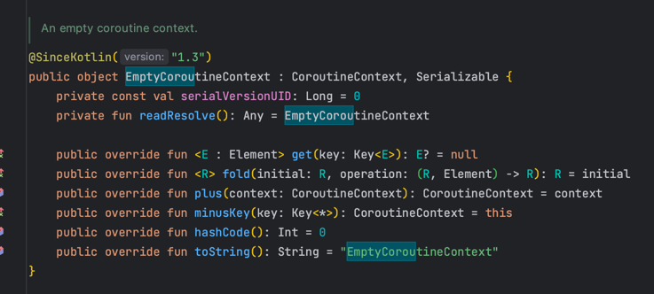

# Spring Webflux
## HttpHandlerAutoConfiguration
* Spring 환경에서는 applicationContext를 이용하여 WebHttpHandlerBuilder를 build


* WebHttpHandlerBuilder에 기존과 다르게 applicationContext만 담고 리턴

## WebHttpHandlerBuilder
* applicationContext로부터 "webHandler"이름을 갖는 bean을 찾아서 WebHandler로 등록
* applicationContext로부터 WebFilter class를 갖는 bean을 찾아서 order로 sort하여 filters로 등록
* applicationContext로부터 WebExceptionHandler class를 갖는 bean을 찾아서 odder로 sort하여 exceptionHandlers로 등록


* WebSessionManager, ServerCodecConfigurer, LocaleContextResolver, ForwardedHeaderTransformer등 bean을 찾아내서 builder에 등록


## DispatcherHandler bean
* WebFluxConfigurationSupport는 autoConfiguration으로 자동으로 등록
* DispatcherHandler가 기본 WebHandler로 등록  


## DispatcherHandler
* handlerMappings, handlerAdapters, resultHandlers로 구성


## HandlerMapping
* getHandler : ServerWebExchange가 주어지면 handler를 Mono로 반환.
  * 지원하는 handler가 없다면, Mono.empty()를 반환
* 대표적인 HandlerMapping
    * RequestMappingHandlerMapping
    * RouterFunctionMapping
    * SimpleUrlHandlerMapping
* 반환하는 handler 타입.
  * HandlerMethod
  * HandlerFunction
  * WebHandler, WebSocketHandler
  

## HandlerAdapter
* support: handlerMapping을 통해서 받은 handler를 지원하는지 여부
  * true라면 주어진 handler로 handle 가능
* handle: ServerWebExchange와 handler를 받아서 요청을 처리하고 HandlerResult를 Mono로 반환.
* 대표적인 HandlerAdapter
  * RequestMappingHandlerAdapter
  * HandlerFunctionAdapter
  * SimpleHandlerAdapter
  * WebSocketHandlerAdapter

## HandlerResultHandler
* support : handlerAdapter를 통해서 받은 handlerResult를 지원하는지 여부. true라면 주어진 handlerResult로 handleResult 가능
* handleResult : ServerWebExchange와 handlerResult를 받아서 응답을 처리하고 완료된 시점을 Mono<Void>로 반환.
* 대표적인 HandlerResultHandler
  * ResponseEntitiyResultHandler
  * ResponseBodyResultHandler
  * ViewResolutionResultHandler
  * ServerResponseResultHandler

## Functional Endpoints
### HandlerFunction
* handle : ServerRequest를 인자로 받고 ServerResponse를 Mono로 반환하는 추상 메서드.
* 요청을 처리하고 응답을 반환.



### RouterFunction
* route : ServerRequest를 인자로 받고 HandlerFunction을 Mono로 반환하는 추상 메서드.
* path, method, predicate 등으로 handlerFunction과 연결하여 해당 요청이 들어왔을때 handlerFunction을 반환.


### ServerRequest
* RouterFunction, HandlerFunction을 지원하기 위해서 추가된 request 객체
* ServerHttpRequest, ServerWebExchange의 메서드들을 대부분 지원.
* 내부적으로 ServerWebExchange를 포함.
  * messageReaders를 제공.
  * codec의 reader를 이용해서 body를 String이나 객체 등으로 쉽게 접근 가능.

### ServerResponse
* HttpHandler 혹은 WebHandler 처럼 처음부터 인자로 주어지는 값이 아니라서, 쉽게 ServerResponse를 만들 수 있는 Builder 제공
* status를 기반으로 BodyBuilder들을 제공.
* header, cookie, allow, lastModified, cacheControl, contentType, bodyValue등을 변경 가능

### ServerResponseBuilder
* ServerRequest를 인자로 받고 queryParam으로 name 획득
* ServerResponse.ok()로 ok status를 갖는 BodyBuilder를 생성.
* headers, cookie, cacheControl 설정
* bodyValue로 content를 받고 그 후 build

```java
@Slf4j
public class HandlerFunctionExample {
	public static void main(String[] args) {
		final HandlerFunction<ServerResponse> handler = request -> {
			final String name = request.queryParam("name")
				.orElse("world");

			final String content = "Hello, " + name;
			final ResponseCookie cookie = ResponseCookie.from("name", name).build();
			return ServerResponse.ok()
				.cookie(cookie)
				.headers(headers -> headers.set("X-Hello", name))
				.cacheControl(CacheControl.noCache())
				.bodyValue(content);
		};
	}
}
```

### HandlerFunction
* 풍부한 기능을 가지고 있는 ServerRequest
* ServerResponseBuilder로 쉽게 응답을 생성 가능.
* 함수형 인터페이스로 간단하게 HandlerFunction 생성 가능.


### RouterFunctionBuilder
* handlerFunction : 해당 조건을 만족했을 경우 실행할 HandlerFunction
* pattern : handlerFunction을 연결할 path pattern
* predicate : handlerFunction을 연결할 추가 조건
* GET, POST, PUT, DELETE, PATCH, OPTIONS 등 method 지원
* path로 공통 prefix pattern을 붙일 수 있고
* nest로 공통 predicate를 더할 수 있다.

### RequestPredicate
* AcceptPredicate : accept 헤더가 인자로 주어진 mediaTypes와 일치하는지
* ContentTypePredicate : content-type 헤더가 인자로 주어진 mediaTypes와 일치하는지
* HeaderPredicate : headers가 조건에 만족 하는지 확인.
* HttpMethodPredicate : method가 인자로 주어진 httpMethods에 포함되는지 확인.
* QueryParamPredicate : queryParam name의 값이 value와 일치하는지 확인.
* PathPatternPredicate : path가 인자로 주어진 pathPattern과 일치하는지 확인.

### RouterFunction 구현
```java
@Slf4j
public class RouterFunctionExample {
	public static void main(String[] args) {
		final RouterFunction<ServerResponse> router = RouterFunctions.route()
			.path("/greet", b1 -> b1
				.nest(RequestPredicates.accept(MediaType.TEXT_PLAIN), b2 -> b2
					.GET("/",
						queryParam("name", name -> !name.isBlank()),
						GreetingHandler::greetQueryParam)
					.GET("/name/{name}", GreetingHandler::greetPathVariable)
					.GET("/header", GreetingHandler::greetHeader)
					.POST("/json", contentType(MediaType.APPLICATION_JSON), GreetingHandler::greetJsonBody)
					.POST("/text", GreetingHandler::greetPlainTextBody)
				)
			)
			.build();
	}
}
```
* path로 전체 prefix에 "/greet" 추가.
* nest로 전체 요청에 Accept 헤더가 text/plain인지 확인
* 첫 번째 GET : queryParam의 name 필드가 빈 값이 아닌지 확인.
* 두 번째 GET : pathVariable을 이용하여 name 전달.
* 세 번째 POST : header에서 X-Custom-Name을 포함하는지 확인.
* 네 번쨰 POST : content-type이 application/json인지 확인.

## RouterFunction in Spring
* RouterFunction이 bean으로 등록되면 RouterFunctionMapping를 통해서 handlerFunction 반환.
* HandlerFunctionAdapter를 통해서 handlerFunction을 실행하고 ServerResponse를 HandlerResult에 담아서 반환.
* ServerResponseResultHandler가 HandlerResult로 render

## RouterFunction bean
* RouterFunction을 bean으로 등록
* 2개 이상의 RouterFunction이 bean으로 등록 되면
  * bean들을 order로 정렬을 하고
  * andOther 연산자로 RouterFunction을 합쳐서
  * 합쳐진 RouterFunction으로 RouterFunctionMapping에서 HandlerFunction 반환

## annotated controller
* RequestMappingHandlerMapping을 통해서 HandlerMethod 반환
* RequestMappingHandlerAdapter를 통해서 HandlerMethod 실행
* @ResponseBody로 인해 ResponseBodyResultHandler가 HandlerResult로 render

## RouterFunction vs Annotated Controller  


## Method Argument
* Servlet stack의 Controller method argument와 거의 비슷
* 하지만 servlet stack에서 제공되지 않고 reactive stack에서만 제공 되거나 같은 역할을 하지만 다른 객체들이 제공

### ServerWebExchange
* method argument로 ServerWebExchange 접근 가능.

```java
@GetMapping("/swe")
Mono<String> serverWebExchange(
	final ServerWebExchange exchange
){
	String name = exchange.getRequest()
        .getQueryParams()
        .getFirst("name");
	
	if(name == null) name = "world";
	return Mono.just("Hello, " + name);
        
}
```

### ServerHttpRequest/Response
* method argument로 ServerHttpRequest/Response 접근 가능.

```java
@GetMapping("/reqres")
Mono<String> serverReqRes(
    final ServerHttpRequest request,
    final ServerHttpResponse response    
){
    String name = request.getQueryParams()
        .getFirst("name");
    
    if(name == null) name = "world";
	response.setStatusCode(HttpStatus.CREATED);
    return Mono.just("Hello, " + name);	
}
```

### WebSession
* servlet stack의 HttpSession이 비슷
* 새로운 attribute가 추가되기 전까지 새로운 session을 강제하지 않는다.
  * HttpSession은 session을 강제로 생성해서 절대 null이 될 수 없다.
* reactive type 지원

```java
@GetMapping("/session")
Mono<String> session(
	final WebSession session,
    final ServerWebExchange exchange    
){
	String savedName = session.getAttribute("name");
	String name;
	if(savedName != null){
        name = savedName;	
    } else {
	    name = exchange.getRequest()
            .getQueryParams()
            .getFirst("name");
        if(name == null) name = "world";
        session.getAttributes().put("name", name);	
    }
    return Mono.just("Hello, " + name);        
}
```

## Return Value
* Servlet stack의 return value와 거의 비슷
* 하지만 ModelAndView 대신 Rendering을 지원
* void를 반환할때 필요로 하는 argument의 차이
* Flux<ServerSentEvent>, Observable<ServerSentEvent> 지원
* Servlet stack에서는 HttpMessageConverter를 사용하지만 reactive stack에서는 HttpMessageWriter를 사용


### return void
* Mono<void>를 반환하거나 null을 반환하는 경우
* ServerHttpResponse, ServerWebExchange, @ResponseStatus가 제공된다면, response 객체로 control
* 만약 위의 조건에 해당하지 않는다면
  * rest controller에서 null을 반환한 경우 텅빈 body를
  * html controller에서는 default view name을 가리킨다.

```java
@GetMapping("/void-shr")
Mono<Void> monoVoid(
	final ServerHttpResponse response
){
	return response.writeWith(
		Mono.just(response.bufferFactory()
            .wrap("Hello, world".getBytes()))
    );
}
```
* Mono<Void>를 반환하고
* ServerHttpResponse가 method argument로 주어지면
* ServerHttpResponse.writeWith를 통해서 응답 반환 가능


```java
@ResponseStatus(HttpStatus.NO_CONTENT)
@GetMapping("/void-status")
void voidStatus(){
}
```
* void를 반환하고
* @ResponseStatus가 주어지면
* empty body와 ResponseStatus로 주어진 상태 전달


## Rendering
* html rendering을 지원하는 객체
* Servlet의 ModelAndView와 비슷한 역할
* html을 그리기 위해서 view, model, status, header등의 정보를 제공
* redirect를 위해서 다양한 option을 제공

### Rendering - redirect
* redirect에서는 status 옵션이 동작하지 않는다
  * 307을 제공했음에도 303으로 반환
* propagateQuery를 true로 제공하는 경우, request에서 받았던 query params를 redirectUrl에 전파.
* header를 통해서 커스텀 헤더 추가

```java
@GetMapping("/redirect")
Mono<Rendering> redirect(){
    var rendering = Rendering.redirectTo("/test")
        .status(HttpStatus.TEMPORARY_REDIRECT)
        .header("X-Custom-Name", "Jay")
        .contextRelative(true)
        .propagateQuery(true)
        .build();
	
	return Mono.just(rendering);
}
```

### redirect

```java
@GetMapping("/redirect2")
String redirect2(){
    return "redirect:/test";
}

@GetMapping("/redirect3")
RedirectView redirect3(){
    return new RedirectView("/test");
}
```
* String을 반환하면 ViewResolutionResultHandler에서 view name으로 view를 찾아서 html render
  * 현재의 경우 redirect:prefix를 이용했기 때문에 redirect view가 동작
* RedirectView는 View를 구현했기 때문에 ViewResolutionResultHandler가 redirect
* 단 template Engine을 사용하는 경우에는 redirect view가 동작

## WebClient
### RestTemplate


* 이전부터 사용되었던 동기 blocking 기반의 web client
* Spring 5.0 부터 요지 모드
* WebClient 사용을 권장.

### WebClient
* Non-blocking, reactive http 클라이언트
* Reactor Netty, Jetty, apache의 HttpComponent를 이용해서 구현.
* http 호출을 위한 여러 설정들을 메소드 체이닝을 통해서 설정

#### WebClient 생성
* buillder를 직접 호출하거나.
* create를 통해서 생성 가능
  * create 호출시 baseUrl 제공 가능

#### WebClient method 
* get, head, post, put, patch, delete, options, method 제공
* post, put, patch의 경우 RequestBodyUriSpec을 나머지는 RequestHeadersUriSpec을 반환

#### WebClient 실행
* WebClient를 생성
* uri, header, accept를 통해서 webClient를 설정하고
* retrieve를 통해서 호출

```java
WebClient webClient = WebClient.create("https://localhost:8080");

ResponseEntity<UserInfo> response = 
        webClient
          .get()
          .uri("/user")
          .header("X-Request-Id", "1234")
          .accept(MediaType.APPLICATION_JSON)
          .retrieve()
          .toEntity(UserInfo.class)
          .block();

assert response.getBody().getId().equals("1234");
assert response.getStatusCode().is2xxSuccessful();
assert response.getHeaders().getContentType()
            .toString().equals("application/json")
assert response.getHeaders().get("X-Request-Id")
            .get(0).equals("1234");
```

## Spring Security Ractive
### SecurityFilterChain
* servlet stack에서는 Servlet filter를 사용
* servlet filter에 DelegaringFilterProxy를 추가하고
* DelegateFilterProxy는 SecurityFilterChain을 호출
  * filterChain 내에서는 bean을 사용하기 힘들지만.
  * securityFilterChain은 spring context를 갖기 때문에 bean에 접근 가능.
  


### SecurityWebFilterChain
* reactive stack에서는 HttpWebHandlerAdapter에 WebFilter를 사용
* WebFilter를 구현한 WebFilterChainProxy는 servlet stack의 DelegatingFilterProxy와 비슷한 역할


### ReactiveSecurityContextHolder
* SecurityContextHolder와 비슷하지만
* ThreadLocal대신 context로 SecurityContext를 제공
* getContext : SecurityContext를 Mono 형태로 제공
* clearContext : SecurityContext를 clear
* withSecurityContext : SecurityContext를 Mono로 받고 이를 포함하는 ReactorContext를 반환
* withAuthentication : Security Authentication을 받고 SecurityContext를 받아서 이를 포함하는 ReactorContext를 반환
