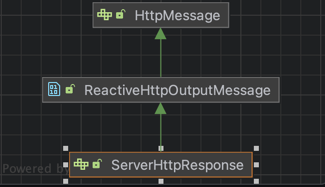
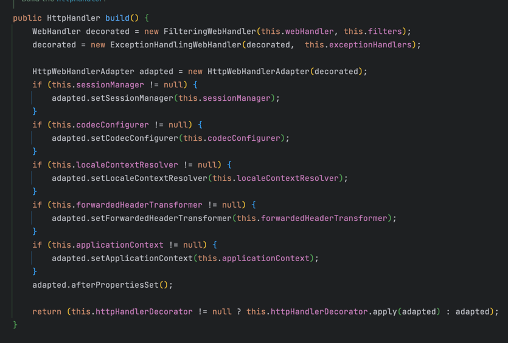

# Spring Webflux

## Spring Webflux 기본 구조

* WebFluxAutoConfiguration
  

---

* ReactiveWebServerFactoryAutoConfiguration.embeddedNetty
  

---

* NettyReactiveWebServerFactory
  

---

* NettyReactiveWebServerFactory  
  

## Reactor Netty

* Reactor 기반으로 Netty를 wrapping
* Netty의 성능과 Reactor의 조합성, 편의성 모두 제공

```java

@Slf4j
public class ReactorNettyHttpExample {

	public static void main(String[] args) {
		log.info("start main");
		Consumer<HttpServerRoutes> routesConsumer = routes ->
			routes.get("/hello", (request, response) -> {
					var data = Mono.just("Hello World!");
					return response.sendString(data);
				}
			);

		HttpServer.create()
			.route(routesConsumer)
			.port(8080)
			.bindNow()
			.onDispose()
			.block();
		log.info("end main");
	}
}
```

## ReactiveAdapterRegistry

  


### ReactiveAdapter


* ReactiveAdapterRegistry는 내부적으로 각각 라이브러리의 publisher에 매칭되는 변환함수를 adapter 형태로 저장.

* getAdapter를 통해서 변환하고자 하는 publisher를 넘기고 해당 adapter의 toPublish를 이용해서 reactive streams의 publisher로 변환

<br />  

* 여러 라이브러리의 publisher들을 reactive streams의 publisher로 변환 가능
* Spring webflux에서는 reactive streams의 publisher 기준으로 구현을 한다면 ReactiveAdapter를 통해서 여러 라이브러리 지원 가능.

---

<br />  


## HttpHandler

* ServerHttpRequest와 ServerHttpResponse를 인자로 받고
* 응답을 돌려줘야 하는 시점을 반환하는 함수형 인터페이스


|   | |
--------------------------|-------------------------| 
 
* ServerHttpRequest와 ServerHttpResponse를 인자로 받고
* Http 요청 처리가 끝나면 Mono<Void> 반환 
  * ServerHttpResponse의 setComplete 혹은 writeWith가 Mono<Void>를 반환하기 때문에 이 결과를 반환하는 경우가 많다.

## HttpHandler 생성

```java
@Slf4j
public class HttpHandlerExample {
	public static void main(String[] args) {
		new HttpHandler() {

			@Override
			public Mono<Void> handle(final ServerHttpRequest request, final ServerHttpResponse response) {
				final String nameQuery = request.getQueryParams().getFirst("name");
				final String name = nameQuery == null ? "world" : nameQuery;

				final String content = "Hello " + name;
				log.info("response Body : {}", content);
				final Mono<DataBuffer> responseBody = Mono.just(
					response.bufferFactory()
						.wrap(content.getBytes())
				);

				response.addCookie(ResponseCookie.from("name", name).build());
				response.getHeaders().add(HttpHeaders.CONTENT_TYPE, MediaType.TEXT_PLAIN_VALUE);
				return response.writeWith(responseBody);
			}
		};
	}
}
```

* request.getQueryParams를 통해서 name query의 값 획득
* name을 이용해서 responseBody 생성
* body을 담은 DataBuffer를 생성해서 Mono로 wrapping
* header의 값 변경
* cookie에 name cnrk.
* response.writeWith를 통해서 Mono로 wrapping한 dataBuffer를 반환

## HttpHandler 실행
* ReactorHttpHandlerAdapter로 감싸서 HttpServer의 handler 전달.

```java
var adapter = new ReactorHttpHandlerAdapter(handler);
HttpServer.create()
        .host("localhost")
        .port(8080)
        .handle(adapter)
        .bindNow()
        .channel().closeFuture().sync();
```

## HttpHandler의 한계
* request header나 body를 변경하는 작업을 HttpHandler에 직접 구현해야 한다.
* HttpHandler 내에서 모든 error를 직접 catch해서 관리해야 한다.
* request의 read와 response의 write 모두 HttpHandler에서 구현해야 한다. 


---

<br />  


## WebHandler
* Filter, Codec, ExceptionHandler 등을 지원.
* ServerWebExchange를 제공


## WebHandler 생성
* ServerWebExchange를 통해서 request와 response를 획득

```java
@Slf4j
public class WebHandlerOnlyQueryParamExample {
	public static void main(String[] args) {
		final WebHandler webHandler = new WebHandler() {

			@Override
			public Mono<Void> handle(final ServerWebExchange exchange) {
				final ServerHttpRequest request = exchange.getRequest();
				final ServerHttpResponse response = exchange.getResponse();

				final String nameQuery = request.getQueryParams().getFirst("name");
				final String name = nameQuery == null ? "world" : nameQuery;

				final String content = "Hello " + name;
				log.info("response Body : {}", content);
				final Mono<DataBuffer> responseBody = Mono.just(
					response.bufferFactory()
						.wrap(content.getBytes())
				);

				response.addCookie(ResponseCookie.from("name", name).build());
				response.getHeaders().add(HttpHeaders.CONTENT_TYPE, MediaType.TEXT_PLAIN_VALUE);

				return response.writeWith(responseBody);
			}
		};

		final HttpHandler webHttpHandler = WebHttpHandlerBuilder
			.webHandler(webHandler)
			.build();

	}
}
```

## WebHttpHandlerBuilder
* Builder에 주어진 Filter, ExceptionHandlers, CodecConfigurer, ApplicationContext 등을 이용하여 하나의 HttpWebHandlerAdapter를 생성  



## ServerWebExchange 만드는 과정  

* HttpWebHandlerAdapter는 ServerWebExchange를 만들면서 CodecConfigurer를 전달.

  
* CodecConfigurer로 formData와 multipartData Mono를 초기화  
  

* fromDataMono 준비
* configurer의 readers 중에 application.x-www-form-urlencoded인 reader를 탐색
  * 없다면 IllegalArgumentException throw
* 해당 reader에 request를 넘겨주고 읽어들이는 mono 준비
* cache : 최초 subscribe에 대해서만 onNext, onComplete 등의 이벤트를 전달하고 이후 subscribe에 대해선 실제로 publisher가 수행 되지 않고 cache된 이벤트 전달.

## WebHandler - formData
* contentType이 application/x-www-form-urlencoded인 경우, exchange의 getFormData로 접근가능.
```java
@Slf4j
public class WebHandlerOnlyFormDataExample {
	public static void main(String[] args) {
		final WebHandler webHandler = new WebHandler() {

			@Override
			public Mono<Void> handle(final ServerWebExchange exchange) {
				final ServerHttpRequest request = exchange.getRequest();
				final ServerHttpResponse response = exchange.getResponse();

				return exchange.getFormData().flatMap(formData -> {
					final String nameQuery = formData.getFirst("name");
					final String name = nameQuery == null ? "world" : nameQuery;

					final String content = "Hello " + name;
					log.info("response Body : {}", content);
					final Mono<DataBuffer> responseBody = Mono.just(
						response.bufferFactory()
							.wrap(content.getBytes())
					);

					response.addCookie(ResponseCookie.from("name", name).build());
					response.getHeaders().add(HttpHeaders.CONTENT_TYPE, MediaType.TEXT_PLAIN_VALUE);
					return response.writeWith(responseBody);
				});
			}
		};
	}
}

```

## MultiPartData
  

* Part 인터페이스를 구현한 FormFieldPart와 FilePart로 구분    
  

* FormFieldPart는 plain text 필드에 해당. value()를 통해서 값에 접근 가능.  


* FilePart는 file 필드에 해당. filename()으로 파일명에 접근하고, transferTo로 로컬에 file 필드의 내용을 전달.

## WebHandler - MultiPartData
* formData
```java
@Slf4j
public class WebHandlerOnlyMultipartDataExample {
	public static void main(String[] args) {
		final WebHandler webHandler = new WebHandler() {
			@Override
			public Mono<Void> handle(final ServerWebExchange exchange) {
				final ServerHttpResponse response = exchange.getResponse();

				return exchange.getMultipartData().map(multipartData -> {
					return ((FormFieldPart)multipartData.getFirst("name")).value();
				}).flatMap(nameQuery->{
					final String name = nameQuery == null ? "world" : nameQuery;

					final String content = "Hello " + name;

                  ...
```

* name 필드의 값에 접근하기 위해 FormFieldPart로 cast하여 value()로 접근
  
<br />  

---  

* fileData

```java
@Slf4j
public class WebHandlerOnlyMultipartDataFileExample {
	public static void main(String[] args) {
		var objectMapper = new ObjectMapper();
		final WebHandler webHandler = new WebHandler() {
			@Override
			public Mono<Void> handle(final ServerWebExchange exchange) {
				final ServerHttpResponse response = exchange.getResponse();

				return exchange.getMultipartData().flatMap(multipartData -> {
					return (multipartData.getFirst("data")).content()
						.map(dataBuffer -> dataBuffer.toString(StandardCharsets.UTF_8))
						.reduce((s1, s2)-> s1 + s2);
				}).flatMap(json->{
					String name;
					try{
						name = objectMapper.readTree(json).get("name").asText();
					} catch (JsonProcessingException e) {
						log.error(e.getMessage(), e);
						name = "world";
					}
					return name;
				});
			}
		};
	}
}
```

* data 필드는 data.json의 내용을 줄마다 나눠서 Flux<DataBuff>로 제공
* String으로 변경하여 Join 후 다음 파이프라인으로 전달.
* 다음 step에서 ObjectMapper로 json으로 변환하여 name 필드를 추출


## WebHandler - json
```java
@Slf4j
public class WebHandlerOnlyAcceptJsonExample {

	record NameHolder(String name) {}
	public static void main(String[] args) {
		final ServerCodecConfigurer codecConfigurer = ServerCodecConfigurer.create();
		final WebHandler webHandler = new WebHandler() {
			@Override
			public Mono<Void> handle(final ServerWebExchange exchange) {
				final ServerRequest serverRequest = ServerRequest.create(
					exchange,
					codecConfigurer.getReaders()
				);
				final ServerHttpResponse response = exchange.getResponse();

				final Mono<NameHolder> bodyMono = serverRequest.bodyToMono(NameHolder.class);
				return bodyMono.flatMap(nameHolder->{
					final String nameQuery = nameHolder.name();
					final String name = nameQuery == null ? "world" : nameQuery;

                  ...
```
* codecConfigurer를 생성하고
* exchange와 codecConfigurer로 ServerRequest를 생성
* serverRequest.bodyToMono로 Mono<NameHolder>를 생성


---

<br />  


## WebFilter
* WebHandler를 실행하기 앞서서 실행
* WebHandler에게 전달될 ServerWebExchange와 다음 filter 혹은 handler를 실행하기 위한 WebFilterChain
* chain.filter를 호출하여, 요청을 다음 filter에게 넘기거나 handler를 실행 가능.

  


### WebFilter - pre, post
* chain.filter를 호출하기 전에 로직을 수행하면 servlet 스택 HandlerInterceptor의 preHandle과 동일
* chain.filter를 호출한 후 chaining을 하여 로직을 수행하면 HandlerInterceptor의 postHandle과 동일

```java
var preFilter = new WebFilter() {
    @Override
    public Mono<Void> filter(final ServerWebExchange exchange, final WebFilterChain chain) {
        log.info("pre filter");
        return chain.filter(exchange);
    }
};

var postFilter = new WebFilter() {
    @Override
    public Mono<Void> filter(final ServerWebExchange exchange, final WebFilterChain chain) {
        return chain.filter(exchange)
        .doOnSuccess(v -> log.info("post filter"));
    }
};

final HttpHandler webHttpHandler = WebHttpHandlerBuilder
        .webHandler(webHandler)
        .filter(preFilter, postFilter)
        .build();
```


### WebFilter - mutate
* ServerWebExchange는 불변
* ServerWebExchange와 ServerHttpRequest는 각각을 Builder로 변경할 수 있는 mutate 제공
* ServerHttpRequest.Builder는 method, uri, path, contextPath, header등을 변경 가능.
* ServerWebExchange.Builder는 request, response, principal 등을 변경 가능.


### WebFilter 구현
* pre-filter
```java
@Slf4j
public class WebFilterExample {
	public static void main(String[] args) {
		new WebFilter() {

			@Override
			public Mono<Void> filter(final ServerWebExchange exchange, final WebFilterChain chain) {
				log.info("extract name from header");
				final ServerHttpRequest request = exchange.getRequest();
				final ServerHttpResponse response = exchange.getResponse();

				final String name = request.getHeaders()
					.getFirst("X-Custom-Name");

				if (name == null) {
					response.setStatusCode(HttpStatus.BAD_REQUEST);
					return response.setComplete();
				}else{
					exchange.getAttributes().put("name", name);
					final ServerHttpRequest newReq = request.mutate()
						.headers(h -> h.remove("X-Custom-Name"))
						.build();
					return chain.filter(
						exchange.mutate().request(newReq).build()
					);
				}
			}
		};
	}
}
```

* request의 header로 부터 X-Custom-Name에 접근
* name이 null 이라면
  * status를 400으로 만들고 complete
* name이 null이 아니라면
  * attrebute에 name을 추가
  * request.mutate()로 builder를 만들고 header에서 X-Custom-Name을 제거
  * exchange.mutate()로 builder를 만들고 변경된 newReq를 전달.

 
<br />

* around-filter
```java
final WebFilter aroundFilter = new WebFilter() {
			@Override
			public Mono<Void> filter(final ServerWebExchange exchange, final WebFilterChain chain) {
				log.info("timeLoggingFilter");
				final long startTime = System.nanoTime();
				return chain.filter(exchange)
					.doOnSuccess(v -> {
						final long endTime = System.nanoTime();
						log.info("time : {}ms", (endTime - startTime) / 1000000.0);
					});
			}
		};
```  

## WebHandler - Exception
```java
new WebHandler() {

			@Override
			public Mono<Void> handle(final ServerWebExchange exchange) {
				final ServerHttpResponse response = exchange.getResponse();

				return response.writeWith(
					Mono.create(sink -> {
						sink.error(new RuntimeException("test"));
					}))
					.onErrorResume(RuntimeException.class, e->{
						response.setStatusCode(HttpStatus.BAD_REQUEST);
						return response.writeWith(
							Mono.just(response.bufferFactory().wrap(e.getMessage().getBytes()))
						);
					});
			}
		};
```

* publisher에서 exception이 발생한 경우, onErrorResume을 이용해서 status를 변경하고 새로운 body write


## WebExceptionHandler
* ServerWebExchange와 Throwable을 인자로 받고
* WebHandler에서 에러가 발생한 경우, WebExceptionHandler에 exchange와 throwable을 전달.
* 처리가 완료되면 Mono<Void>를 리턴
  * 상태를 변경하고 body를 write하거나.
  * Mono.error를 반환하여 error를 처리하지 않고 다음 exceptionHandler에게 pass


## WebExceptionHandler - 구현
```java
@Slf4j
public class WebExceptionHandlerExample {
	public static void main(String[] args) {
		final WebExceptionHandler exceptionHandler = new WebExceptionHandler() {

			@Override
			public Mono<Void> handle(final ServerWebExchange exchange, final Throwable ex) {
				final ServerHttpResponse response = exchange.getResponse();

				if (ex instanceof RuntimeException) {
					response.setStatusCode(HttpStatus.BAD_REQUEST);
					final DataBuffer responseBody = response.bufferFactory().wrap(ex.getMessage().getBytes());
					return response.writeWith(Mono.just(responseBody));
				} else {
					return Mono.error(ex);
				}
			}
		};

		WebHttpHandlerBuilder
			.webHandler(...)
			.exceptionHandler(exceptionHandler)
			.build();

	}
}
```

* WebExceptionHandler를 구현하여 에러가 발생했을때 처리하는 컴포넌트 추가.
* Throwable에  instanceOf를 이용하여 처리할지 말지 결정.
* 같은 exception을 처리하는 WebExceptionHandler가 여러개라면 먼저 등록된 handler가 응답을 처리.