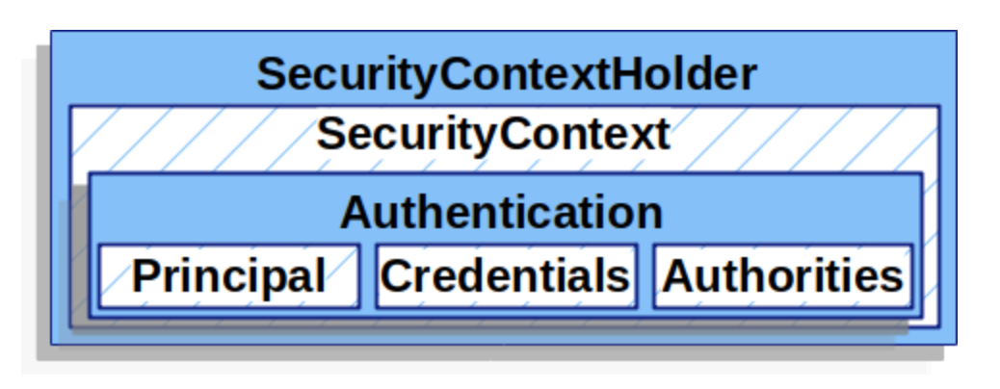
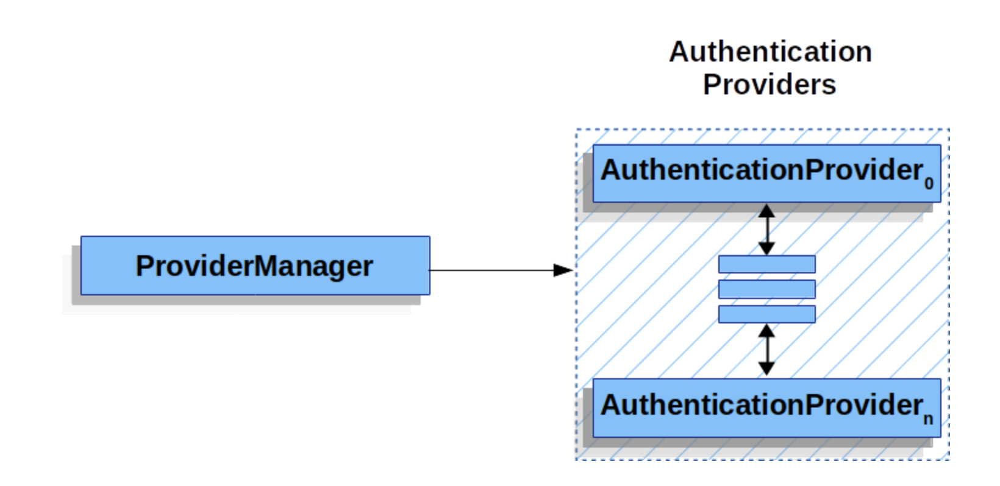
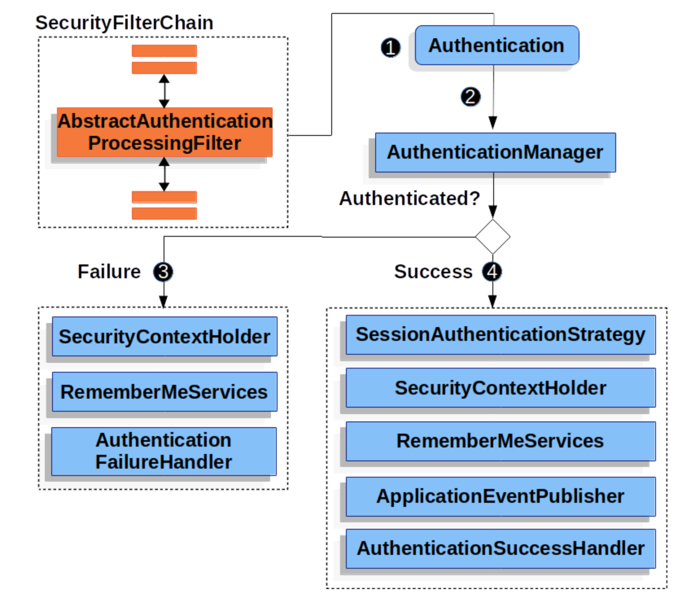

## Spring Security

### Authentication Architecture
#### SecurityContextHolder
* where Spring Security stores the details of who is authenticated.  

* By default, SecurityContextHolder uses a ThreadLocal to store these details, which means that the SecurityContext is always available to methods in the same thread

#### AuthenticationManager
* AuthenticationManager is the API that defines how Spring Security’s Filters perform authentication.

#### ProviderManager
* ProviderManager is the most commonly used implementation of AuthenticationManager
* ProviderManager delegates to a List of AuthenticationProvider instances.     
Each AuthenticationProvider has an opportunity to indicate that authentication should be successful, fail, or indicate it cannot make a decision and allow a downstream AuthenticationProvider to decide.  

* one AuthenticationProvider might be able to validate a username/password,    
  while another might be able to authenticate a SAML assertion.   
  This lets each AuthenticationProvider do a very specific type of authentication while supporting multiple types of authentication and expose only a single AuthenticationManager bean.

#### AuthenticationProvider
* can inject multiple AuthenticationProviders instances into ProviderManager.
* Each AuthenticationProvider performs a specific type of authentication. For example, DaoAuthenticationProvider supports username/password-based authentication, while JwtAuthenticationProvider supports authenticating a JWT token.

#### Request Credentials with AuthenticationEntryPoint
* AuthenticationEntryPoint is used to send an HTTP response that requests credentials from a client.
* a client makes an unauthenticated request to a resource that they are not authorized to access. In this case, an implementation of AuthenticationEntryPoint is used to request credentials from the client.

#### AbstractAuthenticationProcessingFilter
* AbstractAuthenticationProcessingFilter is used as a base Filter for authenticating a user’s credentials.
* AbstractAuthenticationProcessingFilter can authenticate any authentication requests that are submitted to it.

1. When the user submits their credentials,      
   the AbstractAuthenticationProcessingFilter creates an Authentication from the HttpServletRequest to be authenticated.    
   The type of Authentication created depends on the subclass of AbstractAuthenticationProcessingFilter.  
2. the Authentication is passed into the AuthenticationManager to be authenticated.
3. If authentication fails, then Failure.  
   The SecurityContextHolder is cleared out.  
   RememberMeServices.loginFail is invoked. If remember me is not configured, this is a no-op.  
   AuthenticationFailureHandler is invoked. See the AuthenticationFailureHandler interface.   
4. AuthenticationFailureHandler