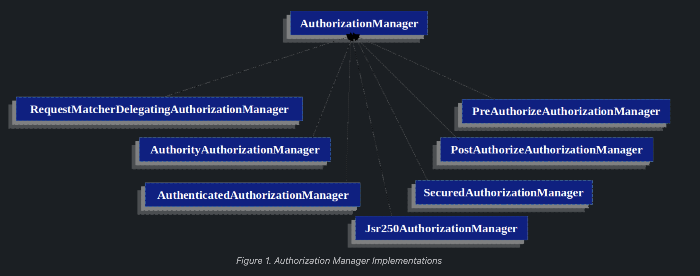

## Spring Security

### Authorization Architecture
#### Authorities
* Authentication discusses how all Authentication implementations store a list of GrantedAuthority objects.
* The GrantedAuthority interface has only one method
```java
String getAuthority();
```

* This method is used by an AuthorizationManager instance to obtain a precise String representation of the GrantedAuthority.
* By returning a representation as a String, a GrantedAuthority can be easily "read" by most AuthorizationManager implementations.
* If a GrantedAuthority cannot be precisely represented as a String, the GrantedAuthority is considered "complex" and getAuthority() must return null.

<br/>

* Spring Security includes one concrete GrantedAuthority implementation: SimpleGrantedAuthority
* This implementation lets any user-specified String be converted into a GrantedAuthority.
* All AuthenticationProvider instances included with the security architecture use SimpleGrantedAuthority to populate the Authentication object.

<br/>

* By default, role-based authorization rules include ROLE_ as a prefix.
* This means that if there is an authorization rule that requires a security context to have a role of "USER", Spring Security will by default look for a GrantedAuthority#getAuthority that returns "ROLE_USER".


#### Invocation Handling
* A pre, & post invocation decision on whether the invocation is allowed to proceed is made by AuthorizationManager instances.

#### AuthorizationManager
* AuthorizationManagers are called by Spring Security’s request-based, method-based, and message-based authorization components and are responsible for making final access control decisions.
* The AuthorizationManager interface contains two methods:

```java
AuthorizationDecision check(Supplier<Authentication> authentication, Object secureObject);

default AuthorizationDecision verify(Supplier<Authentication> authentication, Object secureObject) throws AccessDeniedException {
    // ...
}
```

* The AuthorizationManager's check method is passed all the relevant information it needs in order to make an authorization decision.
* verify calls check and subsequently throws an AccessDeniedException in the case of a negative AuthorizationDecision.

### Delegate-based AuthorizationManager Implementations

* Spring Security ships with a delegating AuthorizationManager that can collaborate with individual AuthorizationManagers.



```java
public class UserAuthorizationManager implements AuthorizationManager<RequestAuthorizationContext> {

	@Override
	public AuthorizationDecision check(Supplier<Authentication> authentication, RequestAuthorizationContext context) {
		HttpServletRequest request = context.getRequest();

		Object principal = authentication.get().getPrincipal();
		if (!(principal instanceof AuthenticationDetails)) {
			return new AuthorizationDecision(false);
		}

		boolean accessible = ((AuthenticationDetails)principal).getAuthorities()
			.stream()
			.flatMap(authority -> RoleType.getPermittedUrlsBy(authority.getAuthority()).stream())
			.anyMatch(url -> new AntPathRequestMatcher(url).matches(request));
		
		return new AuthorizationDecision(accessible);
	}
}
```