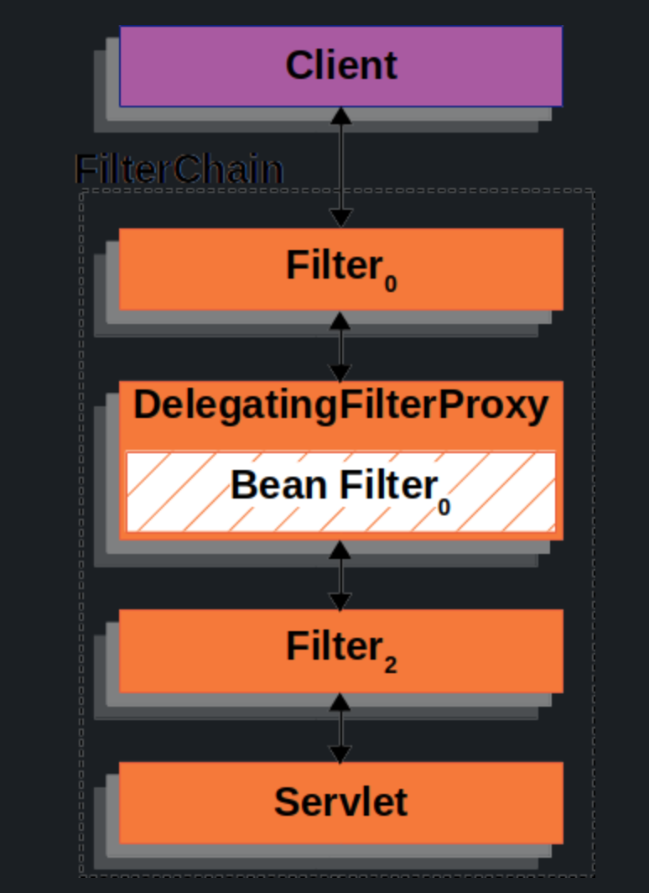
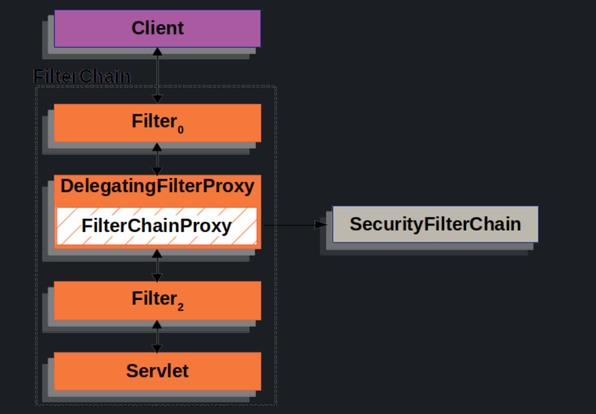
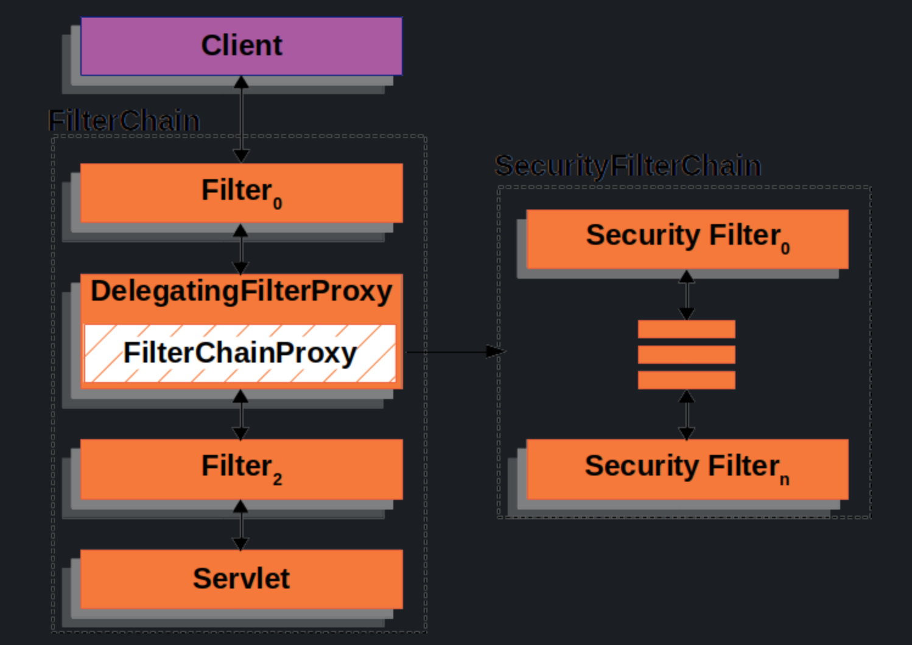
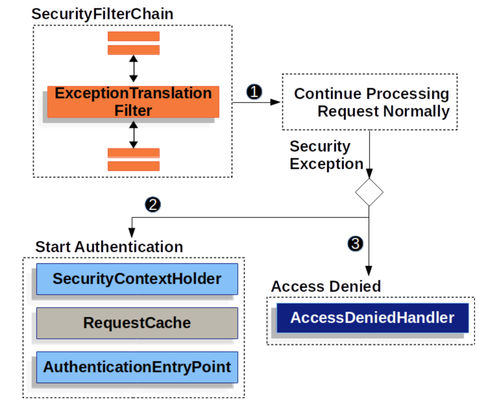

## Spring Security

### Architecture
#### Filters
* Spring Security’s Servlet support is based on Servlet Filters
* Since a Filter impacts only downstream Filter instance and the Servlet,   
the order in which each Filter is invoked is extremely important

#### DelegatingFilterProxy
* Spring provides a Filter implementation named DelegatingFilterProxy   
that allows bridging between the Servlet container’s lifecycle and Spring’s ApplicationContext
* The Servlet container allows registering Filter instances by using its own standards
* but it is not aware of Spring-defined Beans
* however we can register DelegatingFilterProxy through the standard Servlet container mechanisms
* and delegate all the work to a Spring Bean that implements Filter  
  
* DelegatingFilterProxy looks up Bean Filter from the ApplicationContext and then invokes Bean Filter
* Spring uses a ContextLoaderListener to load the Spring Beans which is not done until after Filter instances need to be registered

#### FilterChainProxy
* FilterChainProxy is a special Filter provided by Spring Security that allows delegating to many Filter instances through SecurityFilterChain.
* Since FilterChainProxy is a Bean, it is typically wrapped in a DelegatingFilterProxy.

#### SecurityFilterChain
* SecurityFilterChain is used by FilterChainProxy to determine which Spring Security Filter instances should be invoked for the current request.

* [Spring Security filter order](https://github.com/spring-projects/spring-security/blob/6.3.1/config/src/main/java/org/springframework/security/config/annotation/web/builders/FilterOrderRegistration.java)

`Be careful when you declare your filter as a Spring bean, either by annotating it with @Component or by declaring it as a bean in your configuration, because Spring Boot will automatically register it with the embedded container. That may cause the filter to be invoked twice, once by the container and once by Spring Security and in a different order.`

#### Handling Security Exceptions
* The ExceptionTranslationFilter allows translation of AccessDeniedException and AuthenticationException into HTTP responses.
* ExceptionTranslationFilter is inserted into the FilterChainProxy as one of the Security Filters.

1. First, the ExceptionTranslationFilter invokes FilterChain.doFilter(request, response) to invoke the rest of the application.
2. If the user is not authenticated or it is an AuthenticationException, then Start Authentication.  
  *  The SecurityContextHolder is cleared out. 
  * The HttpServletRequest is saved so that it can be used to replay the original request once authentication is successful. 
  * The AuthenticationEntryPoint is used to request credentials from the client. For example, it might redirect to a log in page or send a WWW-Authenticate header.
3. Otherwise, if it is an AccessDeniedException, then Access Denied. The AccessDeniedHandler is invoked to handle access denied.

`If the application does not throw an AccessDeniedException or an AuthenticationException, then ExceptionTranslationFilter does not do anything.`